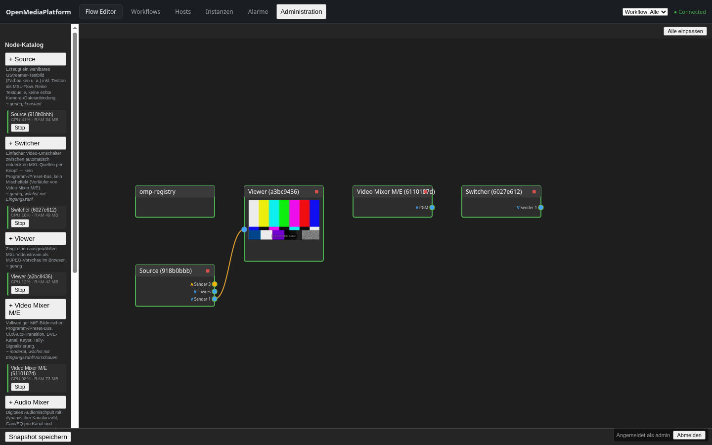
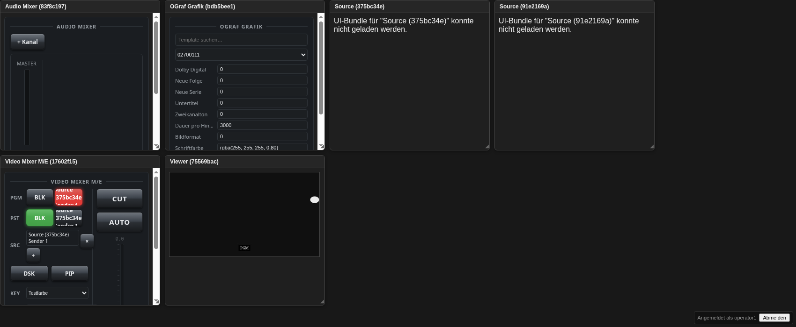

# OpenMediaPlatform


Neues, eigenständiges Projekt (getrennt von `PIPELINE CONTROLLER`).

## An Open-Source Orchestrator for Broadcast – A Current Status

The goal is a proof of concept for a modular broadcast and streaming platform that adheres to open standards and brings modern software architectures to the broadcast world.

The focus is not on a single product, but rather on how to assemble a complete production system from independent services.

The architectural foundation is the EBU Dynamic Media Facility (DMF) model: Functions such as video mixers, audio mixers, playout, graphics, and signal sources are not conceived as monolithic applications, but as independent, loosely coupled services that can be dynamically orchestrated.

For local, high-performance media exchange, MXL (Media Exchange Layer) is used. MXL enables zero-copy exchange of audio and video data between processes on the same host, thus replacing the traditional approach of unnecessarily transporting media streams over network stacks or proprietary interfaces. When multiple hosts are involved, communication takes place either via SMPTE ST 2110 (with an SRT gateway for contribution/distribution over lossy networks) or, as a zero-copy alternative, via MXL-native Fabrics — real remote memory access (RDMA) between two MXL domains on different hosts, verified live over a software transport, with a drop-in path to real RDMA hardware.

The core of the system is an orchestrator developed in Go. It handles discovery, routing, and communication between the individual services. NATS is used as the event bus, while AMWA NMOS (IS-04 and IS-05) handles the automatic registration and routing of the components. This means the orchestrator doesn't have to rely on fixed device types or proprietary interfaces.

An essential part of the architecture is also the NMOS Control Framework (IS-12/IS-14). Each service describes its own parameters and capabilities. Therefore, the orchestrator doesn't need to know whether it's a video mixer, audio mixer, or a future node type. New components can be integrated without requiring any modifications to the orchestrator. This self-description capability is precisely what makes the platform scalable in the long term.

Several microservices are currently available as demonstrators — each
one an independent process that self-registers via NMOS, with its own
UI and its own set of self-described parameters (full list with
functions: [`docs/HANDBUCH.md`](docs/HANDBUCH.md) §9):

- **omp-source** — test sources (color bars etc. plus test tone)
- **omp-switcher** — simple video switcher between auto-discovered
  sources (no program/preset bus)
- **omp-video-mixer-me** — video mixer (1 M/E with cut, crossfade,
  picture-in-picture, downstream keyer)
- **omp-audio-mixer** — digital audio mixer with parametric EQ,
  per-channel compressor, master limiter, and audio-follow-video
- **omp-player** — video player and jingle player (cued playback, plus
  live-MXL-source and real-file playlist items)
- **omp-playout-automation** — playout automation (playlist-driven,
  Auto/Hold, Next/Next-Live/Stop, cart/interrupt assets; no pipeline of
  its own)
- **omp-viewer** / **omp-multiviewer** — single-stream preview and
  auto-discovered multi-tile monitoring (with automatic low-res preview
  fan-out)
- **omp-ograf** — EBU OGraf graphics overlay node (Fill+Key)
- **omp-media-library** — file catalog with technical metadata
  (ffprobe) and mark-in/out segments
- **omp-recorder** — records an MXL source (video/audio) to a Matroska
  file; MXL-only input, no capture-card dependency
- **omp-2110-gateway** / **omp-aes67-gateway** — native ST 2110 video /
  AES67 audio gateways for inter-site contribution with foreign
  equipment
- **omp-srt-gateway** — ST 2110 ⇄ SRT gateway for contribution over
  lossy WANs
- **omp-fabrics-gateway** — **remote memory access between hosts**:
  MXL-native Fabrics (libfabric/RDMA) instead of a network-stack hop —
  zero-copy, one-sided RDMA writes of a full MXL flow into another
  host's domain. Implemented and live-verified over the software `tcp`
  provider (no RDMA hardware required to test); `verbs`/`efa` providers
  for real RoCEv2 hardware are a drop-in config change, hardware
  procurement pending.

All components run as independent services and can be started, stopped, or extended independently — either locally via the built-in instance launcher, or on a separate machine via a lightweight host agent that registers itself with the orchestrator and executes only pre-approved node types (agent-local catalog as the trust boundary, not a wide-open remote-exec channel).

A graphical user interface is being developed in parallel, consistently implementing the concept of a software-defined broadcast system. Nodes register automatically, appear in the flow editor, and can be connected via drag and drop. Parameters are dynamically generated from their respective self-descriptions—without having to develop separate interfaces for each device type. Login-based user/role accounts (local, no external directory server required) gate who can wire the graph, launch instances, or administer hosts.

Although the project is still in its early stages, the current version is already fully functional on my Chromebook. For me, this is important proof that modern broadcast architectures can initially be developed and validated with manageable resources.

The focus is currently deliberately not on topics such as high availability, redundancy, or commercial support. The goal is to verify the architecture and demonstrate the potential of open standards like DMF, MXL, NMOS, and NATS.

I'm excited to see how this approach evolves and look forward to exchanging ideas with everyone involved in software-defined broadcast systems, open standards, or modern media architectures.

## Quickstart

```sh
make start   # NATS + NMOS-Registry + Orchestrator, siehe docs/HANDBUCH.md
```

Danach http://localhost:8000 öffnen. Details/Troubleshooting:
[`docs/HANDBUCH.md`](docs/HANDBUCH.md). Bedienungsanleitung für die
Oberfläche (mit Screenshots): [`docs/BENUTZERHANDBUCH.md`](docs/BENUTZERHANDBUCH.md).





## Status

Architektur/Tech-Stack entschieden (siehe `ARCHITECTURE.md`), Umsetzung
läuft nach `UMSETZUNG.md` (Status-Checkliste dort, laufend
fortgeschrieben — dort steht der jeweils aktuelle Stand, nicht hier).

Stehen bereits: Fundament, Flow-Editor mit Drag&Drop-Routing,
Workflow-Objekte/-Presets, der kleine Regieplatz (Source/Switcher/
Video-Mixer/Audio-Mixer/Player/Multiviewer/Playout-Automation/
OGraf-Grafik, alle GUI-startbar), Mixer-Presets (Snapshot/Recall),
ST 2110-Video/AES67-Audio + ein natives ST-2110-Gateway zusätzlich zum
SRT-Gateway, echter **Remote Memory Access** zwischen zwei OMP-Hosts
über MXL-native Fabrics (`omp-fabrics-gateway`, Software-`tcp`-Provider
live verifiziert — RDMA-Zero-Copy ohne RDMA-Hardware testbar, s.
`docs/HANDBUCH.md` §9.3), PostgreSQL-Backend, mTLS
Orchestrator↔Nodes, ein lokales Nutzer-/Rollenmodell mit Login und
Audit-Log, ein Node-SDK-Tutorial, Remote-Host-Erkennung samt
Kommandokanal (Instanzen auch auf einer entfernten Maschine starten/
stoppen, über einen Host-Agent mit host-lokalem Katalog als
Sicherheitsgrenze), automatischer Prozess-Neustart mit
Crash-Loop-Bremse, ein Metrics-Endpunkt, sowie eine Betriebsansicht mit
laufenden Instanzen (CPU/RAM je Prozess), Host-Ressourcenverlauf und
gesammelten Alarmen.

Offen: automatische Placement-Engine (Ressourcen-bewusste Zielhost-
Wahl), RDMA-Hardware-Anbindung (`verbs`/EFA-Provider, wartet auf
Hardware-Beschaffung), NDI-/Dante-Gateways, PTP-Zeitbasis für die
2110-Pfade.

## Verwandtes Projekt

Für Broadcast-/GStreamer-/Playout-Erfahrung siehe `PIPELINE CONTROLLER`
(separates Repo, siehe `CLAUDE.md` für Details).
