# OpenMediaPlatform

[](https://specs.amwa.tv/is-04/) [](https://specs.amwa.tv/is-05/) [](https://specs.amwa.tv/ms-05-02/) [](https://specs.amwa.tv/is-08/) [](https://specs.amwa.tv/bcp-003-01/) [](https://specs.amwa.tv/bcp-008-01/) [-1f6feb)](https://specs.amwa.tv/bcp-007-03/) [](.github/workflows/ci.yml) [](https://www.smpte.org/standards) [](https://en.wikipedia.org/wiki/AES67) [](https://tech.ebu.ch/loudness)

> **Standards-first:** built directly on AMWA NMOS — IS-04 v1.3 for
> discovery/registration, **IS-05 v1.1 and the current v1.2.0 release
> served side by side** (wire-compatible, same handlers) for connection
> management, IS-12/IS-14 for self-described control, BCP-008-01/02
> for real receiver/sender health status (link, sync, connection/
> transmission, stream/essence) on the network-facing nodes, and
> **BCP-007-03** for standardized IS-05 connection management of MXL
> flows (`urn:x-nmos:transport:mxl`, real `mxl_domain_id`/`mxl_flow_id`
> transport parameters, not a proprietary transport string). This isn't
> a compatibility claim on paper: the official AMWA NMOS Testing Tool
> runs against a real node on every push, and the current run is fully
> green — 62 passing IS-05-01 checks, zero accepted exceptions, on both
> API versions; BCP-007-03 (too new to have an official AMWA test suite
> yet) is checked by our own schema-conformance tool instead, against
> the real published JSON schemas.

### Standards conformance — verified, not just claimed

| Standard | What it covers here | Verified by |
|---|---|---|
| AMWA NMOS IS-04 v1.3 | Discovery & registration | Official AMWA NMOS Testing Tool, in CI on every push |
| AMWA NMOS IS-05 v1.1 + v1.2.0 | Connection management, both API versions served side by side | Official AMWA NMOS Testing Tool — 62/62 checks, zero accepted exceptions |
| AMWA NMOS IS-08 | Audio channel mapping | Real `audiomixmatrix` routing over the standard API, round-trip live-verified |
| AMWA NMOS IS-12 / IS-14 | Self-described control (no built-in node-type knowledge) | Every node self-describes; new node types integrate with zero orchestrator changes |
| AMWA BCP-003-01 | Secure transport for the NMOS control plane | Registry over TLS, opt-in, same model as orchestrator↔node mTLS |
| AMWA BCP-007-03 | MXL as a standardized NMOS transport, not a proprietary one | Own schema-conformance tool against the real published JSON schemas (spec too new for an official AMWA suite yet) |
| AMWA BCP-008-01/02 | Receiver/sender health status | Real signals (GStreamer jitterbuffer stats, PTP lock, DeckLink cable lock, SRT stats), live-verified |
| MXL (Media eXchange Layer) | Zero-copy local media exchange | Read/write path run against MXL's own independent reference tools, both directions, down to actual pixels |
| SMPTE ST 2110-20/30 | Video/audio over IP | Conformant SDP, live-verified against real RTP traffic |
| AES67 (Dante-compatible) | Audio interop over IP | SAP discovery, live-verified |
| PTP (IEEE 1588) | Network timebase for the 2110 paths | Opt-in domain, verified live-synchronized across two network namespaces |
| EBU R 37 | A/V lip-sync tolerance window | `omp-scope` measures real signals and scores them against it live |
| EBU R 128 / ITU-R BS.1770 | Loudness & true peak | `omp-scope` computes both and gives a live compliance verdict |


New, standalone project (separate from `PIPELINE CONTROLLER`).

## An Open-Source Orchestrator for Broadcast – A Current Status

The goal is a proof of concept for a modular broadcast and streaming platform that adheres to open standards and brings modern software architectures to the broadcast world.

The focus is not on a single product, but rather on how to assemble a complete production system from independent services.

The architectural foundation is the EBU Dynamic Media Facility (DMF) model: Functions such as video mixers, audio mixers, playout, graphics, and signal sources are not conceived as monolithic applications, but as independent, loosely coupled services that can be dynamically orchestrated.

For local, high-performance media exchange, MXL (Media Exchange Layer) is used. MXL enables zero-copy exchange of audio and video data between processes on the same host, thus replacing the traditional approach of unnecessarily transporting media streams over network stacks or proprietary interfaces. When multiple hosts are involved, communication takes place either via SMPTE ST 2110 (with an SRT gateway for contribution/distribution over lossy networks) or, as a zero-copy alternative, via MXL-native Fabrics — real remote memory access (RDMA) between two MXL domains on different hosts, verified live over a software transport, with a drop-in path to real RDMA hardware.

The core of the system is an orchestrator developed in Go. It handles discovery, routing, and communication between the individual services. NATS is used as the event bus, while AMWA NMOS (IS-04 v1.3 and IS-05, both the v1.1.x line and the current v1.2.0 release) handles the automatic registration and routing of the components. This means the orchestrator doesn't have to rely on fixed device types or proprietary interfaces.

**A note on scope:** the microservices listed below (`omp-source`,
`omp-video-mixer-me`, `omp-mxf-player`, etc.) exist to demonstrate what the
orchestrator can actually coordinate end to end — they are reference
implementations, not the product. The project's core focus, and where
most of the engineering effort goes, is the orchestrator itself:
discovery/routing, placement and multi-host operation, high
availability (Raft cluster, clustered NATS, Patroni/etcd Postgres),
auth/audit, and the tooling around it (Flow Editor, guided Host and
Cluster setup wizards, workflows). Anyone is welcome to build their own
nodes against the same NMOS-based contract; the orchestrator doesn't
need to know or care what they do.

An essential part of the architecture is also the NMOS Control Framework (IS-12/IS-14). Each service describes its own parameters and capabilities. Therefore, the orchestrator doesn't need to know whether it's a video mixer, audio mixer, or a future node type. New components can be integrated without requiring any modifications to the orchestrator. This self-description capability is precisely what makes the platform scalable in the long term.

Although the project is still in its early stages, the current version is already fully functional on my Chromebook. For me, this is important proof that modern broadcast architectures can initially be developed and validated with manageable resources.

I'm excited to see how this approach evolves and look forward to exchanging ideas with everyone involved in software-defined broadcast systems, open standards, or modern media architectures.

## Quickstart

```sh
make start   # NATS + NMOS registry + orchestrator, see docs/HANDBUCH.md
```

Then open http://localhost:8000. Details/troubleshooting:
[`docs/HANDBUCH.md`](docs/HANDBUCH.md). User guide for the UI (with
screenshots): [`docs/BENUTZERHANDBUCH.md`](docs/BENUTZERHANDBUCH.md).
(Both docs are in German — this README is the only English-language
entry point so far.)

## Demo

https://github.com/user-attachments/assets/f347147b-6052-4a5c-af90-4a5c946592a1

_~5 min walkthrough of the UI in action — node catalog, Flow Editor
wiring, multi-host operation, workflows._

## Screenshots


_The flow editor: node catalog on the left, drag-and-drop wiring on the
canvas, a running workflow shown as a collapsible tile._


_Multi-host operation made visible: each registered host gets its own
zone with live CPU/RAM; a source migrated to a second host while its
viewer stayed local — the resulting MXL connection (host-local by
design) is automatically flagged in the warning style, because that
link needs an ST 2110/SRT/Fabrics gateway to actually work across
hosts, not a same-host zero-copy MXL flow._


_An operator's console: every node UI it's entitled to operate, live,
side by side — no flow editor, no catalog, nothing to misconfigure._

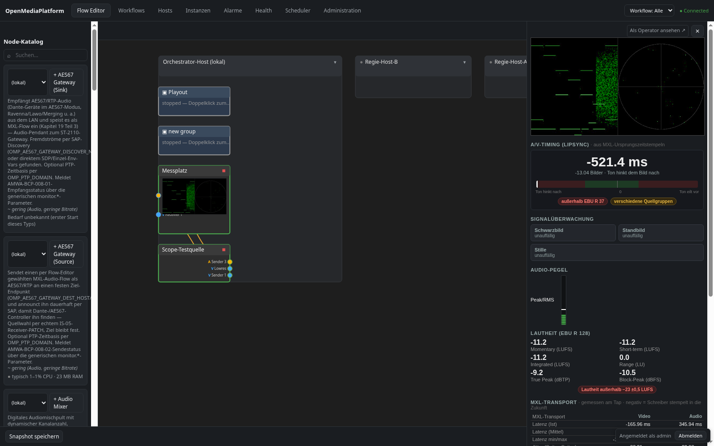

_The `omp-scope` measurement tap: lip-sync computed from the MXL grain
origin timestamps of the two flows (not from arrival times), scored
against the EBU R 37 window; held black/freeze/silence alarms; EBU R 128
loudness with ITU-R BS.1770 true peak. Further down the same panel:
per-flow transport latency, delay variation, cadence and dropped-grain
counters, next to what the writer actually declares about the flow._

### More screens

<table>
<tr>
<td width="33%">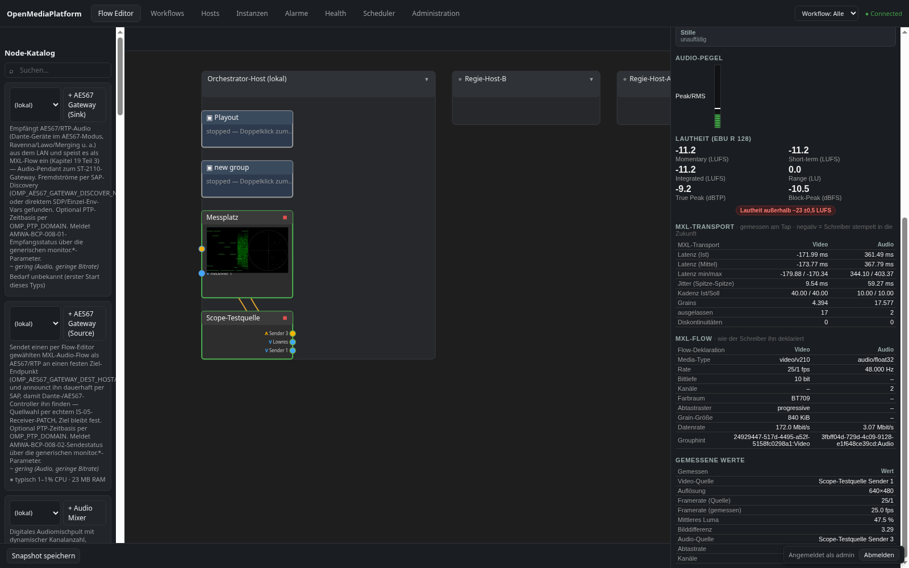<br><sub><code>omp-scope</code>: per-flow MXL transport latency, delay variation, cadence and dropped-grain counters, next to the writer's own flow declaration</sub></td>
<td width="33%">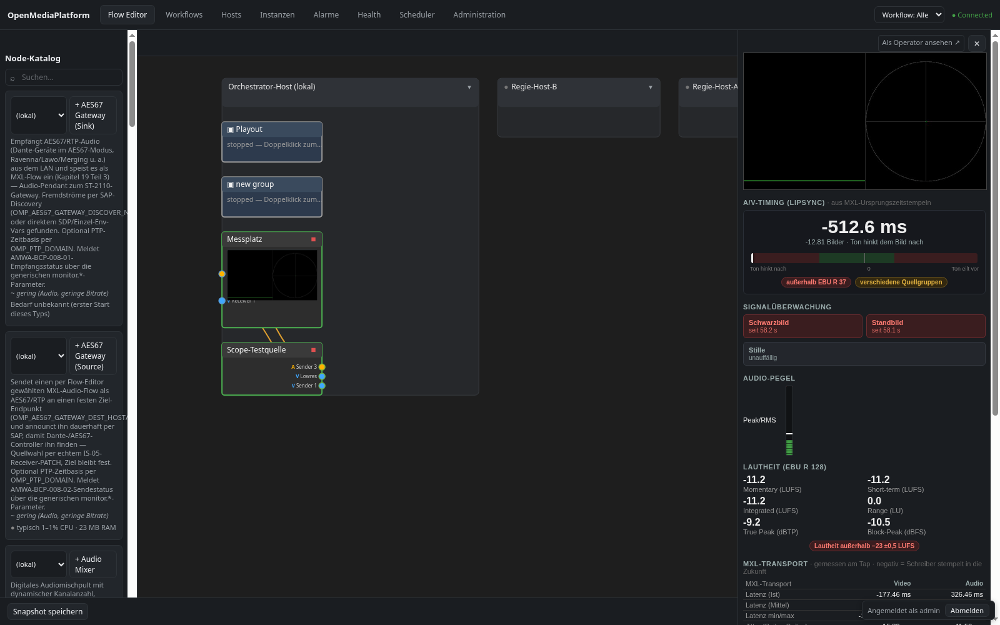<br><sub><code>omp-scope</code>: held black/freeze/silence QC alarms — debounced, not a false alarm on every cut</sub></td>
<td width="33%">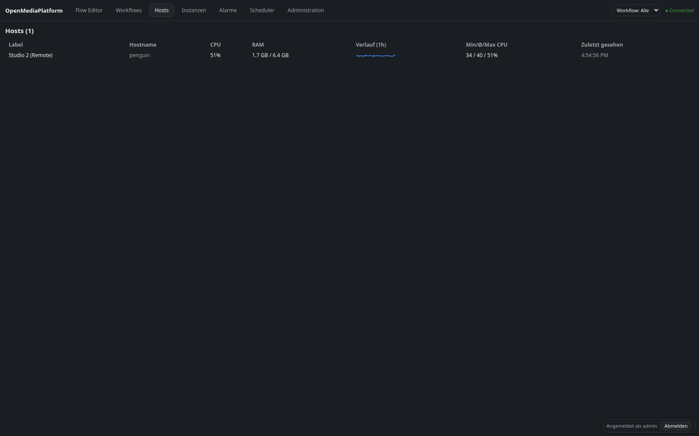<br><sub>Host list: CPU/RAM/network telemetry per host, online status, sparkline history</sub></td>
</tr>
<tr>
<td width="33%">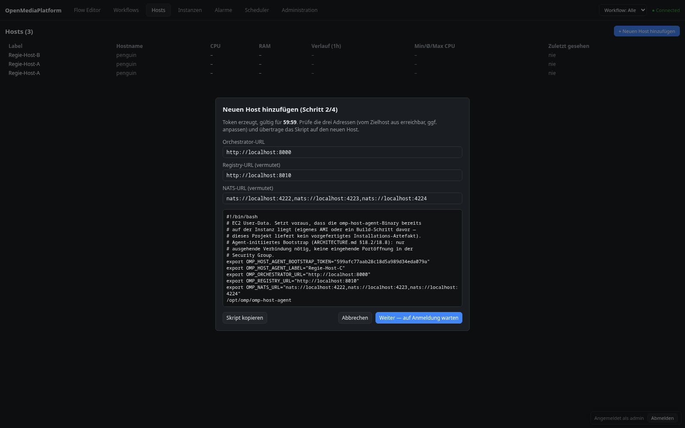<br><sub>Guided host onboarding — bare-metal, VM or AWS</sub></td>
<td width="33%">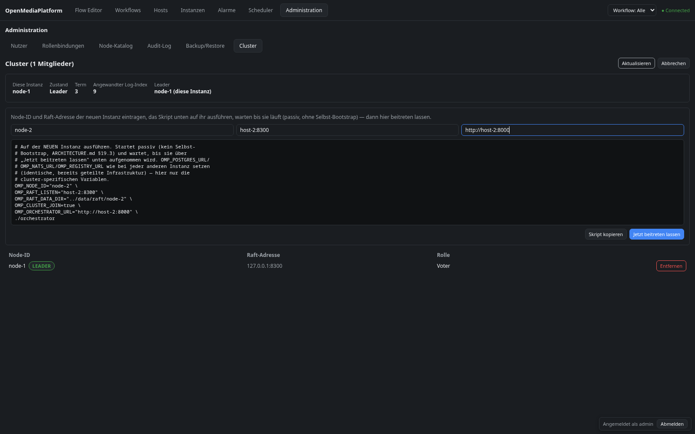<br><sub>Raft cluster status, guided join/leave for growing or shrinking the orchestrator cluster</sub></td>
<td width="33%">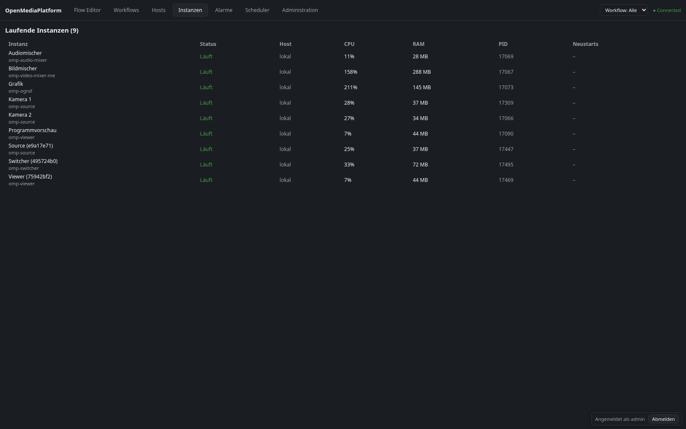<br><sub>Running instances: CPU/RAM per process, across all hosts</sub></td>
</tr>
<tr>
<td width="33%">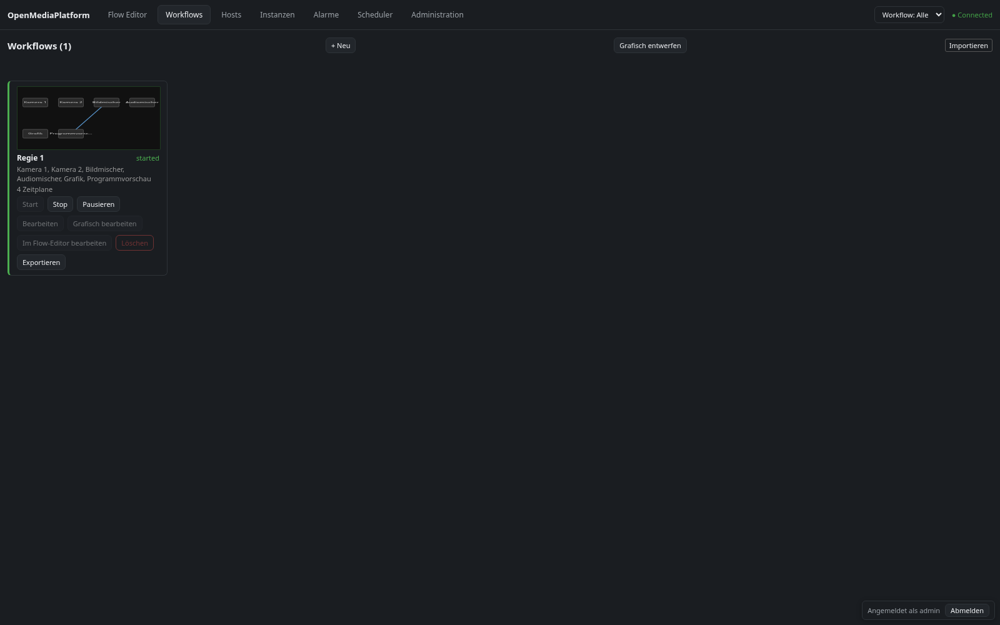<br><sub>Workflow management — presets, snapshots, running state</sub></td>
<td width="33%">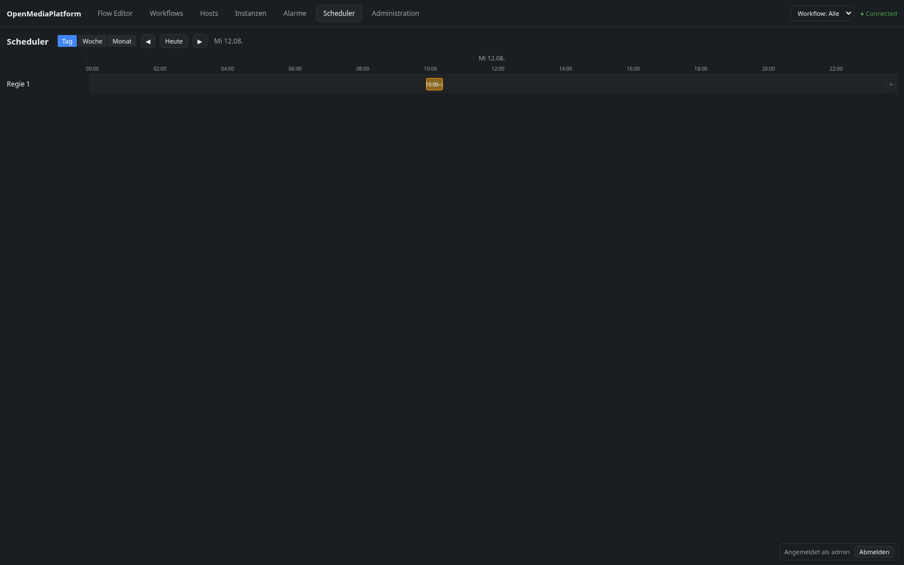<br><sub>Time-driven start/stop scheduling — day/week/month view, drag-to-move/resize</sub></td>
<td width="33%">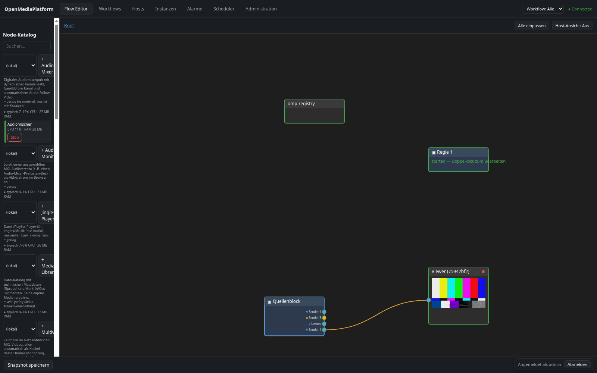<br><sub>Grouped/nested tiles in the flow editor</sub></td>
</tr>
<tr>
<td width="33%">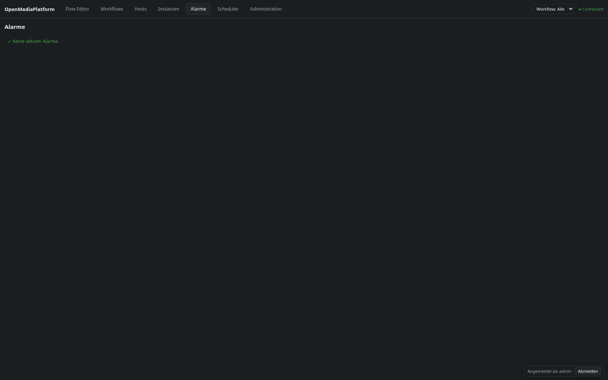<br><sub>Collected alarms across the whole fleet</sub></td>
<td width="33%">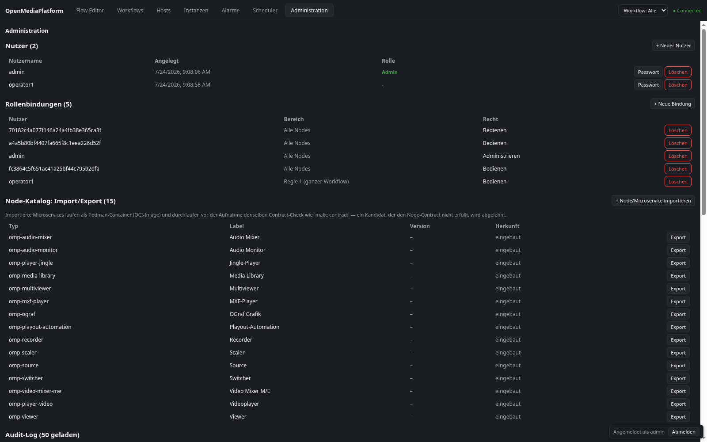<br><sub>Administration: users, role bindings, node catalog, audit log</sub></td>
<td width="33%">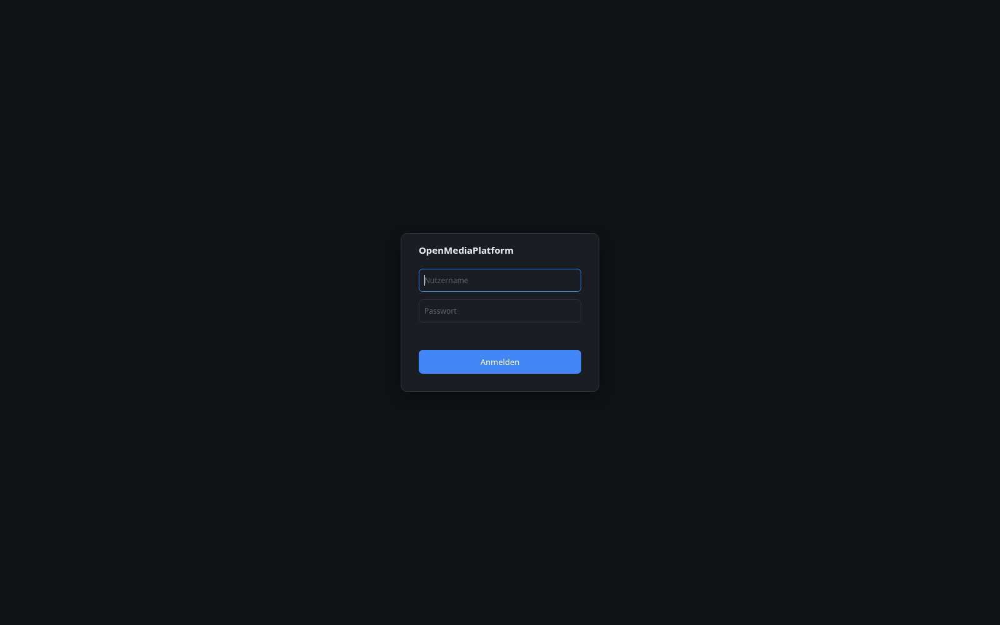<br><sub>Login — local user/role model with audit log</sub></td>
</tr>
</table>

Full walkthroughs and context for every screen above are in
[`docs/BENUTZERHANDBUCH.md`](docs/BENUTZERHANDBUCH.md).

## What's in the box

**Standard-based core**

- EBU DMF-style service decomposition — a mixer, a player, a graphics
  engine, etc. are independent, self-describing processes, not modules
  inside a monolith.
- AMWA NMOS IS-04 v1.3/IS-05 for discovery and routing; IS-12/IS-14 for
  self-described parameters and methods — the orchestrator never has
  built-in knowledge of a specific node type. IS-05 serves both the
  v1.1.x line and the current **v1.2.0** release side by side (wire-
  compatible, same handlers) so existing v1.1 controllers keep working
  while new ones can already target v1.2. Conformance isn't just
  claimed: the official AMWA NMOS Testing Tool runs in CI on every push
  against a real running registry (IS-04-02) and a real running node,
  for both IS-05-01 API versions, with every accepted deviation
  individually named and justified in the workflow file — no silent
  skips (and as of the latest pass, zero: all IS-05-01 exceptions,
  including the ones that needed a real Sender fixture, are closed).
- MXL zero-copy shared memory for same-host media exchange, on the
  current stable MXL release; SMPTE ST 2110 (+ SRT gateway for lossy
  WANs) or MXL-native Fabrics (RDMA) for cross-host exchange,
  including AES67 audio (Dante-compatible). Because MXL is an open
  format shared by the whole software-defined-production ecosystem
  (not an OMP-specific transport), interoperability was verified
  directly: OMP's own read/write path was run against the MXL
  project's independent reference tools on the same shared-memory
  domain — in both directions, including full pixel-level playback —
  confirming a third-party media function speaking the same open MXL
  format could exchange a flow with an OMP node with no gateway in
  between. IS-05 connection management for MXL flows now speaks the
  standardized **AMWA BCP-007-03** transport (`urn:x-nmos:transport:mxl`,
  real `mxl_domain_id`/`mxl_flow_id` parameters) instead of a proprietary
  transport string — a foreign, spec-compliant controller can address an
  OMP MXL sender/receiver as such, not just OMP's own orchestrator.
- **AMWA BCP-008-01/02 health monitoring**: real receiver/sender status
  (link, external sync, connection/transmission, stream/essence, plus
  an aggregated overall status) on every node that touches a real
  network or hardware boundary — `omp-2110-gateway`, `omp-decklink`,
  `omp-aes67-gateway`, `omp-srt-gateway` — backed by actual signals
  (GStreamer `rtpjitterbuffer` packet-loss counters, PTP lock state,
  DeckLink cable/format lock, real SRT connection statistics), not
  synthetic placeholders; MXL-internal nodes (`omp-video-mixer-me`,
  `omp-viewer`, `omp-recorder`) get the same status model applied to
  "is this input's MXL flow actually readable" instead of link health.
  Exposed as generic parameters (`monitor.*`), readable through the
  same self-description mechanism as everything else — no separate
  BCP-008 client needed to inspect it.
- PostgreSQL-backed state (highly available via Patroni + etcd, no
  single-node database SPOF), mTLS between orchestrator and nodes, a
  local user/role model with audit log — no external directory server
  required. The NMOS Registry (IS-04/05 Query/Registration API) can
  also be run over AMWA BCP-003-01 transport TLS (`make
  nmos-registry-tls-up`) instead of plaintext HTTP — opt-in, same as
  mTLS.
- The orchestrator itself runs as a Raft-consensus cluster (one or more
  instances, automatic leader election/failover) and the NATS event bus
  is clustered too — no single point of failure anywhere in the control
  plane. Both onboarding a new host (bare-metal, VM, or an AWS EC2
  instance) and growing the orchestrator cluster itself are guided,
  point-and-click wizards in the Administration UI — not a curl-only
  API you have to script by hand.

**Flow editor & workflows**

- Drag-and-drop canvas: nodes register automatically and appear as
  tiles; connecting two ports creates a real IS-05 connection.
- Reusable workflow objects (named role→role templates), snapshots/
  presets, grouping tiles into collapsible macro blocks, import/export.
- A scheduler tab for time-driven start/stop of whole workflows
  (day/week/month view, drag to move/resize).
- Multi-host operation is visible on the same canvas, not a separate
  screen: once more than one host is registered, the flow editor shows
  a zone per host (live CPU/RAM, fixed lanes, toggleable), a connection
  that crosses a host boundary while using host-local MXL is flagged
  automatically (dashed, with an explanation), zones are collapsible,
  and dragging a standalone node's tile into another zone triggers a
  guided move (stop, start on the target host, best-effort reconnect
  of its existing connections) after a confirmation dialog.

**Business process engine & asset catalog**

Deliberately a *second*, separate concept from the "workflow" objects
above (which are node-role deployment bundles, i.e. a control-room
setup) — a business-process/task-graph engine in the BPMN sense:
definitions, versions with an immutable-once-published lifecycle, and executions
that survive an orchestrator restart mid-run (crash-recovery is a
tested requirement, not an afterthought). The step vocabulary covers
task, media function (drives any self-described node method through
the same IS-12/14 contract the Flow Editor uses), service call,
allow-listed shell script (`ffmpeg`/`ffprobe` auto-detected on the
host, nothing else runs unless explicitly allow-listed) — with a
**guided assistant** on top rather than raw CLI flags: five tasks
(read technical metadata, make a thumbnail, convert format/codec,
extract an audio track, build a multi-track container) driven by the
host's *actual* installed ffmpeg — real encoder/container/filter
lists and their real options, valid ranges, and defaults, introspected
live rather than hand-maintained, plus a visual drag-and-drop
filter-graph builder (search a real filter, wire named pads, adjustable
pad count for filters like `amix`) that compiles to the real
`-filter_complex` syntax; raw arguments stay one click away for anyone
who prefers them — condition/
branch (a sandboxed expression language, no host access), parallel/
join, wait/timer, human task/approval (assign, claim, decide, with
optimistic-concurrency-safe state), notification, subworkflow, and
compensation. Domain events (e.g. an asset becoming ready) can start a
process automatically — delivered at-least-once via a Postgres
outbox written atomically with the state change, relayed through
clustered NATS JetStream, so a crashed relay never silently drops an
event. A visual, drag-and-drop step-graph editor (reusing the same
`ui/graph` pan/zoom/connect primitives as the Flow Editor and the
graphical workflow designer, on a genuine business-process graph
instead of a live NMOS wiring view) sits next to a plain HTTP API —
both produce the identical JSON. Alongside it, an asset/content domain
model (assets, versions, representations, free-form metadata
categories, an explicit ingest→…→published→archived lifecycle state
machine, plus collections and typed asset-to-asset relationships such
as `derived_from`/`version_of`) gives the process engine something
real to operate on. Storage is provider-agnostic by design and backed
by a real implementation, not just a placeholder: representations get
presigned upload/download URLs against an actual S3-compatible store
(MinIO), so media bytes move directly between client and object store,
never proxied through the orchestrator. A process execution can link
to the specific asset version it produced or consumed (a generic,
process/asset-agnostic link record, not a special case in either
domain), and every asset/process state change is additionally captured
in its own business-level audit trail, separate from the general
request audit log. Its own "Assets" tab offers search/filter, lifecycle
transitions (only those the backend state machine actually allows —
the UI reads them from the server rather than keeping its own copy), a
key/value metadata editor that keeps non-string values intact, and
versions with their technical representations; a published version is
enforced immutable on the server, not just hidden in the UI.

**Microservices** (demonstration nodes, not the focus — see the note
above) — each an independent process that self-registers via NMOS,
with its own UI and self-described parameters (full list with
functions: [`docs/HANDBUCH.md`](docs/HANDBUCH.md) §9):

- **omp-source** — test sources (color bars etc. plus test tone)
- **omp-decklink** — Blackmagic DeckLink SDI/IP capture card bridge,
  directed per instance (ingest: card → MXL; output: MXL → card,
  video-anchored with an independent optional audio leg); SDI and IP
  cards are addressed identically in software — a DeckLink IP card's
  network-side configuration (multicast/PTP/SDP) lives entirely in
  Blackmagic's own driver, outside NMOS's reach; also exposes AMWA NMOS
  IS-08 for its embedded SDI audio channels (e.g. remap embedded
  channels 3+4 onto program audio via the standard API)
- **omp-switcher** — simple video switcher between auto-discovered
  sources (no program/preset bus)
- **omp-video-mixer-me** — video mixer (1 M/E with cut, crossfade,
  picture-in-picture, downstream keyer)
- **omp-audio-mixer** — digital audio mixer with parametric EQ,
  per-channel compressor, master limiter, and audio-follow-video
- **omp-mxf-player** — MXF file player with program-group audio shuffle
  (cued playback, plus live-MXL-source and real-file playlist items)
- **omp-channel-player** — isel-free single-branch player for the
  playout automation channels (load-only, no playlist/cue-take)
- **omp-playout-automation** — playout automation (playlist-driven,
  Auto/Hold, Next/Next-Live/Stop, cart/interrupt assets; no pipeline of
  its own)
- **omp-viewer** / **omp-multiviewer** — single-stream preview and
  auto-discovered multi-tile monitoring (with automatic low-res preview
  fan-out)
- **omp-ograf** — EBU OGraf graphics overlay node (Fill+Key)
- **omp-media-library** — file catalog with technical metadata
  (ffprobe) and mark-in/out segments
- **omp-recorder** — records an MXL source (video/audio) to a Matroska
  file; MXL-only input, no capture-card dependency
- **omp-scaler** — scales/converts a connected MXL video source to a
  fixed target format; also one of two nodes that can absorb a
  workflow's declared output-delay compensation (see Status)
- **omp-scope** — a passive measurement tap (taps a video and/or an
  audio flow, sends nothing itself): waveform/vectorscope, EBU R 128
  loudness with ITU-R BS.1770 true peak, held black/freeze/silence
  alarms, and **A/V timing derived from the MXL grain origin
  timestamps** — per-flow transport latency, delay variation, measured
  vs. nominal cadence, dropped-grain and reader-restart counters, and
  the resulting lip-sync offset judged against EBU R 37 (see below)
- **omp-2110-gateway** / **omp-aes67-gateway** — native ST 2110 video /
  AES67 audio gateways for inter-site contribution with foreign
  equipment; `omp-2110-gateway` also carries an independent ST 2110-30
  audio ingest/output path alongside its video (its own MXL flow, own
  NMOS sender/receiver), and both nodes expose AMWA NMOS IS-08 (Audio
  Channel Mapping) so an external controller can re-route/mute their
  channels live, not just view them
- **omp-srt-gateway** — ST 2110 ⇄ SRT gateway for contribution over
  lossy WANs
- **omp-webrtc-gateway** — WebRTC (WHIP/WHEP) bridge for ordinary phone
  cameras and phone/browser monitors to join the MXL fabric with zero
  install, catalog entries for both directions
  (`omp-webrtc-gateway-camera` ingest, `omp-webrtc-gateway-monitor`
  playout). Connecting is invitation-only by design (a phone's browser
  is by definition on the open internet-facing side): an operator
  issues time-scoped invitation links/QR codes from the node's own UI,
  and WHIP/WHEP requests without a valid, unexpired invitation token
  are rejected outright — there is no way to join by guessing or
  scanning the endpoint URL alone.
- **omp-fabrics-gateway** — **remote memory access between hosts**:
  MXL-native Fabrics (libfabric/RDMA) instead of a network-stack hop —
  zero-copy, one-sided RDMA writes of a full MXL flow into another
  host's domain. Implemented and live-verified over the software `tcp`
  provider (no RDMA hardware required to test); `verbs`/`efa` providers
  for real RoCEv2 hardware are a drop-in config change, hardware
  procurement pending.
- **omp-pipeline-controller** — embeds `PIPELINE CONTROLLER` (a
  separate, previously production-run broadcast playout system) as an
  OMP node: its full web UI and REST API run unmodified in the
  container, shown via `<iframe>` in the operate panel. Registers two
  NMOS senders (program video/audio) and two receivers for real MXL
  I/O in the DMF fabric — live sources wired in via IS-05 connect are
  added to PIPELINE CONTROLLER's own live-source list automatically.
  No native OMP play/stop/cue methods of its own — playlist,
  graphics, player, assets, voiceover, and record stay exclusively on
  PIPELINE CONTROLLER's own UI.

All components run as independent services and can be started,
stopped, or extended independently — either locally via the built-in
instance launcher, or on a separate machine via a lightweight host
agent that registers itself with the orchestrator and executes only
pre-approved node types (agent-local catalog as the trust boundary,
not a wide-open remote-exec channel). Third-party microservices can
also be imported as Podman containers straight from the GUI, subject
to an admission check against the same node contract every built-in
node has to satisfy.

**Reliability & operations**

- Centralized observability: every IS-05 connect/disconnect and every
  request through the generic node proxy carries a trace ID (returned
  as an `X-OMP-Trace-Id` response header, success and failure alike),
  logged into a single, Raft/JetStream-replicated log channel — no
  per-host log-scraping across a multi-host deployment. A "Diagnose"
  tab in the Flow Editor tails that log live (SSE, filterable by trace
  ID/node/level), turns a failed connection's toast into a one-click
  jump straight to its trace, and — on that same click — briefly
  highlights every graph tile touched by that trace, so an operator
  sees the blast radius of a failure, not just an error string.
- Automatic process restart with a crash-loop brake; a metrics
  endpoint; an operations view with running instances (CPU/RAM per
  process), host resource history, and collected alarms.
- Optional hot-standby for critical roles: a mirrored instance takes
  over on crash-loop exhaustion or host-offline detection
  (break-before-make handover, operator state carried across).
- A workflow can declare a target end-to-end latency budget — the
  orchestrator hard-rejects wiring that can't meet it and automatically
  compensates paths that are too short by assigning output delay to
  capable nodes.
- A placement engine (overload alarm + target-host suggestion,
  configurable per workflow role between purely advisory, a
  confirmation window with automatic execution on expiry, or immediate
  automatic execution) plus, since Kapitel 13, a manual guided move via
  drag in the flow editor for standalone nodes (see above); the
  equivalent for workflow roles exists in the orchestrator (reuses the
  same make-before-break protocol) but has no UI trigger yet — see
  "What OpenMediaPlatform does not do" below.
- Login-based user/role accounts (local, no external directory server
  required) gate who can wire the graph, launch instances, or
  administer hosts; every write access is captured in an audit log.
  Multi-organization access scoping sits on top: each user belongs to
  one organization, and workflows/process definitions/assets/
  collections carry an owner organization — a user only sees and can
  act on their own organization's objects (cross-organization access
  returns a plain not-found, not a permission error, so it doesn't even
  leak that the object exists). Node/instance infrastructure itself
  stays shared across organizations by design, same as the rest of the
  control plane — this is access scoping for a multi-team/multi-client
  install, not a hard per-tenant data silo.
- **Measurement you can act on, not just monitoring.** Every MXL read
  path already carries the origin timestamp the *writer* stamped onto a
  grain (`timestamp/x-mxl-tai`). `omp-scope` reads it and turns it into
  real numbers: transport latency (`mxlGetTime()` minus grain origin,
  both from the same clock), its peak-to-peak variation, measured
  against nominal cadence, dropped grains — and, across a video and an
  audio flow, the **lip-sync offset**, because the difference of the two
  latencies cancels the unknown clock offset and doesn't require the two
  flows to be sampled at the same instant. It is judged against EBU
  R 37 (sound may lead picture by at most 40 ms and lag by at most
  60 ms — deliberately asymmetric, because the standard is).

  This paid for itself on the first run. Pointed at a plain test
  source, it measured that this project's own MXL writers drift against
  the MXL clock: video stamps its grains about four frames into the
  *future*, audio falls progressively behind. Both numbers were then
  confirmed independently by MXL's own `mxl-info` tool (audio: scope
  +408 ms vs. `mxl-info` +406 ms). That is not a new bug — it is the
  first actual measurement of a simplification `MxlVideoOutput` has
  documented since day one ("index initialised once, incremented
  freely, no drift correction … a production source should switch to
  the PTS-based method *if drift is observed*"). Nothing sounds wrong
  today, because no consumer in OMP plays out by TAI stamp; it is a
  latent defect that surfaces the moment one does. Fixing it belongs in
  the writer path and is its own step — the measuring device that can
  prove it is the prerequisite.

## What OpenMediaPlatform does **not** do

Being upfront about the current edges, not just the highlights:

- **No RDMA hardware verified.** MXL-native Fabrics is implemented and
  live-tested, but only over the software `tcp` libfabric provider;
  `verbs`/`efa` for real RoCEv2 NICs is a drop-in config change that
  hasn't been run against real hardware yet (procurement pending).
- **No NDI gateway, no proprietary Dante.** AES67 (which most Dante
  devices also speak) is supported via `omp-aes67-gateway`; native NDI
  and Dante's proprietary control protocol are not implemented.
- **Workflow-role migration has no drag-to-move UI yet.** The backend
  for moving a running workflow role to another host exists and is
  tested (`POST /api/v1/workflows/{id}/roles/{role}/migrate`), and the
  flow editor's host view now correctly places a running workflow's
  collapsed tile in the zone matching where its roles actually run
  (including a dedicated zone when roles are split across hosts) — but
  it's still one collapsed tile, so there's no individual-role tile to
  drag. Only standalone (non-workflow) node instances can be moved
  today via drag-and-drop; migrating a workflow role needs the API
  directly for now.
- **MXL writer timestamps drift against the MXL clock.** Measured, not
  suspected: `omp-scope` (plus MXL's own `mxl-info` as an independent
  check) shows the video writer stamping grains roughly four frames
  ahead of the clock and the audio writer falling progressively behind,
  so the A/V offset *as the timestamps describe it* is large and grows.
  Nothing misbehaves audibly today — every consumer here plays out by
  arrival time, not by TAI stamp — but a standards-facing consumer
  would be misled. The cause is the documented simplification in the
  MXL write path (grain index initialised once, then free-running, with
  no drift correction); the fix belongs there and hasn't been made yet.
  Related: OMP's own flow definitions use each flow's own ID as the
  NMOS grouphint group name, so a source's video and audio flows never
  share a group, which is exactly what that tag is for.
- **No independent security audit.** Auth, mTLS, and audit logging
  exist and are exercised by the test suite, but there has been no
  external penetration test or formal security review.
- **Not production-hardened at broadcast scale.** This is a working
  proof of concept, developed and demonstrated on a single laptop-class
  machine (see below) — it has not been run in a real multi-day,
  multi-operator broadcast production, and there is no commercial
  support offering.
- **No mobile/tablet-optimized UI.** The web UI targets desktop
  operator positions and engineering workstations.
- **No external identity provider.** User accounts are local to the
  orchestrator; there is no SSO/LDAP/OIDC integration.

If any of these matter for your use case and you'd like to help close
the gap, contributions and issues are welcome.

## Status

Architecture/tech stack decided (see `ARCHITECTURE.md`), implementation
follows `UMSETZUNG.md` (status checklist there, continuously updated —
that's where the actual current state lives, not here).

Already in place: foundation, drag-and-drop flow editor, workflow
objects/presets, the small control room (source/switcher/video mixer/
audio mixer/player/multiviewer/playout automation/OGraf graphics, all
launchable from the GUI), mixer presets (snapshot/recall), ST 2110
video/AES67 audio (incl. Dante in AES67 mode, SAP discovery) plus a
native ST 2110 gateway in addition to the SRT gateway, an opt-in PTP
timebase for the 2110 paths (`OMP_PTP_DOMAIN`, verified live
synchronized across two network namespaces), real **remote memory
access** between two OMP hosts via MXL-native Fabrics
(`omp-fabrics-gateway`, verified live over the software `tcp` provider
— RDMA zero-copy testable without RDMA hardware, see
`docs/HANDBUCH.md` §9.3), a highly available PostgreSQL backend
(Patroni + etcd, automatic primary failover), mTLS orchestrator↔
nodes, a local user/role model with login and audit log, a node SDK
tutorial, remote-host discovery including a command channel (instances
can also be started/stopped on a remote machine, via a host agent with
a host-local catalog as the trust boundary), automatic process restart
with a crash-loop brake, a metrics endpoint, plus an operations view
with running instances (CPU/RAM per process), host resource history,
and collected alarms. The flow editor itself automatically shows host
zones on the same canvas once more than one host is registered (one
zone per machine with live CPU/RAM, fixed lanes, toggleable) — makes it
visible at a glance which instance is actually running on which host,
not just in the separate hosts tab. A connection that would cross a
host boundary over host-local MXL is flagged in a warning style right
on the canvas, zones can be collapsed, and a standalone node's tile can
be dragged into another zone to trigger a guided move (confirmation
dialog, then stop/start/reconnect). Also added since then: a scheduler
tab for time-driven start/stop of entire workflows (day/week/month
view, drag-to-move/resize schedules), a resource preview (typical
CPU/RAM load per node type right in the catalog, from real measurement
history), a GUI import path for containerized third-party microservices
(Podman images, admission check, multiple versions of the same type in
parallel), and a placement engine (overload alarm + target-host
suggestion, already accounts for other workflows' scheduled runs) —
since Kapitel D6 Teil 4 configurable per workflow role between purely
advisory (default), a confirmation window with automatic execution on
expiry, and immediate automatic execution, each via a real
make-before-break move to a healthy fallback host. Since Kapitel K7
Teil 4 additionally an automatic hot-standby failover for critical
roles (`Role.standbyFor`, triggered by crash-loop or host-offline
detection, operator state carried over via the existing state
export/import mechanism), plus, since D8, a workflow latency budget
(`targetLatencyFrames`): the orchestrator hard-rejects wiring that
can't meet the target and automatically compensates paths that are too
short by assigning output delay to capable nodes (currently
`omp-scaler`, `omp-video-mixer-me`). Since Kapitel 13 Teil 4, a running
workflow's collapsed tile is placed in the host zone matching where its
roles actually run (its own zone when split across hosts), instead of
floating outside the host view; the operator console also now shows
which host each assigned node UI is running on. Since Kapitel D9/D11,
IS-05-01 (Connection API) conformance runs for real in CI against a
running node, not just IS-04-02 against the registry — the official
AMWA NMOS Testing Tool goes from 0 executed tests to 29 passing after
adding the missing base-discovery endpoints and fixing real gaps it
then surfaced (schema-incomplete default responses, PATCH accepting
malformed bodies, a scheduled-activation TAI/UTC time bug), with every
remaining accepted deviation named individually rather than skipped
silently. The mock node also gained a real Sender-side IS-05 Connection
API (staged/active/constraints/transporttype/transportfile, bulk POST),
closing the one remaining exception group (`auto_connection_*`, which
needs a real IS-04-registered sender to connect to) — CI now runs with
zero accepted deviations for IS-05-01. The Connection API now also
serves the current **AMWA IS-05 v1.2.0** release (Aug. 2024) side by
side with v1.1.x — checked against the real v1.2.0 schemas/examples
rather than assumed, with node-global version/bulk discovery and CORS
preflight support added across all node implementations, Rust included
(Go/mock-node side verified green against both API versions in CI;
Rust nodes aren't part of the CI gate at all, verified locally instead —
see `docs/decisions.md` Nachtrag 189–197 for the full trail). Since
Kapitel D10, a real
Blackmagic DeckLink SDI/IP capture
card can be bridged to/from MXL (`omp-decklink`, both directions).
Since D12, the orchestrator itself runs as a Raft-consensus cluster —
one or more instances, automatic leader election, and the critical
control-plane state (migration locks, crash-loop tracking, standby
promotion, scheduler firing) survives a leader failover without
duplicate or lost actions. Since D13, I/O cards (e.g. the DeckLink
ports above) are a placement-aware resource: a real device inventory
plus exclusive claim/release means the placement engine only ever
starts an instance where the required port is actually free, with a
clean rejection (and rollback) otherwise. Since D14, the NATS event bus
is clustered too (three nodes, automatic client failover). Since D15,
PostgreSQL itself is highly available via Patroni + etcd — a killed
primary is automatically promoted from a replica within seconds, and
the orchestrator's own database connection follows the failover with
no restart. Together, D12/D14/D15 close every remaining single point of
failure in the control plane (orchestrator process, event bus, and
datastore are all redundant now). Also added since then: a guided
Host-Setup wizard (bare-metal/VM/AWS, in the Hosts tab) and a Cluster
tab under Administration (Raft status, plus a guided join/leave for
growing or shrinking the orchestrator cluster) — both flows existed as
API-only since D6/D12, now they're a walkthrough in the UI. Most
recently, AMWA BCP-008-01/02 receiver/sender status monitoring landed
across every node with a real network/hardware boundary
(`omp-2110-gateway`, `omp-decklink`, `omp-aes67-gateway`,
`omp-srt-gateway`) plus the MXL-internal nodes that most benefit from
knowing whether an input's flow is actually readable
(`omp-video-mixer-me`, `omp-viewer`, `omp-recorder`) — real signals
throughout (GStreamer jitterbuffer stats, PTP lock, DeckLink cable
lock, SRT connection stats), exposed as generic `monitor.*` parameters
on each node's self-description.

Since D16, the NMOS Registry can run over AMWA BCP-003-01 transport TLS
instead of plaintext HTTP (opt-in, `make nmos-registry-tls-up`, same
model as orchestrator↔node mTLS). Since D17/D18/D21, AMWA NMOS IS-08
(Audio Channel Mapping) is live on all three gateway/card nodes that
carry an independent audio path (`omp-aes67-gateway`, `omp-decklink`'s
embedded SDI audio, and `omp-2110-gateway`'s new ST 2110-30 audio
ingest/output) — a real `audiomixmatrix` routed live via the standard
`/x-nmos/channelmapping/v1.0/` API, not just a status readout. Since
D19/D20, a centralized observability system ties it all together: a
trace ID follows every IS-05 connect/disconnect and generic-proxy
request end to end, landing in one replicated log channel instead of
scattered per-process stdout, surfaced through a "Diagnose" tab in the
Flow Editor with live tailing, trace pivoting, and a graph overlay that
highlights every tile a failing trace actually touched.

Most recently, the measurement node `omp-scope` grew from a picture-and-
level scope into a timing instrument: per-flow MXL transport latency,
delay variation, cadence and dropped-grain counters read from the grain
origin timestamps, lip-sync scored against EBU R 37, the writer's own
flow declaration shown next to the measured reality, held black/freeze/
silence alarms, and ITU-R BS.1770 true peak with an EBU R 128 compliance
verdict — which immediately surfaced a real, independently confirmed
clock-drift defect in this project's own MXL writers (see "What
OpenMediaPlatform does not do"). The MXL core itself was also brought
up to the current stable release, and interoperability against the MXL
project's own independent reference tooling was verified directly, in
both directions and down to actual pixels — see the MXL bullet above.

Most recently, the MXL transport moved from a proprietary
`urn:x-omp:transport:mxl` to the now-standardized **AMWA BCP-007-03
v1.0.0** transport (`urn:x-nmos:transport:mxl`, real
`mxl_domain_id`/`mxl_flow_id` IS-05 transport parameters instead of
transport-mismatched leftover RTP fields) — the gap a competing
multi-vendor DMF interop showcase at IBC 2026 would otherwise have
exposed immediately. Since the official AMWA NMOS Testing Tool has no
BCP-007-03 suite yet (the spec is from August 2026), our own
`contract-check` tool gained a schema-conformance check against the
real published JSON schemas instead, live-verified against two
IS-05-connected node instances. Checking that fix's blast radius also
led to actually rebuilding MXL-native Fabrics with the RDMA feature
flag on against the current MXL release, which surfaced (and fixed) a
real regression: current MXL now requires an explicit transfer
capability on fabrics setup that this project's fabrics wrapper never
set, silently working only by the old library's lack of validation —
re-verified live with a real one-sided RDMA write between two MXL
domains, RDMA-hardware-free.

Most recently, Kapitel 21 added the business-process engine and
asset/content domain model described above (definitions/versions/
crash-recoverable executions, the full BPMN-style step vocabulary,
reliable domain-event triggers via a Postgres outbox + clustered NATS
JetStream, an HTTP API for both domains, and a visual drag-and-drop
step-graph editor reusing the Flow Editor's own `ui/graph` primitives)
— live-verified end to end against the real running orchestrator at
every step, including a real browser click-through of the visual
editor (genuine CDP-driven mouse drags, not just API calls) that
created a step graph, connected it, and ran it to completion. The
"Assets" tab followed, along with editing an existing process version
in the visual editor.

Most recently, the asset/content domain model grew collections and
typed asset-to-asset relationships, a generic link between a process
execution and the specific asset version it produced/consumed, its own
business-level audit trail separate from the general request audit
log, and real MinIO/S3-backed storage for representations via
presigned upload/download URLs (media bytes never proxy through the
orchestrator). `omp-webrtc-gateway` landed as a new microservice pair
(camera/monitor) so an ordinary phone browser can join the MXL fabric
over WHIP/WHEP with zero install — gated by operator-issued, time-
scoped invitation links/QR codes rather than a bare, guessable
endpoint. The platform also gained multi-organization access scoping
(Kapitel 21 B14): each user belongs to one organization, workflows/
process definitions/assets/collections carry an owner organization,
and every read/write on someone else's organization's object returns a
plain not-found rather than a permission error or any other sign the
object exists — live-verified with two real organizations and
confirmed non-disruptive to all pre-existing, organization-less data
(grandfathered into a default organization).

Most recently of all, Kapitel 22 turned the allow-listed `ffmpeg`/
`ffprobe` script step from raw CLI flags into a guided assistant: five
tasks (metadata, thumbnail, format/codec conversion, audio extraction,
multi-track container) backed by the host's actually installed
ffmpeg's real encoders/containers/filters and their real options —
introspected live, not a hand-maintained list — plus a visual drag-and-
drop filter-graph builder that compiles real filter names and pads
into an actual `-filter_complex` string; the raw-arguments editor
stays one click away. A hardening pass building several deliberately
different real scenarios (a multi-track container with its own video
source, the same as a different container as a metadata control test,
audio extraction, a filter graph with a variable-pad-count filter)
found and fixed two genuine gaps this way rather than special-casing
around them — a video source wrongly tied to the first audio track,
and multi-input filter graphs having no way to supply more than one
input file — plus a third found by actually running the generated
command: `-c:v copy` into MXF failing for some source codecs on the
project's ffmpeg build, now a selectable encoder instead of a hard-
coded assumption. Every scenario was run for real and checked with
`ffprobe`, not just previewed.

Open: the MXL writer clock drift and grouphint gap that `omp-scope`
just made measurable, RDMA hardware integration (`verbs`/EFA providers,
pending hardware procurement), an NDI gateway, proprietary Dante (Dante in
AES67 mode already runs via `omp-aes67-gateway`), a drag-to-move UI
for the already-built workflow-role migration backend (the flow
editor now at least places a running workflow's tile in its correct
host zone, see "What OpenMediaPlatform does not do" above).

## License

Apache License 2.0 — see [`LICENSE`](LICENSE). Vendored third-party
components under `third_party/` (MXL, libfabric) are never committed
to this repository (fetched at build time by `deploy/dev/install-mxl.sh`
and friends) and keep their own upstream licenses (both Apache-2.0/
BSD-or-GPLv2-compatible).

## Related project

For broadcast/GStreamer/playout experience, see `PIPELINE CONTROLLER`
(separate repo, see `CLAUDE.md` for details).
