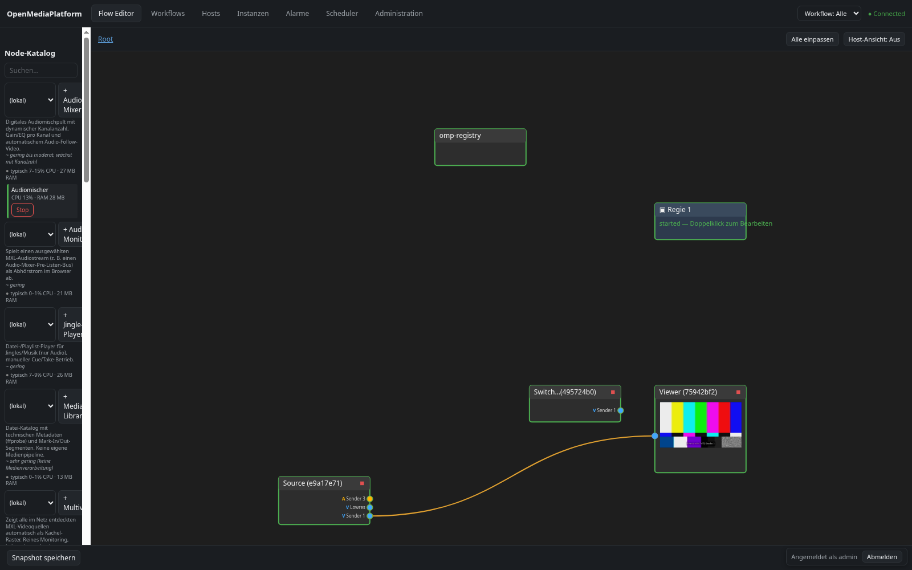
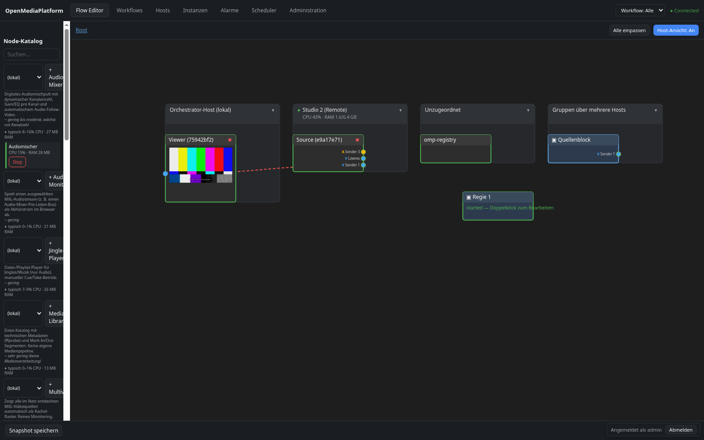
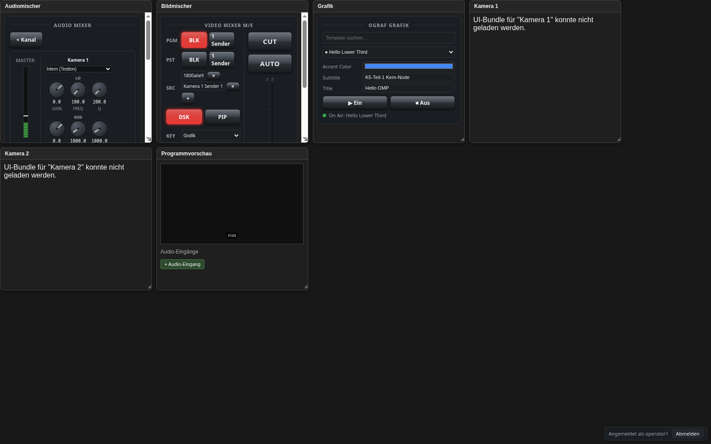

# OpenMediaPlatform


New, standalone project (separate from `PIPELINE CONTROLLER`).

## An Open-Source Orchestrator for Broadcast – A Current Status

The goal is a proof of concept for a modular broadcast and streaming platform that adheres to open standards and brings modern software architectures to the broadcast world.

The focus is not on a single product, but rather on how to assemble a complete production system from independent services.

The architectural foundation is the EBU Dynamic Media Facility (DMF) model: Functions such as video mixers, audio mixers, playout, graphics, and signal sources are not conceived as monolithic applications, but as independent, loosely coupled services that can be dynamically orchestrated.

For local, high-performance media exchange, MXL (Media Exchange Layer) is used. MXL enables zero-copy exchange of audio and video data between processes on the same host, thus replacing the traditional approach of unnecessarily transporting media streams over network stacks or proprietary interfaces. When multiple hosts are involved, communication takes place either via SMPTE ST 2110 (with an SRT gateway for contribution/distribution over lossy networks) or, as a zero-copy alternative, via MXL-native Fabrics — real remote memory access (RDMA) between two MXL domains on different hosts, verified live over a software transport, with a drop-in path to real RDMA hardware.

The core of the system is an orchestrator developed in Go. It handles discovery, routing, and communication between the individual services. NATS is used as the event bus, while AMWA NMOS (IS-04 and IS-05) handles the automatic registration and routing of the components. This means the orchestrator doesn't have to rely on fixed device types or proprietary interfaces.

An essential part of the architecture is also the NMOS Control Framework (IS-12/IS-14). Each service describes its own parameters and capabilities. Therefore, the orchestrator doesn't need to know whether it's a video mixer, audio mixer, or a future node type. New components can be integrated without requiring any modifications to the orchestrator. This self-description capability is precisely what makes the platform scalable in the long term.

Although the project is still in its early stages, the current version is already fully functional on my Chromebook. For me, this is important proof that modern broadcast architectures can initially be developed and validated with manageable resources.

I'm excited to see how this approach evolves and look forward to exchanging ideas with everyone involved in software-defined broadcast systems, open standards, or modern media architectures.

## Quickstart

```sh
make start   # NATS + NMOS registry + orchestrator, see docs/HANDBUCH.md
```

Then open http://localhost:8000. Details/troubleshooting:
[`docs/HANDBUCH.md`](docs/HANDBUCH.md). User guide for the UI (with
screenshots): [`docs/BENUTZERHANDBUCH.md`](docs/BENUTZERHANDBUCH.md).
(Both docs are in German — this README is the only English-language
entry point so far.)

## Screenshots



_The flow editor: node catalog on the left, drag-and-drop wiring on the
canvas, a running workflow shown as a collapsible tile._



_Multi-host operation made visible: each registered host gets its own
zone with live CPU/RAM; a source migrated to a second host while its
viewer stayed local — the resulting MXL connection (host-local by
design) is automatically flagged in the warning style, because that
link needs an ST 2110/SRT/Fabrics gateway to actually work across
hosts, not a same-host zero-copy MXL flow._



_An operator's console: every node UI it's entitled to operate, live,
side by side — no flow editor, no catalog, nothing to misconfigure._

More screens (login, instances, workflows, scheduler, alarms,
administration, hosts, grouped tiles) are in
[`docs/BENUTZERHANDBUCH.md`](docs/BENUTZERHANDBUCH.md).

## What's in the box

**Standard-based core**

- EBU DMF-style service decomposition — a mixer, a player, a graphics
  engine, etc. are independent, self-describing processes, not modules
  inside a monolith.
- AMWA NMOS IS-04/IS-05 for discovery and routing; IS-12/IS-14 for
  self-described parameters and methods — the orchestrator never has
  built-in knowledge of a specific node type. Conformance isn't just
  claimed: the official AMWA NMOS Testing Tool runs in CI on every push
  against a real running registry (IS-04-02) and a real running node
  (IS-05-01), with every accepted deviation individually named and
  justified in the workflow file — no silent skips.
- MXL zero-copy shared memory for same-host media exchange; SMPTE
  ST 2110 (+ SRT gateway for lossy WANs) or MXL-native Fabrics (RDMA)
  for cross-host exchange, including AES67 audio (Dante-compatible).
- PostgreSQL-backed state (highly available via Patroni + etcd, no
  single-node database SPOF), mTLS between orchestrator and nodes, a
  local user/role model with audit log — no external directory server
  required.
- The orchestrator itself runs as a Raft-consensus cluster (one or more
  instances, automatic leader election/failover) and the NATS event bus
  is clustered too — no single point of failure anywhere in the control
  plane.

**Flow editor & workflows**

- Drag-and-drop canvas: nodes register automatically and appear as
  tiles; connecting two ports creates a real IS-05 connection.
- Reusable workflow objects (named role→role templates), snapshots/
  presets, grouping tiles into collapsible macro blocks, import/export.
- A scheduler tab for time-driven start/stop of whole workflows
  (day/week/month view, drag to move/resize).
- Multi-host operation is visible on the same canvas, not a separate
  screen: once more than one host is registered, the flow editor shows
  a zone per host (live CPU/RAM, fixed lanes, toggleable), a connection
  that crosses a host boundary while using host-local MXL is flagged
  automatically (dashed, with an explanation), zones are collapsible,
  and dragging a standalone node's tile into another zone triggers a
  guided move (stop, start on the target host, best-effort reconnect
  of its existing connections) after a confirmation dialog.

**Microservices** — each an independent process that self-registers
via NMOS, with its own UI and self-described parameters (full list
with functions: [`docs/HANDBUCH.md`](docs/HANDBUCH.md) §9):

- **omp-source** — test sources (color bars etc. plus test tone)
- **omp-decklink** — Blackmagic DeckLink SDI/IP capture card bridge,
  directed per instance (ingest: card → MXL; output: MXL → card,
  video-anchored with an independent optional audio leg); SDI and IP
  cards are addressed identically in software — a DeckLink IP card's
  network-side configuration (multicast/PTP/SDP) lives entirely in
  Blackmagic's own driver, outside NMOS's reach
- **omp-switcher** — simple video switcher between auto-discovered
  sources (no program/preset bus)
- **omp-video-mixer-me** — video mixer (1 M/E with cut, crossfade,
  picture-in-picture, downstream keyer)
- **omp-audio-mixer** — digital audio mixer with parametric EQ,
  per-channel compressor, master limiter, and audio-follow-video
- **omp-player** — video player and jingle player (cued playback, plus
  live-MXL-source and real-file playlist items)
- **omp-playout-automation** — playout automation (playlist-driven,
  Auto/Hold, Next/Next-Live/Stop, cart/interrupt assets; no pipeline of
  its own)
- **omp-viewer** / **omp-multiviewer** — single-stream preview and
  auto-discovered multi-tile monitoring (with automatic low-res preview
  fan-out)
- **omp-ograf** — EBU OGraf graphics overlay node (Fill+Key)
- **omp-media-library** — file catalog with technical metadata
  (ffprobe) and mark-in/out segments
- **omp-recorder** — records an MXL source (video/audio) to a Matroska
  file; MXL-only input, no capture-card dependency
- **omp-scaler** — scales/converts a connected MXL video source to a
  fixed target format; also one of two nodes that can absorb a
  workflow's declared output-delay compensation (see Status)
- **omp-2110-gateway** / **omp-aes67-gateway** — native ST 2110 video /
  AES67 audio gateways for inter-site contribution with foreign
  equipment
- **omp-srt-gateway** — ST 2110 ⇄ SRT gateway for contribution over
  lossy WANs
- **omp-fabrics-gateway** — **remote memory access between hosts**:
  MXL-native Fabrics (libfabric/RDMA) instead of a network-stack hop —
  zero-copy, one-sided RDMA writes of a full MXL flow into another
  host's domain. Implemented and live-verified over the software `tcp`
  provider (no RDMA hardware required to test); `verbs`/`efa` providers
  for real RoCEv2 hardware are a drop-in config change, hardware
  procurement pending.

All components run as independent services and can be started,
stopped, or extended independently — either locally via the built-in
instance launcher, or on a separate machine via a lightweight host
agent that registers itself with the orchestrator and executes only
pre-approved node types (agent-local catalog as the trust boundary,
not a wide-open remote-exec channel). Third-party microservices can
also be imported as Podman containers straight from the GUI, subject
to an admission check against the same node contract every built-in
node has to satisfy.

**Reliability & operations**

- Automatic process restart with a crash-loop brake; a metrics
  endpoint; an operations view with running instances (CPU/RAM per
  process), host resource history, and collected alarms.
- Optional hot-standby for critical roles: a mirrored instance takes
  over on crash-loop exhaustion or host-offline detection
  (break-before-make handover, operator state carried across).
- A workflow can declare a target end-to-end latency budget — the
  orchestrator hard-rejects wiring that can't meet it and automatically
  compensates paths that are too short by assigning output delay to
  capable nodes.
- A placement engine (overload alarm + target-host suggestion,
  configurable per workflow role between purely advisory, a
  confirmation window with automatic execution on expiry, or immediate
  automatic execution) plus, since Kapitel 13, a manual guided move via
  drag in the flow editor for standalone nodes (see above); the
  equivalent for workflow roles exists in the orchestrator (reuses the
  same make-before-break protocol) but has no UI trigger yet — see
  "What OpenMediaPlatform does not do" below.
- Login-based user/role accounts (local, no external directory server
  required) gate who can wire the graph, launch instances, or
  administer hosts; every write access is captured in an audit log.

## What OpenMediaPlatform does **not** do

Being upfront about the current edges, not just the highlights:

- **No RDMA hardware verified.** MXL-native Fabrics is implemented and
  live-tested, but only over the software `tcp` libfabric provider;
  `verbs`/`efa` for real RoCEv2 NICs is a drop-in config change that
  hasn't been run against real hardware yet (procurement pending).
- **No NDI gateway, no proprietary Dante.** AES67 (which most Dante
  devices also speak) is supported via `omp-aes67-gateway`; native NDI
  and Dante's proprietary control protocol are not implemented.
- **Workflow-role migration has no drag-to-move UI yet.** The backend
  for moving a running workflow role to another host exists and is
  tested (`POST /api/v1/workflows/{id}/roles/{role}/migrate`), and the
  flow editor's host view now correctly places a running workflow's
  collapsed tile in the zone matching where its roles actually run
  (including a dedicated zone when roles are split across hosts) — but
  it's still one collapsed tile, so there's no individual-role tile to
  drag. Only standalone (non-workflow) node instances can be moved
  today via drag-and-drop; migrating a workflow role needs the API
  directly for now.
- **No independent security audit.** Auth, mTLS, and audit logging
  exist and are exercised by the test suite, but there has been no
  external penetration test or formal security review.
- **Not production-hardened at broadcast scale.** This is a working
  proof of concept, developed and demonstrated on a single laptop-class
  machine (see below) — it has not been run in a real multi-day,
  multi-operator broadcast production, and there is no commercial
  support offering.
- **No mobile/tablet-optimized UI.** The web UI targets desktop
  operator positions and engineering workstations.
- **No external identity provider.** User accounts are local to the
  orchestrator; there is no SSO/LDAP/OIDC integration.

If any of these matter for your use case and you'd like to help close
the gap, contributions and issues are welcome.

## Status

Architecture/tech stack decided (see `ARCHITECTURE.md`), implementation
follows `UMSETZUNG.md` (status checklist there, continuously updated —
that's where the actual current state lives, not here).

Already in place: foundation, drag-and-drop flow editor, workflow
objects/presets, the small control room (source/switcher/video mixer/
audio mixer/player/multiviewer/playout automation/OGraf graphics, all
launchable from the GUI), mixer presets (snapshot/recall), ST 2110
video/AES67 audio (incl. Dante in AES67 mode, SAP discovery) plus a
native ST 2110 gateway in addition to the SRT gateway, an opt-in PTP
timebase for the 2110 paths (`OMP_PTP_DOMAIN`, verified live
synchronized across two network namespaces), real **remote memory
access** between two OMP hosts via MXL-native Fabrics
(`omp-fabrics-gateway`, verified live over the software `tcp` provider
— RDMA zero-copy testable without RDMA hardware, see
`docs/HANDBUCH.md` §9.3), a highly available PostgreSQL backend
(Patroni + etcd, automatic primary failover), mTLS orchestrator↔
nodes, a local user/role model with login and audit log, a node SDK
tutorial, remote-host discovery including a command channel (instances
can also be started/stopped on a remote machine, via a host agent with
a host-local catalog as the trust boundary), automatic process restart
with a crash-loop brake, a metrics endpoint, plus an operations view
with running instances (CPU/RAM per process), host resource history,
and collected alarms. The flow editor itself automatically shows host
zones on the same canvas once more than one host is registered (one
zone per machine with live CPU/RAM, fixed lanes, toggleable) — makes it
visible at a glance which instance is actually running on which host,
not just in the separate hosts tab. A connection that would cross a
host boundary over host-local MXL is flagged in a warning style right
on the canvas, zones can be collapsed, and a standalone node's tile can
be dragged into another zone to trigger a guided move (confirmation
dialog, then stop/start/reconnect). Also added since then: a scheduler
tab for time-driven start/stop of entire workflows (day/week/month
view, drag-to-move/resize schedules), a resource preview (typical
CPU/RAM load per node type right in the catalog, from real measurement
history), a GUI import path for containerized third-party microservices
(Podman images, admission check, multiple versions of the same type in
parallel), and a placement engine (overload alarm + target-host
suggestion, already accounts for other workflows' scheduled runs) —
since Kapitel D6 Teil 4 configurable per workflow role between purely
advisory (default), a confirmation window with automatic execution on
expiry, and immediate automatic execution, each via a real
make-before-break move to a healthy fallback host. Since Kapitel K7
Teil 4 additionally an automatic hot-standby failover for critical
roles (`Role.standbyFor`, triggered by crash-loop or host-offline
detection, operator state carried over via the existing state
export/import mechanism), plus, since D8, a workflow latency budget
(`targetLatencyFrames`): the orchestrator hard-rejects wiring that
can't meet the target and automatically compensates paths that are too
short by assigning output delay to capable nodes (currently
`omp-scaler`, `omp-video-mixer-me`). Since Kapitel 13 Teil 4, a running
workflow's collapsed tile is placed in the host zone matching where its
roles actually run (its own zone when split across hosts), instead of
floating outside the host view; the operator console also now shows
which host each assigned node UI is running on. Since Kapitel D9/D11,
IS-05-01 (Connection API) conformance runs for real in CI against a
running node, not just IS-04-02 against the registry — the official
AMWA NMOS Testing Tool goes from 0 executed tests to 29 passing after
adding the missing base-discovery endpoints and fixing real gaps it
then surfaced (schema-incomplete default responses, PATCH accepting
malformed bodies, a scheduled-activation TAI/UTC time bug), with every
remaining accepted deviation named individually rather than skipped
silently. Since Kapitel D10, a real Blackmagic DeckLink SDI/IP capture
card can be bridged to/from MXL (`omp-decklink`, both directions).
Since D12, the orchestrator itself runs as a Raft-consensus cluster —
one or more instances, automatic leader election, and the critical
control-plane state (migration locks, crash-loop tracking, standby
promotion, scheduler firing) survives a leader failover without
duplicate or lost actions. Since D13, I/O cards (e.g. the DeckLink
ports above) are a placement-aware resource: a real device inventory
plus exclusive claim/release means the placement engine only ever
starts an instance where the required port is actually free, with a
clean rejection (and rollback) otherwise. Since D14, the NATS event bus
is clustered too (three nodes, automatic client failover). Since D15,
PostgreSQL itself is highly available via Patroni + etcd — a killed
primary is automatically promoted from a replica within seconds, and
the orchestrator's own database connection follows the failover with
no restart. Together, D12/D14/D15 close every remaining single point of
failure in the control plane (orchestrator process, event bus, and
datastore are all redundant now).

Open: RDMA hardware integration (`verbs`/EFA providers, pending
hardware procurement), an NDI gateway, proprietary Dante (Dante in
AES67 mode already runs via `omp-aes67-gateway`), and a drag-to-move UI
for the already-built workflow-role migration backend — the flow
editor now at least places a running workflow's tile in its correct
host zone (see "What OpenMediaPlatform does not do" above).

## License

Apache License 2.0 — see [`LICENSE`](LICENSE). Vendored third-party
components under `third_party/` (MXL, libfabric) are never committed
to this repository (fetched at build time by `deploy/dev/install-mxl.sh`
and friends) and keep their own upstream licenses (both Apache-2.0/
BSD-or-GPLv2-compatible).

## Related project

For broadcast/GStreamer/playout experience, see `PIPELINE CONTROLLER`
(separate repo, see `CLAUDE.md` for details).
