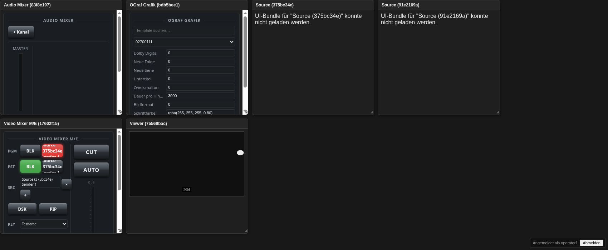

# OpenMediaPlatform


New, standalone project (separate from `PIPELINE CONTROLLER`).

## An Open-Source Orchestrator for Broadcast – A Current Status

The goal is a proof of concept for a modular broadcast and streaming platform that adheres to open standards and brings modern software architectures to the broadcast world.

The focus is not on a single product, but rather on how to assemble a complete production system from independent services.

The architectural foundation is the EBU Dynamic Media Facility (DMF) model: Functions such as video mixers, audio mixers, playout, graphics, and signal sources are not conceived as monolithic applications, but as independent, loosely coupled services that can be dynamically orchestrated.

For local, high-performance media exchange, MXL (Media Exchange Layer) is used. MXL enables zero-copy exchange of audio and video data between processes on the same host, thus replacing the traditional approach of unnecessarily transporting media streams over network stacks or proprietary interfaces. When multiple hosts are involved, communication takes place either via SMPTE ST 2110 (with an SRT gateway for contribution/distribution over lossy networks) or, as a zero-copy alternative, via MXL-native Fabrics — real remote memory access (RDMA) between two MXL domains on different hosts, verified live over a software transport, with a drop-in path to real RDMA hardware.

The core of the system is an orchestrator developed in Go. It handles discovery, routing, and communication between the individual services. NATS is used as the event bus, while AMWA NMOS (IS-04 and IS-05) handles the automatic registration and routing of the components. This means the orchestrator doesn't have to rely on fixed device types or proprietary interfaces.

An essential part of the architecture is also the NMOS Control Framework (IS-12/IS-14). Each service describes its own parameters and capabilities. Therefore, the orchestrator doesn't need to know whether it's a video mixer, audio mixer, or a future node type. New components can be integrated without requiring any modifications to the orchestrator. This self-description capability is precisely what makes the platform scalable in the long term.

Several microservices are currently available as demonstrators — each
one an independent process that self-registers via NMOS, with its own
UI and its own set of self-described parameters (full list with
functions: [`docs/HANDBUCH.md`](docs/HANDBUCH.md) §9):

- **omp-source** — test sources (color bars etc. plus test tone)
- **omp-switcher** — simple video switcher between auto-discovered
  sources (no program/preset bus)
- **omp-video-mixer-me** — video mixer (1 M/E with cut, crossfade,
  picture-in-picture, downstream keyer)
- **omp-audio-mixer** — digital audio mixer with parametric EQ,
  per-channel compressor, master limiter, and audio-follow-video
- **omp-player** — video player and jingle player (cued playback, plus
  live-MXL-source and real-file playlist items)
- **omp-playout-automation** — playout automation (playlist-driven,
  Auto/Hold, Next/Next-Live/Stop, cart/interrupt assets; no pipeline of
  its own)
- **omp-viewer** / **omp-multiviewer** — single-stream preview and
  auto-discovered multi-tile monitoring (with automatic low-res preview
  fan-out)
- **omp-ograf** — EBU OGraf graphics overlay node (Fill+Key)
- **omp-media-library** — file catalog with technical metadata
  (ffprobe) and mark-in/out segments
- **omp-recorder** — records an MXL source (video/audio) to a Matroska
  file; MXL-only input, no capture-card dependency
- **omp-scaler** — scales/converts a connected MXL video source to a
  fixed target format; also one of two nodes that can absorb a
  workflow's declared output-delay compensation (see Status)
- **omp-2110-gateway** / **omp-aes67-gateway** — native ST 2110 video /
  AES67 audio gateways for inter-site contribution with foreign
  equipment
- **omp-srt-gateway** — ST 2110 ⇄ SRT gateway for contribution over
  lossy WANs
- **omp-fabrics-gateway** — **remote memory access between hosts**:
  MXL-native Fabrics (libfabric/RDMA) instead of a network-stack hop —
  zero-copy, one-sided RDMA writes of a full MXL flow into another
  host's domain. Implemented and live-verified over the software `tcp`
  provider (no RDMA hardware required to test); `verbs`/`efa` providers
  for real RoCEv2 hardware are a drop-in config change, hardware
  procurement pending.

All components run as independent services and can be started, stopped, or extended independently — either locally via the built-in instance launcher, or on a separate machine via a lightweight host agent that registers itself with the orchestrator and executes only pre-approved node types (agent-local catalog as the trust boundary, not a wide-open remote-exec channel).

A graphical user interface is being developed in parallel, consistently implementing the concept of a software-defined broadcast system. Nodes register automatically, appear in the flow editor, and can be connected via drag and drop. Parameters are dynamically generated from their respective self-descriptions—without having to develop separate interfaces for each device type. Login-based user/role accounts (local, no external directory server required) gate who can wire the graph, launch instances, or administer hosts.

Although the project is still in its early stages, the current version is already fully functional on my Chromebook. For me, this is important proof that modern broadcast architectures can initially be developed and validated with manageable resources.

High availability is no longer entirely out of scope: critical roles can run with an automatic hot-standby (a mirrored instance that takes over on crash-loop exhaustion or host-offline detection, break-before-make handover, operator state carried across via the existing state export/import mechanism), and a workflow can declare a target end-to-end latency budget — the orchestrator hard-rejects wiring that can't meet it and automatically compensates paths that are too short by assigning output delay to capable nodes (currently `omp-scaler` and `omp-video-mixer-me`). Commercial support is still not offered. The goal remains to verify the architecture and demonstrate the potential of open standards like DMF, MXL, NMOS, and NATS.

I'm excited to see how this approach evolves and look forward to exchanging ideas with everyone involved in software-defined broadcast systems, open standards, or modern media architectures.

## Quickstart

```sh
make start   # NATS + NMOS registry + orchestrator, see docs/HANDBUCH.md
```

Then open http://localhost:8000. Details/troubleshooting:
[`docs/HANDBUCH.md`](docs/HANDBUCH.md). User guide for the UI (with
screenshots): [`docs/BENUTZERHANDBUCH.md`](docs/BENUTZERHANDBUCH.md).
(Both docs are in German — this README is the only English-language
entry point so far.)




## Status

Architecture/tech stack decided (see `ARCHITECTURE.md`), implementation
follows `UMSETZUNG.md` (status checklist there, continuously updated —
that's where the actual current state lives, not here).

Already in place: foundation, drag-and-drop flow editor, workflow
objects/presets, the small control room (source/switcher/video mixer/
audio mixer/player/multiviewer/playout automation/OGraf graphics, all
launchable from the GUI), mixer presets (snapshot/recall), ST 2110
video/AES67 audio (incl. Dante in AES67 mode, SAP discovery) plus a
native ST 2110 gateway in addition to the SRT gateway, an opt-in PTP
timebase for the 2110 paths (`OMP_PTP_DOMAIN`, verified live
synchronized across two network namespaces), real **remote memory
access** between two OMP hosts via MXL-native Fabrics
(`omp-fabrics-gateway`, verified live over the software `tcp` provider
— RDMA zero-copy testable without RDMA hardware, see
`docs/HANDBUCH.md` §9.3), a PostgreSQL backend, mTLS orchestrator↔
nodes, a local user/role model with login and audit log, a node SDK
tutorial, remote-host discovery including a command channel (instances
can also be started/stopped on a remote machine, via a host agent with
a host-local catalog as the trust boundary), automatic process restart
with a crash-loop brake, a metrics endpoint, plus an operations view
with running instances (CPU/RAM per process), host resource history,
and collected alarms. The flow editor itself automatically shows host
zones on the same canvas once more than one host is registered (one
zone per machine with live CPU/RAM, fixed lanes, toggleable) — makes it
visible at a glance which instance is actually running on which host,
not just in the separate hosts tab. Also added since then: a scheduler
tab for time-driven start/stop of entire workflows (day/week/month
view, drag-to-move/resize schedules), a resource preview (typical
CPU/RAM load per node type right in the catalog, from real measurement
history), a GUI import path for containerized third-party microservices
(Podman images, admission check, multiple versions of the same type in
parallel), and a placement engine (overload alarm + target-host
suggestion, already accounts for other workflows' scheduled runs) —
since Kapitel D6 Teil 4 configurable per workflow role between purely
advisory (default), a confirmation window with automatic execution on
expiry, and immediate automatic execution, each via a real
make-before-break move to a healthy fallback host. Since Kapitel K7
Teil 4 additionally an automatic hot-standby failover for critical
roles (`Role.standbyFor`, triggered by crash-loop or host-offline
detection, operator state carried over via the existing state
export/import mechanism), plus, since D8, a workflow latency budget
(`targetLatencyFrames`): the orchestrator hard-rejects wiring that
can't meet the target and automatically compensates paths that are too
short by assigning output delay to capable nodes (currently
`omp-scaler`, `omp-video-mixer-me`).

Open: I/O cards as their own, exclusively-claimable resource class,
RDMA hardware integration (`verbs`/EFA providers, pending hardware
procurement), an NDI gateway, and proprietary Dante (Dante in AES67
mode already runs via `omp-aes67-gateway`).

## Related project

For broadcast/GStreamer/playout experience, see `PIPELINE CONTROLLER`
(separate repo, see `CLAUDE.md` for details).
