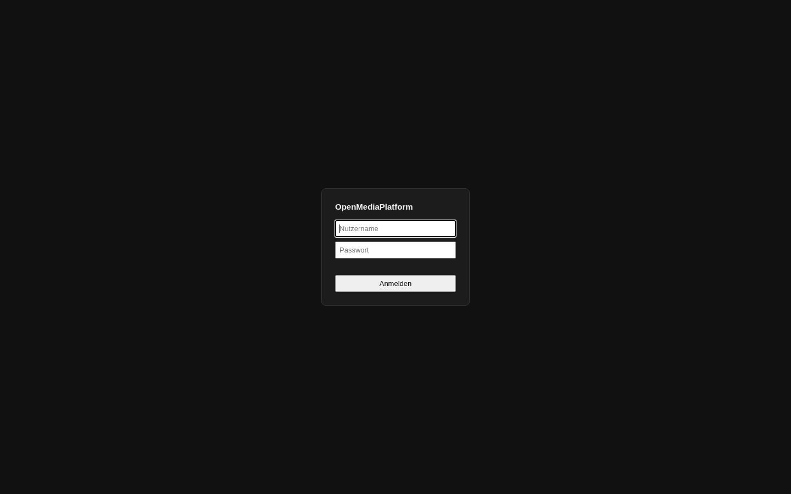
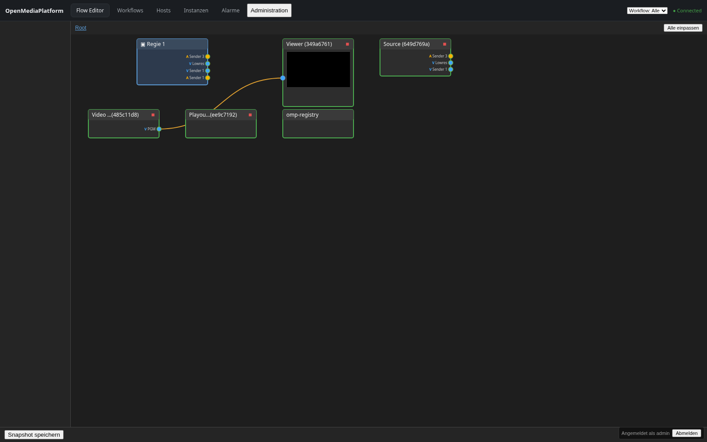
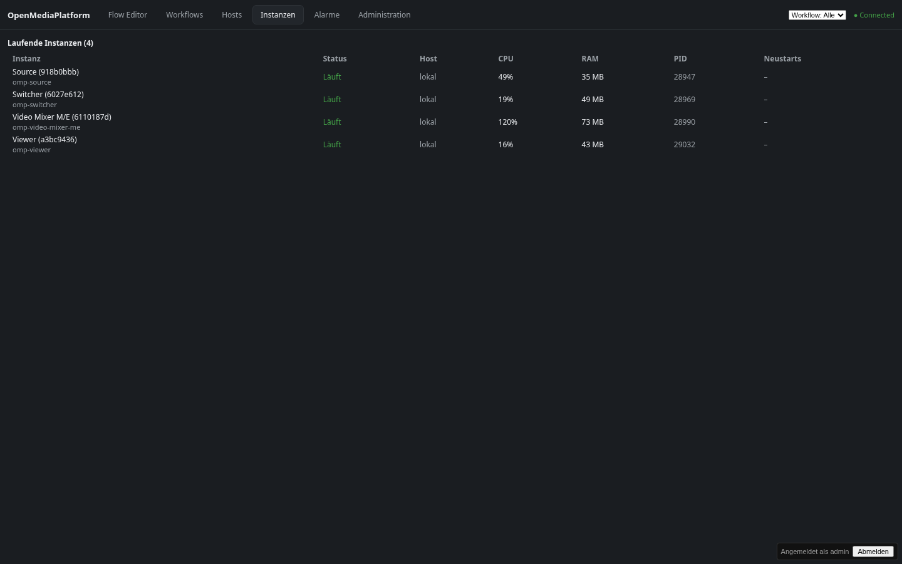
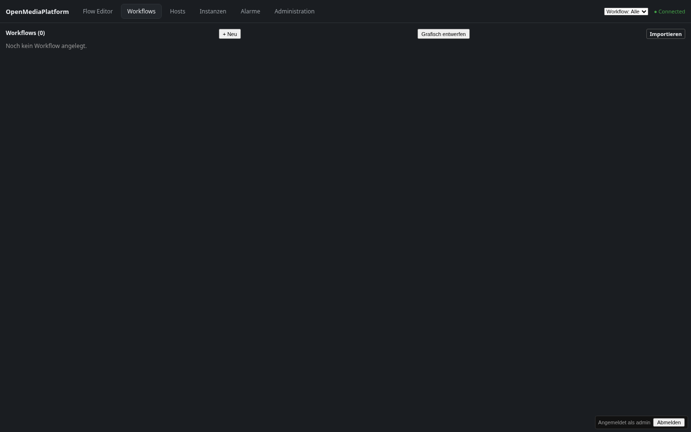
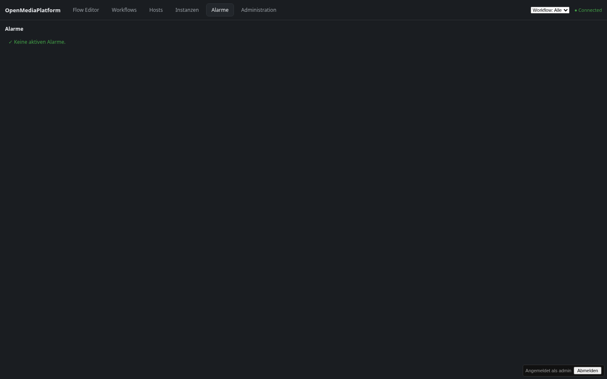
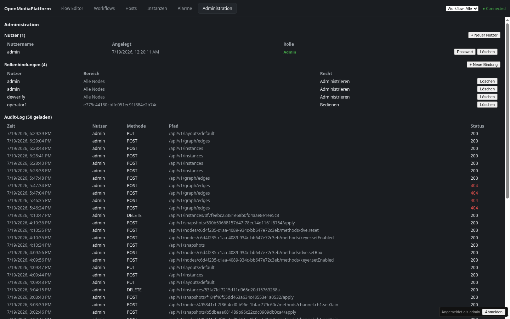
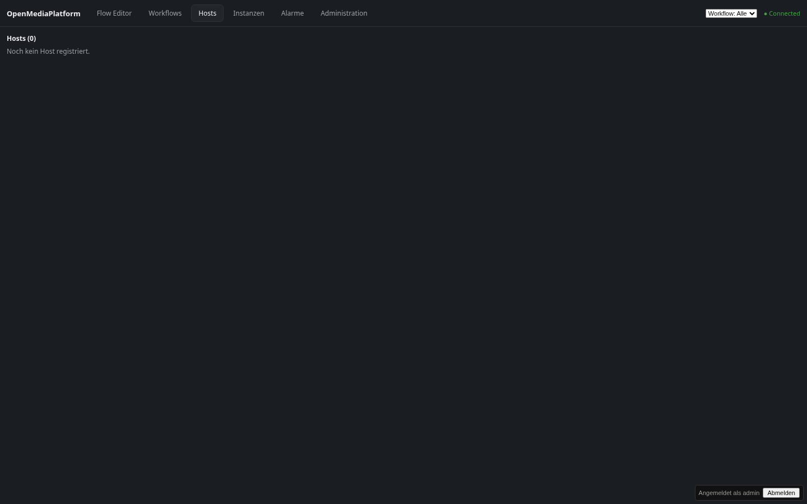
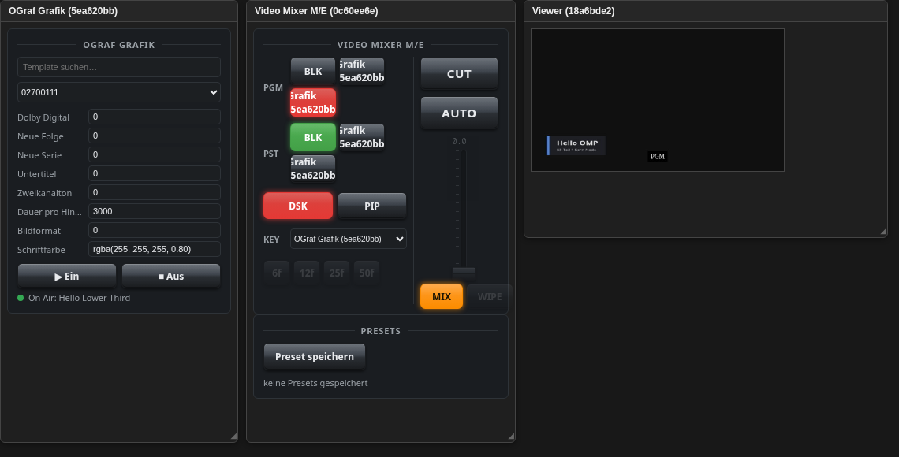

# OpenMediaPlatform — Benutzerhandbuch

Anleitung für Bediener/Operatoren der Weboberfläche (Flow Editor,
Instanz-Start, Workflows, Alarme, Administration). Screenshots stammen
aus einer echten, lokal laufenden Entwicklungsinstanz (`make start`),
kein Mockup.

Für den technischen Dev-Betrieb (Installation, `make`-Targets,
Troubleshooting) siehe [`HANDBUCH.md`](HANDBUCH.md). Für Architektur-
Hintergrund siehe [`../ARCHITECTURE.md`](../ARCHITECTURE.md).

## 1. Anmelden

Beim Öffnen von `http://localhost:8000` (bzw. der URL, unter der der
Orchestrator erreichbar ist) erscheint zuerst die Anmeldemaske:

Nutzername/Passwort vergibt der Administrator über die
Administration-Ansicht (Abschnitt 6). Im lokalen Dev-Betrieb existiert
standardmäßig ein `admin`-Nutzer (siehe `HANDBUCH.md` Abschnitt 3 für
das Dev-Passwort — nicht für den Produktivbetrieb geeignet).

Nach erfolgreicher Anmeldung bleibt die Sitzung angemeldet (Token im
Browser gespeichert), bis auf „Abmelden" geklickt wird oder das Token
abläuft.

## 2. Der Flow Editor

Der Flow Editor ist die zentrale Ansicht: links der **Node-Katalog**
(alle Node-Typen, die auf dieser Installation gestartet werden können),
rechts die **Arbeitsfläche** mit den bereits laufenden Instanzen als
Kacheln.

In diesem Beispiel laufen vier Instanzen:

- **Source** — eine Testquelle (Farbbalken + Testton), erzeugt drei
  Sender (Video, Lowres-Vorschau, Audio).
- **Viewer** — zeigt einen ausgewählten Videostream als Vorschau direkt
  in der Kachel (das bunte Farbbalkenbild oben ist eine **echte**,
  laufende MJPEG-Vorschau, kein Platzhalter).
- **Video Mixer M/E** und **Switcher** — noch unverbunden, zeigen aber
  bereits ihre verfügbaren Ein-/Ausgänge als Anschlusspunkte.

### 2.1 Eine Instanz starten

Im Node-Katalog links auf einen „+ <Node-Typ>"-Knopf klicken (z. B.
„+ Source"). Die Instanz erscheint nach kurzer Zeit als neue Kachel auf
der Arbeitsfläche und gleichzeitig im Katalogeintrag mit CPU-/RAM-Werten
und einem „Stop"-Knopf.

### 2.2 Verbinden (Routing)

Von einem Ausgangs-Anschlusspunkt (rechter Rand einer Kachel) auf einen
Eingangs-Anschlusspunkt (linker Rand einer anderen Kachel) ziehen. Das
erzeugt im Hintergrund eine echte NMOS-IS-05-Verbindung — die Zielnode
öffnet den entsprechenden MXL-Flow und beginnt sofort zu lesen. Eine
aktive Verbindung wird als farbige Linie zwischen den Kacheln
dargestellt (im Screenshot oben: Source → Viewer, orange/aktiv).

### 2.3 Layout

„Alle einpassen" (oben rechts) zentriert und skaliert die Ansicht auf
alle vorhandenen Kacheln. Kachel-Positionen werden pro Nutzer
gespeichert („Snapshot speichern" unten links sichert zusätzlich den
kompletten Verbindungszustand als benanntes Preset, wiederherstellbar).

### 2.4 Gruppieren

Mehrere Kacheln lassen sich zu einem einklappbaren Makro-Block
zusammenfassen — praktisch für einen ganzen Regieplatz („Regie 1" =
Source + Player + Automation + Mixer + Audio + Viewer), der im Root-
Graphen dann nur noch als **eine** Kachel erscheint:

1. Erste Kachel anklicken, weitere mit **Umschalt+Klick** dazu wählen
   (mindestens zwei).
2. Taste **G** drücken, Namen der Gruppe eingeben.

Im Beispiel wurden „Videoplayer" und „Audio Mixer" zur Gruppe „Regie 1"
zusammengefasst — deren Ein-/Ausgänge werden an der Gruppen-Kachel nach
außen durchgereicht (hier vier Ports: zwei Sender, ein Lowres-Sender, ein
weiterer Audio-Sender), die übrigen, nicht gruppierten Kacheln bleiben
unverändert sichtbar.
Doppelklick auf eine Gruppen-Kachel „betritt" sie (Breadcrumb-Pfad oben
links); „Gruppe auflösen" dort macht die Gruppierung wieder rückgängig.
„Als Workflow speichern" innerhalb einer Gruppe legt aus ihr direkt ein
startbares Workflow-Objekt an (Abschnitt 4).

## 3. Instanzen-Übersicht

Der Reiter **Instanzen** zeigt alle laufenden Node-Prozesse tabellarisch
mit Status, Host, CPU-Auslastung, RAM-Verbrauch, PID und der Anzahl
automatischer Neustarts nach einem Absturz:

Ein Prozess, der abstürzt, wird automatisch neu gestartet (mit einer
Bremse gegen Neustart-Schleifen) — die Neustarts-Spalte macht das
sichtbar, ohne dass man die Logs durchsuchen muss.

## 4. Workflows

Der Reiter **Workflows** verwaltet benannte, wiederverwendbare
Kombinationen aus Node-Typen und Verbindungen — praktisch ein
Vorlagen-System für „diese Sendung braucht immer dieselben fünf
Nodes in derselben Verkabelung". In einer frischen Installation ist
die Liste zunächst leer:

„+ Neu" legt einen leeren Workflow an, „Grafisch entwerfen" öffnet den
Flow Editor in einem Workflow-Entwurfsmodus, „Importieren" lädt eine
zuvor exportierte Workflow-Definition. Die App-Bar-Auswahl „Workflow:
Alle" (oben rechts, auf jeder Seite sichtbar) filtert den Flow Editor
auf die Instanzen eines einzelnen Workflows, sobald welche existieren.

## 5. Alarme

Der Reiter **Alarme** sammelt an einer Stelle, was operative
Aufmerksamkeit braucht: abgestürzte oder instabile (flappende)
Instanzen, überlastete Hosts und fehlgeschlagene Workflow-Starts. Im
Normalbetrieb bleibt er leer:

## 6. Administration

Der Reiter **Administration** (nur sichtbar für Nutzer mit
Administrationsrecht) verwaltet Nutzerkonten, Rollenbindungen und
zeigt ein Audit-Log aller schreibenden API-Zugriffe:

- **Nutzer** — anlegen, Passwort zurücksetzen, löschen.
- **Rollenbindungen** — verknüpfen einen Nutzer mit einem Rechtebereich
  (`Alle Nodes` oder eine einzelne Node-ID) und einem Recht
  (`Bedienen` < `Konfigurieren` < `Administrieren`). Ein Nutzer ohne
  passende Bindung sieht die entsprechende Aktion in der Oberfläche gar
  nicht erst als Option.
- **Audit-Log** — jede schreibende Anfrage (wer, wann, welcher
  API-Pfad, welcher HTTP-Status) — auch fehlgeschlagene Versuche (rot
  markierte Statuscodes) bleiben sichtbar.

## 7. Hosts (Remote-Betrieb)

Der Reiter **Hosts** zeigt entfernte Maschinen, auf denen ein
Host-Agent läuft und die sich beim Orchestrator registriert haben —
Instanzen lassen sich dann auch auf diesen entfernten Hosts starten,
nicht nur lokal. In einer Installation ohne registrierten Host-Agent
ist die Liste leer:

Ein Host-Agent führt ausschließlich Node-Typen aus seinem eigenen,
lokal konfigurierten Katalog aus — der Orchestrator kann keinen
beliebigen Befehl auf einem entfernten Host ausführen, das ist eine
bewusste Sicherheitsgrenze.

## 8. Operator-Konsole (Regieplatz)

Ein Nutzer ohne Konfigurationsrecht, aber mit `Bedienen`-Rechten auf
mehrere Node-Rollen innerhalb eines Workflows (Abschnitt 6:
Rollenbindungen), landet nach dem Anmelden nicht im Flow Editor, sondern
direkt auf einer **Operator-Konsole** — einer reinen Bedienoberfläche
ohne Graph, Katalog oder Verkabelungsmöglichkeit. Sind einem Nutzer
mehrere Workflows zugewiesen, wählt er zunächst aus einer Kachel-Liste
den gewünschten Regieplatz.

Sobald einem Operator **mehr als eine** Rolle in einem Workflow zusteht,
zeigt die Konsole alle zugewiesenen Node-Oberflächen gleichzeitig als
frei verschieb- und skalierbare Kacheln (bei genau einer Rolle erscheint
stattdessen deren Oberfläche vollflächig, ohne Kachel-Rahmen):

In diesem Beispiel sind einem Operator vier Rollen desselben Workflows
zugewiesen:

- **Audio Mixer** (ganz links) — Kanalzüge mit Gain/EQ (LO/MID/HIGH),
  Kompressor und Master-Limiter; „+ Kanal" legt einen neuen Eingang an.
- **OGraf Grafik** — Grafik-Vorlage auswählen, Formularfelder befüllen,
  „▶ Ein"/„■ Aus" schaltet die Grafik auf Sendung (im Screenshot bereits
  aktiv: „On Air: Material Design Billboard").
- **Video Mixer M/E** — echtes Bildmischer-Bedienpult: PGM-/PST-
  Kreuzschienen-Tasten (nach Workflow-Zugehörigkeit gruppiert, sobald
  mehrere Workflows gemeinsam Quellen anbieten; per SRC-„+"-Taste
  kuratiert angepinnt statt automatisch aufgelistet), CUT/AUTO für harte
  bzw. weiche Umschaltung, DSK (Downstream-Keyer, hier aktiv/rot, mit
  wählbarer Fill+Key-Quelle über das KEY-Dropdown) und PIP
  (Bild-im-Bild als eigener, frei mit Quelle und Position/Größe
  einstellbarer Bildlayer, PIP-Dropdown daneben).
- **Viewer** (ganz rechts) — zeigt das tatsächliche PGM-Ausgangsbild des
  Mixers als Live-Vorschau; im Screenshot ist die soeben aufgeschaltete
  OGraf-Grafik über dem Programmbild sichtbar.

Jede Kachel besitzt eine Titelleiste zum Verschieben (Ziehen) und einen
Anfasser unten rechts zum Skalieren. Position und Größe werden pro
Regieplatz im Browser gespeichert und bleiben über einen Seiten-Reload
hinweg erhalten — passend zu einem fest installierten Regieplatz-
Bildschirm, an dem stets derselbe Browser läuft.

### 8.1 Beispiel: Regieplatz „Regie 1"

Ein zweites, vollständiges Beispiel — der Workflow „Regie 1" (Source,
Videoplayer, Playout-Automation, Video Mixer M/E, Audio Mixer, Viewer)
mit einem Operator, der auf alle sechs Rollen `Bedienen`-Rechte hat:

- **Audio Mixer**, **Playout-Automation**, **Video Mixer M/E**,
  **Videoplayer**, **Viewer** — je die eigene Node-Oberfläche, identisch
  zu der, die auch im Flow-Editor-Parameter-Panel erscheint.
- **Source** — zeigt hier bewusst „UI-Bundle … konnte nicht geladen
  werden": nicht jeder Node-Typ bringt eine eigene Bedienoberfläche mit
  (`omp-source` hat keine, außer den generischen Parametern nichts zu
  bedienen) — die Konsole meldet das ehrlich statt eine leere Kachel
  ohne Erklärung zu zeigen.
- Im Screenshot wurde über den Video-Mixer-M/E-Bedienpult bereits eine
  Quelle an die Kreuzschiene angeheftet (SRC „+") und auf PGM
  geschnitten — der Viewer zeigt das reale, laufende Farbbalkenbild.

## 9. Weiterführende Dokumente

- [`HANDBUCH.md`](HANDBUCH.md) — Installation, `make`-Targets,
  Troubleshooting, mTLS/Backup/Soak-Betrieb.
- [`NODE-TUTORIAL.md`](NODE-TUTORIAL.md) — eigene Node-Typen
  entwickeln (Node-Contract, SDK).
- [`../ARCHITECTURE.md`](../ARCHITECTURE.md) — Architekturentscheidungen
  und Standard-Basis (EBU DMF, MXL, NMOS/ST2110).
- [`../UMSETZUNG.md`](../UMSETZUNG.md) — Umsetzungsstand, Status-
  Checkliste aller Kapitel.
