# OpenMediaPlatform — Benutzerhandbuch

Anleitung für Bediener/Operatoren der Weboberfläche (Flow Editor,
Instanz-Start, Workflows, Alarme, Administration). Screenshots stammen
aus einer echten, lokal laufenden Entwicklungsinstanz (`make start`),
kein Mockup.

Für den technischen Dev-Betrieb (Installation, `make`-Targets,
Troubleshooting) siehe [`HANDBUCH.md`](HANDBUCH.md). **Bei der
Erstinstallation zuerst `make preflight` ausführen:** es prüft, ob der
Rechner alles Nötige hat, und nennt zu jedem Problem den Befehl zur
Behebung (`HANDBUCH.md` §1.1). Für Architektur-
Hintergrund siehe [`../ARCHITECTURE.md`](../ARCHITECTURE.md).

## 1. Anmelden

Beim Öffnen von `http://localhost:8000` (bzw. der URL, unter der der
Orchestrator erreichbar ist) erscheint zuerst die Anmeldemaske:

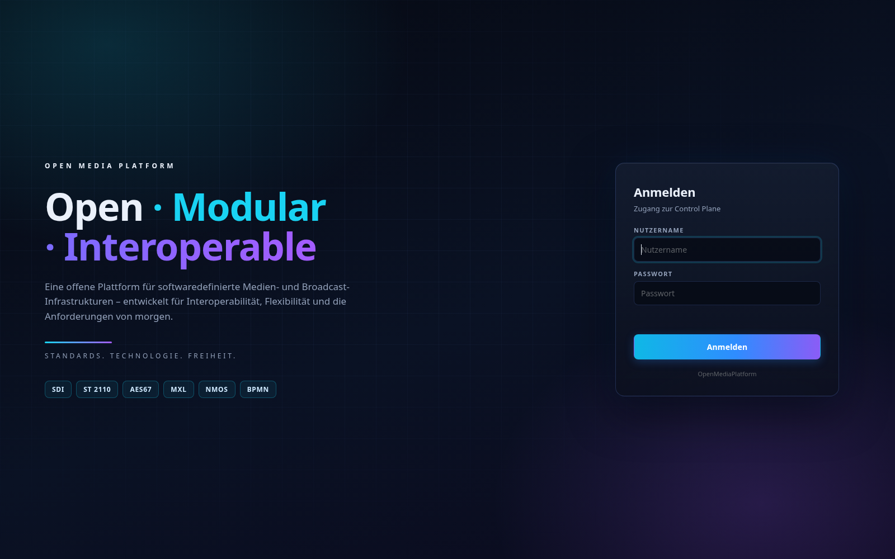

Nutzername/Passwort vergibt der Administrator über die
Administration-Ansicht (Abschnitt 7). Im lokalen Dev-Betrieb existiert
standardmäßig ein `admin`-Nutzer (siehe `HANDBUCH.md` Abschnitt 3 für
das Dev-Passwort — nicht für den Produktivbetrieb geeignet).

Nach erfolgreicher Anmeldung bleibt die Sitzung angemeldet (Token im
Browser gespeichert), bis auf „Abmelden" geklickt wird oder das Token
abläuft.

## 2. Der Flow Editor

Der Flow Editor ist die zentrale Ansicht: links der **Node-Katalog**
(alle Node-Typen, die auf dieser Installation gestartet werden können),
rechts die **Arbeitsfläche** mit den bereits laufenden Instanzen als
Kacheln. Jeder Katalog-Eintrag zeigt zusätzlich eine kurze
Funktionsbeschreibung, eine grobe Lasteinschätzung (z. B. „~ gering,
konstant") und, sobald der Typ mindestens einmal lief, eine gemessene
CPU-/RAM-Hausnummer („typisch 47–56 % CPU · 34 MB RAM") — hilfreich, um
vor dem Start abzuschätzen, was eine weitere Instanz kostet. Das
Suchfeld über der Liste filtert nach Name/Typ, ohne die Seite neu zu
laden.

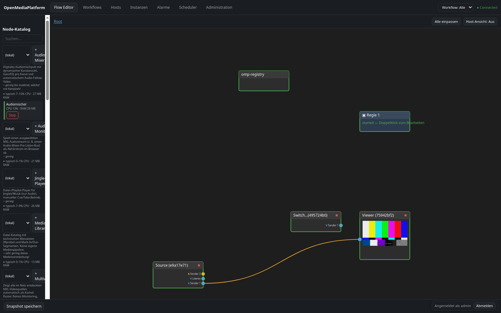

In diesem Beispiel sind auf der Arbeitsfläche sichtbar:

- **Source → Viewer** — eine Testquelle (Farbbalken + Testton), per
  Kante mit einem Viewer verbunden; das bunte Farbbalkenbild in der
  Viewer-Kachel ist eine **echte**, laufende MJPEG-Vorschau, kein
  Platzhalter.
- **Switcher** — noch unverbunden, zeigt aber bereits seinen
  verfügbaren Anschlusspunkt.
- **Regie 1** — ein laufender Workflow (Abschnitt 4): erscheint am
  Root immer als **eine** kollabierte Kachel, unabhängig vom Status;
  Doppelklick öffnet ihn zum Bearbeiten/Betrachten seiner Rollen.
- **omp-registry** — der Orchestrator selbst als NMOS-Node (Registry-
  Housekeeping, keine Medienfunktion).

### 2.1 Eine Instanz starten

Im Node-Katalog links auf einen „+ <Node-Typ>"-Knopf klicken (z. B.
„+ Source"). Die Instanz erscheint nach kurzer Zeit als neue Kachel auf
der Arbeitsfläche und gleichzeitig im Katalogeintrag mit CPU-/RAM-Werten
und einem „Stop"-Knopf.

### 2.2 Verbinden (Routing)

Von einem Ausgangs-Anschlusspunkt (rechter Rand einer Kachel) auf einen
Eingangs-Anschlusspunkt (linker Rand einer anderen Kachel) ziehen. Das
erzeugt im Hintergrund eine echte NMOS-IS-05-Verbindung — die Zielnode
öffnet den entsprechenden MXL-Flow und beginnt sofort zu lesen. Eine
aktive Verbindung wird als farbige Linie zwischen den Kacheln
dargestellt (im Screenshot oben: Source → Viewer, orange/aktiv).

### 2.3 Layout

„Alle einpassen" (oben rechts) zentriert und skaliert die Ansicht auf
alle vorhandenen Kacheln. Kachel-Positionen werden pro Nutzer
gespeichert. Früher gab es unten links einen Knopf „Snapshot speichern";
er ist entfallen. Bereits vorhandene Szenen erscheinen weiterhin als
Knöpfe unten links und lassen sich per Klick anwenden — ohne gespeicherte
Szenen bleibt die Leiste ausgeblendet.

### 2.4 Gruppieren

Mehrere Kacheln lassen sich zu einem einklappbaren Makro-Block
zusammenfassen — praktisch für einen ganzen Regieplatz, der im Root-
Graphen dann nur noch als **eine** Kachel erscheint:

1. Erste Kachel anklicken, weitere mit **Umschalt+Klick** dazu wählen
   (mindestens zwei).
2. Taste **G** drücken, Namen der Gruppe eingeben.

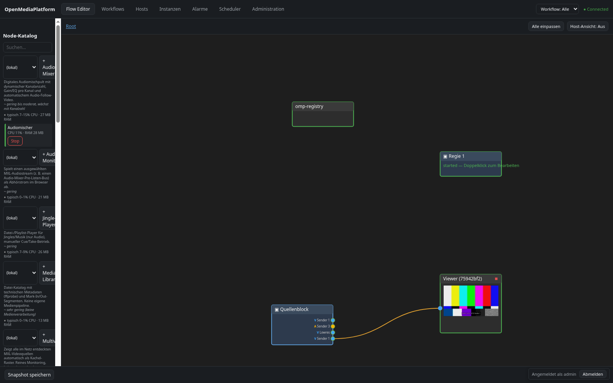

Im Beispiel wurden „Source" und „Switcher" zur Gruppe „Quellenblock"
zusammengefasst — deren Ein-/Ausgänge werden an der Gruppen-Kachel nach
außen durchgereicht (hier: die vier Ports der Source, unverändert
erreichbar), die übrigen, nicht gruppierten Kacheln (Viewer, Regie 1,
omp-registry) bleiben unverändert sichtbar.
Doppelklick auf eine Gruppen-Kachel „betritt" sie (Breadcrumb-Pfad oben
links); „Gruppe auflösen" dort macht die Gruppierung wieder rückgängig.
„Als Workflow speichern" innerhalb einer Gruppe legt aus ihr direkt ein
startbares Workflow-Objekt an (Abschnitt 4).

### 2.5 Host-Ansicht (Zonen für Mehr-Host-Betrieb)

Sobald mehr als ein Host registriert ist (Abschnitt 8), zeigt der Flow
Editor auf der Arbeitsfläche automatisch **Host-Zonen** an — je ein
Rechteck pro Host, mit Label, Online-Punkt und live CPU-/RAM-Anzeige im
Zonen-Kopf, dazu eine feste Zone „Orchestrator-Host (lokal)" für lokal
gestartete Instanzen und eine Zone „Unzugeordnet" für Nodes ohne
Instanz-Launcher-Zuordnung. Jede Node-Kachel liegt sichtbar in der Zone
des Hosts, auf dem sie tatsächlich läuft. Eine B5-Gruppe (Abschnitt 2.4)
bekommt ebenfalls eine Zone — eindeutig, wenn alle ihre Mitglieder auf
demselben Host laufen, sonst landet sie in einer eigenen Sammelzone
„Gruppen über mehrere Hosts":

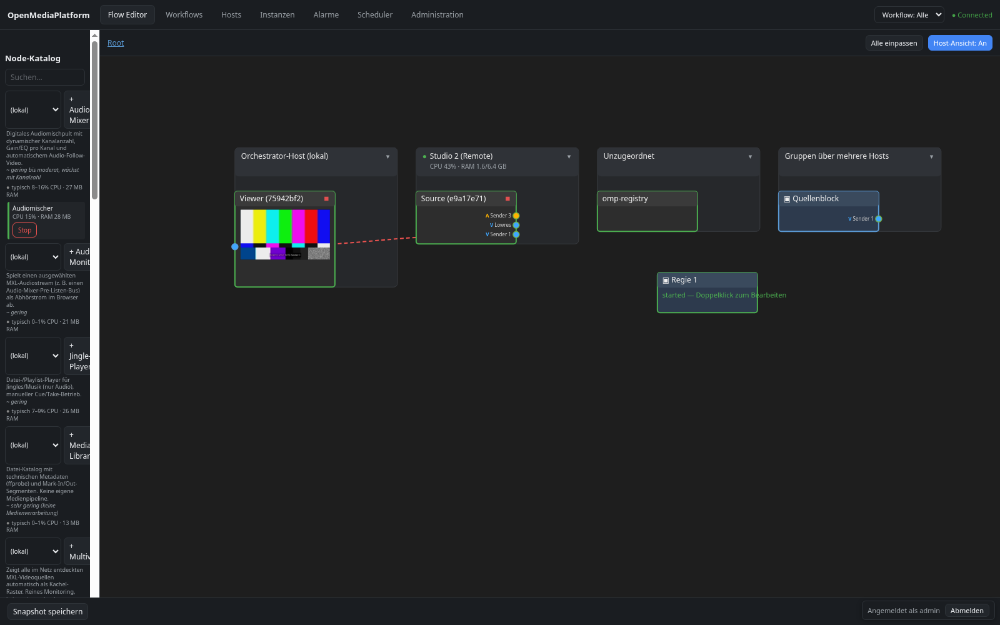

In diesem Beispiel läuft die Quelle „Source" auf dem entfernten Host
„Studio 2 (Remote)" (live CPU/RAM im Zonen-Kopf), während ihr Viewer
weiterhin lokal läuft. Die Gruppe „Quellenblock" aus Abschnitt 2.4
enthält Mitglieder auf unterschiedlichen Hosts und erscheint deshalb in
der Sammelzone rechts.

Der Knopf **„Host-Ansicht: An/Aus"** (oben rechts, nur im Root-Graphen
sichtbar) schaltet die Zonen manuell um; unterhalb von zwei
registrierten Hosts bleibt sie standardmäßig aus. Positionen innerhalb
einer Zone lassen sich frei verschieben — dieses Layout wird getrennt
vom normalen freien Layout gemerkt: Ausschalten stellt die Kachel-
Positionen von vor dem Einschalten unverändert wieder her. Ein ▾/▸-
Symbol im Zonen-Kopf klappt eine einzelne Zone samt ihrer Kacheln ein
(zeigt dann nur noch die Anzahl der enthaltenen Kacheln) — praktisch,
um bei vielen Hosts die Übersicht zu behalten.

**Kanten-Warnstil:** MXL ist host-lokal (gemeinsamer Shared Memory) —
eine Verbindung, deren Sender MXL-Transport nutzt und deren beide
Kacheln in unterschiedlichen Zonen liegen, funktioniert medienseitig
nicht und wird deshalb gestrichelt in Warnfarbe gezeichnet (im
Screenshot: die Verbindung zwischen „Source" auf „Studio 2" und dem
lokalen „Viewer"). Das ist ein Hinweis, keine Sperre — für echte
Hostgrenzen-Übertragung ST 2110, den SRT-Gateway oder MXL-Fabrics
(Abschnitt „Related project"/`HANDBUCH.md` §9.3) statt einer direkten
MXL-Kante verwenden.

**Begleiteter Host-Umzug per Drag:** eine **eigenständige** (nicht zu
einem Workflow gehörende) Node-Kachel lässt sich bei aktiver Host-
Ansicht in eine andere Zone ziehen. Landet sie dort, erscheint ein
Bestätigungsdialog; nach Bestätigen wird die Instanz auf dem Zielhost
neu gestartet und ihre bestehenden Verbindungen werden automatisch neu
hergestellt (Zuordnung über Port-Rolle, nicht über die alte ID, die
sich beim Neustart ändert). Für Rollen innerhalb eines laufenden
Workflows gibt es diese Drag-Funktion noch nicht — ein laufender
Workflow zeigt sich in der Host-Ansicht immer als eine kollabierte
Kachel (Abschnitt 2), einzelne Rollen erscheinen dort nicht individuell
zonierbar. Die kollabierte Kachel selbst liegt aber in der zu ihren
Rollen passenden Zone (bei uneinheitlichen Hosts in der Sammelzone
„Gruppen über mehrere Hosts" oben) — nur das Hineinziehen einer
einzelnen Rolle in eine andere Zone fehlt noch.

## 3. Instanzen-Übersicht

Der Reiter **Instanzen** zeigt alle laufenden Node-Prozesse tabellarisch
mit Status, Host, CPU-Auslastung, RAM-Verbrauch, PID und der Anzahl
automatischer Neustarts nach einem Absturz:

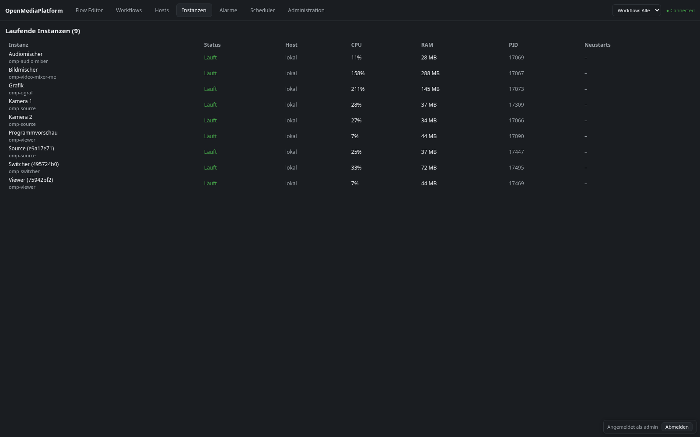

Ein Prozess, der abstürzt, wird automatisch neu gestartet (mit einer
Bremse gegen Neustart-Schleifen) — die Neustarts-Spalte macht das
sichtbar, ohne dass man die Logs durchsuchen muss.

Nach einem **System-Update** (Abschnitt 7, „System-Update") trägt eine
Instanz das Kennzeichen **„veraltet"**, wenn ihr Programm durch das Update
ersetzt wurde, der laufende Prozess aber noch den alten Stand ausführt.
Das gilt für Instanzen auf dem Orchestrator-Host genauso wie für Instanzen
auf Remote-Hosts. Ein Update startet nie selbstständig laufende Sendungen
neu; die Instanzen werden erst mit ihrem nächsten Neustart aktuell —
gezielt über „Veraltete Instanzen jetzt neu starten" im Reiter
System-Update.

## 4. Workflows

Der Reiter **Workflows** verwaltet benannte, wiederverwendbare
Kombinationen aus Node-Typen und Verbindungen — praktisch ein
Vorlagen-System für „diese Sendung braucht immer dieselben Nodes in
derselben Verkabelung":

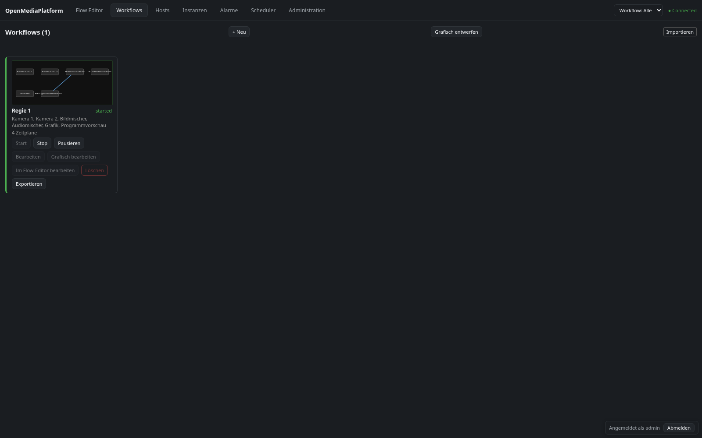

Jede Workflow-Kachel zeigt eine Miniaturvorschau ihrer Rollen-Struktur,
Namen, Status und ihre Rollenliste. „+ Neu" legt einen leeren Workflow
an, „Grafisch entwerfen" öffnet den Flow Editor in einem Workflow-
Entwurfsmodus, „Importieren" lädt eine zuvor exportierte Workflow-
Definition. Start/Stop/Pausieren wirken auf den ganzen Workflow;
„Bearbeiten" öffnet das Formular (Rollen, Verbindungen, Zeitpläne),
„Grafisch bearbeiten"/„Im Flow-Editor bearbeiten" den grafischen
Entwurfsmodus, „Exportieren" liefert eine importierbare
JSON-Definition. Die App-Bar-Auswahl „Workflow: Alle" (oben rechts, auf
jeder Seite sichtbar) filtert den Flow Editor auf die Instanzen eines
einzelnen Workflows.

**Rollenname = Quellen-Label:** der frei vergebbare „Rollenname" jeder
Rolle im Workflow-Formular ist zugleich das Label, unter dem diese
Quelle später überall erscheint, wo sie auswählbar ist — z. B. in den
Kreuzschienen-Dropdowns von Bild-/Audiomischer. Eine Rolle „Kamera 1"
zeigt sich dort als „Kamera 1", nicht als kryptische Instanz-ID. Direkt
über den „+"-Knopf im Node-Katalog (Abschnitt 2.1) gestartete Instanzen
ohne Workflow-Zugehörigkeit bekommen dagegen weiterhin nur das
generische „`<Typ>` (`<Kurz-ID>`)"-Label — ein eigenes Namensfeld dafür
gibt es in der Oberfläche noch nicht.

### 4.1 Hot-Standby (Redundanz für kritische Rollen)

Im Rollen-Designer bietet jede Rolle ein zusätzliches Dropdown „Standby
für: …", das alle anderen Rollen desselben Node-Typs im Workflow
auflistet. Wird eine Rolle als Standby für eine andere eingetragen,
läuft sie ab dem Workflow-Start dauerhaft mit, aber unverbunden — im
Flow Editor gestrichelt dargestellt, solange sie nicht aktiv ist.

Fällt die begleitete Rolle endgültig aus (Prozess-Absturz jenseits der
Neustart-Bremse, oder ihr Host wird als nicht mehr erreichbar erkannt),
übernimmt die Standby-Instanz automatisch: Verkabelung und
Bedienzustand (z. B. Kreuzschienen-Stellung, Kanalpegel) werden
übertragen, ihre Kachel wechselt von gestrichelt auf normal, und eine
Toast-Meldung „Failover: … → …" erscheint. Die Übernahme selbst ist ein
kurzer sichtbarer Schnitt (kein unterbrechungsfreier Genlock-Wechsel) —
für unkritische Regieplätze meist unnötig, für 24/7-Sendeplätze mit
einer einzelnen tragenden Rolle (z. B. dem Bildmischer) empfohlen.

### 4.2 Latenzbudget (Verzögerungsausgleich)

Das Workflow-Formular hat ein Feld „Ziel-Latenz (Frames)"
(`targetLatencyFrames`). Ist es gesetzt, muss jeder Signalpfad im
Workflow nach genau dieser Anzahl Frames beim jeweiligen Ausgang
ankommen:

- Ist das Ziel **zu knapp** für den kürzesten möglichen Pfad, lehnt
  „Start" den Workflow mit einer konkreten Fehlermeldung ab (welcher
  Pfad, wie viele Frames fehlen) — kein Teilstart.
- Ist ein Pfad **kürzer** als das Ziel, weist der Orchestrator die
  fehlende Verzögerung automatisch einem geeigneten Node entlang des
  Pfads zu (aktuell Bildmischer und Scaler) — ohne dass dafür etwas
  manuell verkabelt oder eingestellt werden muss. Steht auf einem zu
  kurzen Pfad kein geeigneter Node zur Verfügung, schlägt „Start"
  ebenso mit einer konkreten Fehlermeldung fehl.

Praktisch nützlich, um mehrere Kamerapfade unterschiedlicher Länge (z. B.
einer über einen Scaler, einer direkt) am Bildmischer wieder
bildsynchron ankommen zu lassen, ohne die Verzögerung von Hand
auszurechnen.

## 5. Scheduler

Der Reiter **Scheduler** zeigt für jeden Workflow eine eigene Zeile auf
einer horizontalen Zeitachse — Tag- (30-Minuten-Raster), Wochen- (7 Tage,
gleiche Auflösung, nur schmaler) und Monatsansicht (Tage-Überblick ohne
Uhrzeit, Klick springt in die Tagesansicht) über die drei Knöpfe oben
umschaltbar, `◀`/`Heute`/`▶` navigiert. Der blaue senkrechte Strich
markiert „jetzt".

Unter den Workflow-Zeilen zeigt der Scheduler, **welche Ressourcen zu
welcher Zeit belegt und wo noch frei sind** (Abschnitt 5.1). Das Wissen
um verfügbare Ressourcen ist beim Planen der wichtigste Punkt: ein Zeitplan
ist nur dann verlässlich, wenn der Host zur geplanten Zeit auch genug
Reserve hat.

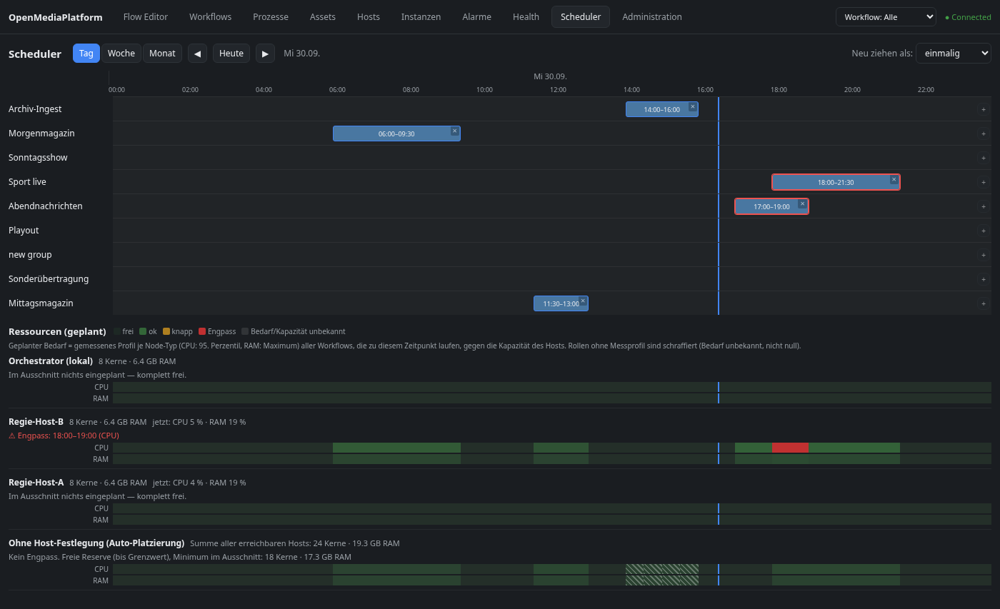

**Zeitpläne bearbeiten** — alles per Maus, Loslassen speichert sofort (kein
separater „Speichern"-Schritt, anders als das Workflow-Formular in
Abschnitt 4):

- **Verschieben:** einen Balken in der Mitte anfassen und ziehen.
- **Verlängern/Verkürzen:** den linken oder rechten Rand des Balkens
  ziehen (Start bzw. Stop ändern sich einzeln).
- **Neu anlegen:** auf eine **leere Stelle** einer Workflow-Zeile klicken,
  gedrückt halten und über die gewünschte Dauer ziehen — beim Loslassen
  entsteht ein Start-/Stop-Paar. Die Art (**einmalig**, **täglich**,
  **wöchentlich**) wählst du oben rechts unter „Neu ziehen als". Ein
  neuer Zeitplan gilt für den Tag, auf dem du gezogen hast (bei „täglich"
  jeden Tag, bei „wöchentlich" an diesem Wochentag).
- **„+"** am rechten Zeilenrand legt alternativ ein Paar mit
  Standardzeiten an (09:00–17:00).
- **Doppelklick** auf einen Balken öffnet exakte HH:MM-Eingabefelder
  (Ziehen rastet auf 30 Minuten ein).
- **„×"** an einem Balken löscht den Zeitplan.

Ein Zeitplan löst je nach Balkenende **Start** oder **Stop** des ganzen
Workflows aus — technisch dieselbe Aktion wie ein Klick auf „Start"/„Stop"
im Workflows-Tab.

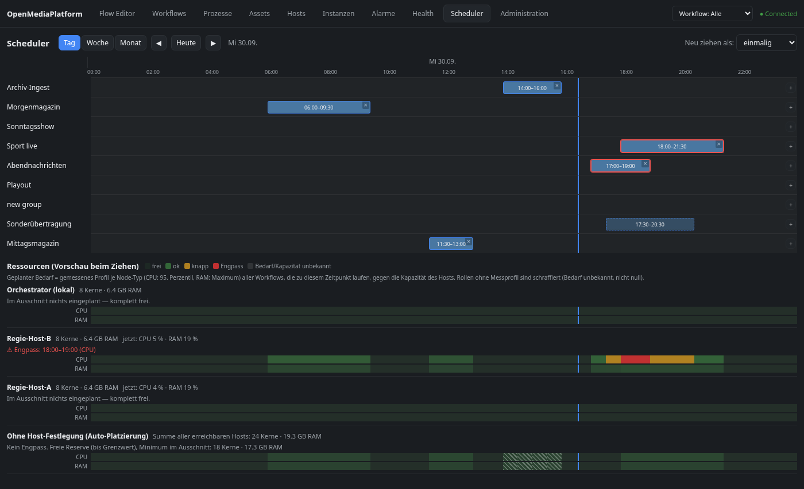

Während du ziehst, aktualisiert sich der Ressourcen-Block live
(„Vorschau beim Ziehen") — du siehst sofort, ob die neue Lage einen Host
überlastet. Erzeugt die Änderung beim Loslassen einen **neuen** Engpass,
erscheint zusätzlich eine Warnung mit Host, Zeit und Ressource. Gespeichert
wird trotzdem: der Scheduler informiert, entscheidet aber nicht für dich.

### 5.1 Ressourcen: Engpässe und freie Kapazität

Für jeden Host (und einen Streifen für Workflows **ohne Host-Festlegung**,
die der Orchestrator zum Startzeitpunkt selbst platziert) zeigt der
Ressourcen-Block:

- **CPU** und **RAM** als Streifen über die Zeit, dazu je **I/O-Kartentyp**
  (z. B. SDI-Eingänge) ein eigener Streifen — Bedarf gegen die Anzahl
  vorhandener Ports.
- **Farben:** dunkel = frei, grün = in Ordnung, gelb = knapp (ab 80 % des
  Grenzwerts), **rot = Engpass** (über dem Grenzwert, standardmäßig 85 % CPU
  und 90 % RAM — dieselben Werte, mit denen die Platzierung entscheidet).
  Schraffiert = **Bedarf unbekannt**: für einen Node-Typ liegt noch kein
  Messprofil vor. Das ist ausdrücklich nicht „null", sondern „nicht
  bekannt" — solche Zeiträume können mehr Last bedeuten, als angezeigt.
- Pro Host eine **Zusammenfassung**: entweder die Engpass-Zeiträume
  („⚠ Engpass: 18:00–19:00 (CPU)") oder die **freie Reserve** bis zum
  Grenzwert (Minimum im sichtbaren Ausschnitt, in Kernen und GB), oder
  „komplett frei".
- Neben dem Hostnamen die **aktuelle Auslastung** („jetzt: CPU 5 % · RAM
  19 %") — eine Momentaufnahme, nicht die Planung.
- Ein **Tooltip** an jeder Zelle nennt Zeit, Bedarf, Kapazität, die freie
  Reserve und welche Workflows/Rollen wie viel beitragen.
- Ein **Balken bekommt einen roten Rand**, wenn während seiner Laufzeit auf
  einem seiner Hosts ein Engpass liegt (Grund im Tooltip).

Wie der Bedarf entsteht: für jede Rolle eines Workflows, der zu dem
Zeitpunkt läuft, zählt das **gemessene Profil ihres Node-Typs** auf dem
festgelegten Host (fehlt es dort, das typweite Profil) — CPU als 95.
Perzentil (in Kernen), RAM als Maximum. Ein Workflow zählt als laufend,
wenn der Zeitplan ihn zu diesem Zeitpunkt gestartet hat; ein gerade von
Hand gestarteter Workflow zählt bis zu seinem nächsten geplanten Stop.
Grundlage sind die Messungen der Host-Agents; je länger ein Node-Typ schon
gelaufen ist, desto belastbarer die Werte.

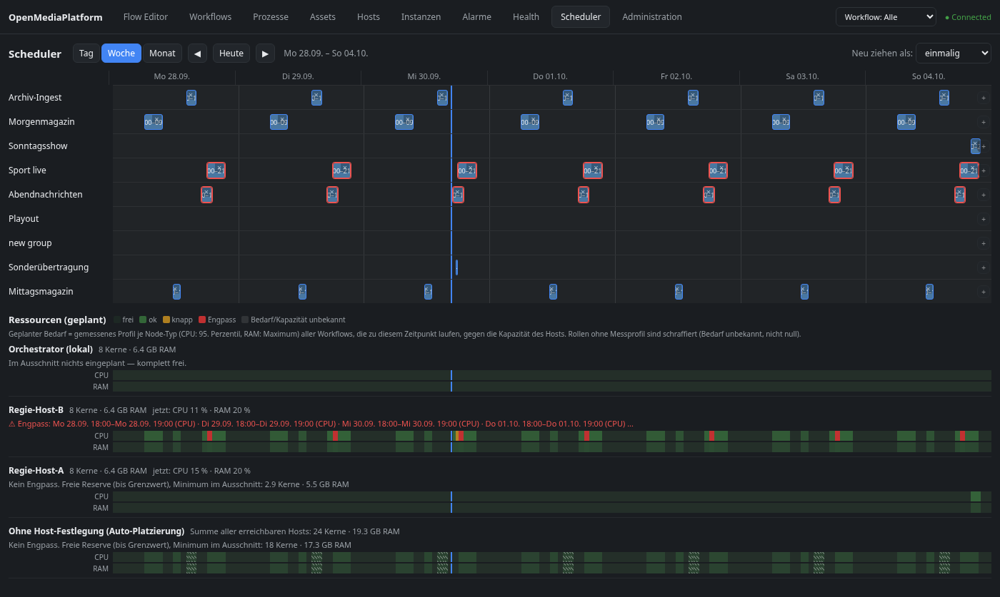

In der **Wochenansicht** wiederholen sich tägliche Zeitpläne erkennbar; in
der **Monatsansicht** zeigt jede Tageszelle den **ungünstigsten Zeitpunkt
des Tages** — ein schneller Blick, an welchen Tagen Engpässe drohen.

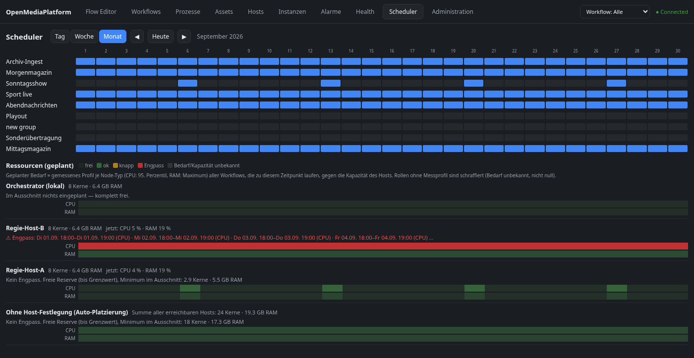

**Grenzen, die man kennen sollte:**

- Geplant wird nur, was **in Zeitplänen** steht. Von Hand zusätzlich
  gestartete Instanzen sieht man nur in der „jetzt"-Angabe des Hosts.
- Netz- und GPU-Auslastung erscheinen nur live, nicht in der Planung (für
  sie gibt es keine Messprofile je Node-Typ).
- Für den Streifen „ohne Host-Festlegung" gilt die Summe aller erreichbaren
  Hosts als Kapazität; ob eine einzelne Rolle dort noch auf einen Host
  passt, prüft die Anzeige nicht.
- Zeitpläne, die über Mitternacht laufen (Start 22:00, Stop 06:00), werden
  in der Ressourcenrechnung korrekt berücksichtigt; als Balken zeigt die
  Tagesansicht sie heute nur, wenn Start und Stop am selben Tag liegen.

Der Tab ist für alle Nutzer mit Lesezugriff sichtbar; Änderungen
verlangen (wie das Workflow-Formular selbst) das Konfigurationsrecht auf
den betroffenen Workflow — ohne dieses Recht schlägt das Speichern mit
einer Fehlermeldung fehl, statt die Änderung still zu verwerfen.

**Vorsicht bei eigenen Tests:** ein hier eingetragener Zeitplan startet/
stoppt den echten Workflow zur eingetragenen Uhrzeit, auch unbeaufsichtigt
— zum Ausprobieren einen eigens dafür angelegten, unwichtigen Workflow
verwenden, nicht einen produktiv genutzten Regieplatz.

## 5a. Prozesse

Der Reiter **Prozesse** ist die Business-Prozess-Engine (Ablaufgraph aus
Schritten wie Genehmigung, Service-Aufruf, ffmpeg-Skript, Bedingung) —
bewusst ein anderes Konzept als die **Workflows** aus Abschnitt 4 (dort:
Node-Verkabelung eines Regieplatzes). Links die Prozess-Definitionen,
rechts deren Versionen, Ausführungen und offene Aufgaben.

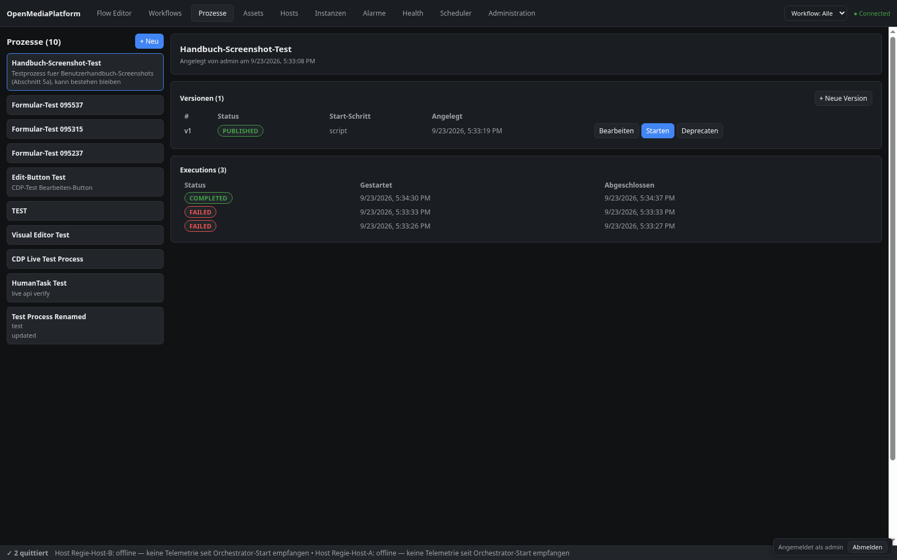

- **„+ Neu"** legt eine Definition an (nur Name/Beschreibung).
- **„Prozess löschen"** (oben im Detailbereich der gewählten Definition)
  entfernt den Prozess samt allen Versionen und der Ausführungs-Historie —
  nach einer Sicherheitsabfrage und endgültig. Solange noch Ausführungen
  laufen (auch wartende oder pausierte), lehnt der Server das Löschen ab;
  dann zuerst die Ausführungen abbrechen.
- **„+ Neue Version"** öffnet den grafischen Editor. Links stehen die
  **Bausteine**, gruppiert nach Aktionen (Node-Funktion, Web-Aufruf,
  Datei-Werkzeug ffmpeg/ffprobe, Benachrichtigung, Unterprozess),
  Menschen (Aufgabe für Person, Freigabe) und Ablauf (Wenn … dann,
  Verteiler, Parallel aufteilen/Zusammenführen, Warten, Timer).
  Bausteine, die dieser Server nicht ausführen kann, stehen eingeklappt
  unter „Nicht verfügbar“. Ein Baustein wird per Klick oder Ziehen
  hinzugefügt.

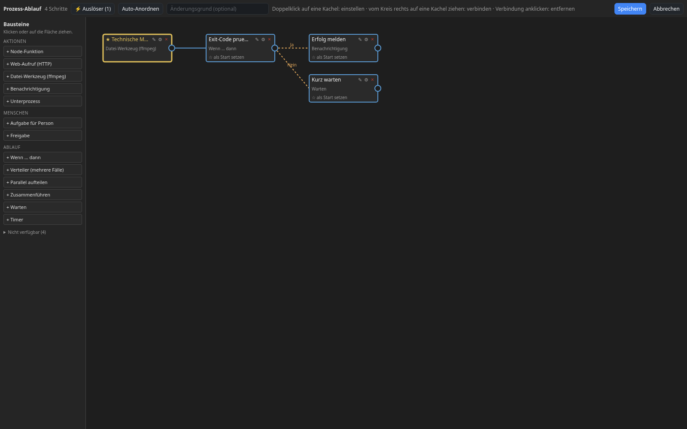

- **Doppelklick auf eine Kachel** öffnet ein Formular für genau diesen
  Schritt-Typ, ohne JSON: bei „Wenn … dann“ eine Regel aus
  *Wert · Vergleich · Wert*, bei der Node-Funktion die laufenden
  Microservices und ihre Funktionen als Auswahl. Fehlt eine
  Pflichtangabe, zeigt die Kachel „⚠ … fehlt“.
- **„{x} Variable“** neben Textfeldern setzt Werte aus dem Prozesslauf
  ein: Felder der Start-Eingabe/des auslösenden Ereignisses (z. B.
  Asset-ID), Ergebnisse vorheriger Schritte (z. B. „Ausgabe (stdout)“
  von „Metadaten lesen“) und Angaben zum Prozesslauf. Angeboten werden
  nur Schritte, die vor diesem Schritt garantiert gelaufen sind.
- **Verbinden:** vom Kreis rechts an einer Kachel auf die nächste Kachel
  ziehen. Bei „Wenn … dann“, „Verteiler“ und „Freigabe“ fragt der
  Editor, welcher Weg dorthin führt (z. B. „Ja“/„Nein“ oder
  „freigegeben“/„abgelehnt“/„Änderungen angefordert“).
- **„Wenn etwas schiefgeht“** (im selben Formular): automatisch
  wiederholen (Anzahl, Pause, zunehmender Abstand), maximale Laufzeit und
  ein Schritt, der die Wirkung bei einem späteren Fehler rückgängig macht.
- **„⚡ Auslöser“** (Werkzeugleiste): den Prozess automatisch starten,
  z. B. wenn ein Asset angelegt wird oder auf „Bereit“ wechselt. Die
  Daten des Ereignisses stehen dann als Start-Eingabe zur Verfügung.
  Auslöser wirken erst ab dem Veröffentlichen der Version.
- **„Erweitert: Einstellungen als JSON“** am Ende jedes Formulars ist
  nur noch für Sonderfälle gedacht.
- **Speichern** legt die Version als Entwurf an.
- **Einen bestehenden Prozess bearbeiten:** in der Versionstabelle
  **„Bearbeiten"** an der gewünschten Version — der Editor öffnet mit
  genau diesem Graphen, **Speichern** legt daraus eine **neue**
  Entwurfs-Version an. Eine Version selbst wird nie überschrieben:
  veröffentlichte Versionen sind unveränderlich, laufende und frühere
  Ausführungen bleiben so nachvollziehbar.
- **„Veröffentlichen"** macht einen Entwurf startbar, **„Starten"** an
  einer veröffentlichten Version startet eine Ausführung (optional mit
  JSON-Eingabe). Ausführungen lassen sich pausieren, fortsetzen und
  abbrechen; ihre Schritte und Genehmigungs-Aufgaben erscheinen darunter
  („Für mich beanspruchen" → „Genehmigen"/„Ablehnen"/„Änderungen
  anfordern").

### 5a.1 Datei-Werkzeug (ffmpeg/ffprobe): der Assistent

Beim Datei-Werkzeug öffnet der Doppelklick standardmäßig den
**Assistenten** — ein Formular mit echten, von diesem Server
tatsächlich unterstützten Werten (Container, Codecs, Filter samt
Hilfetext), keine Rohargumente. Über **„Aufgabe"** stehen folgende
geführte Abläufe zur Wahl:

- **Technische Metadaten auslesen** — nur die Eingabedatei angeben,
  liefert Codec/Auflösung/Dauer als JSON im Ergebnisfeld „Ausgabe
  (stdout)“.
- **Vorschaubild erzeugen** — Eingabe-/Ausgabedatei, Zeitpunkt und
  Breite in Pixeln.
- **Format/Codec konvertieren** — Container optional erzwingen,
  Video-/Audio-Codec aus der echten Liste dieses Servers wählen; wird
  ein Codec gewählt, erscheinen seine tatsächlichen Einstellungen
  darunter — Auswahlliste bei festen Werten, Schieberegler bei
  Zahlenwerten mit bekannter Ober-/Untergrenze (z. B. `-crf`),
  Kontrollkästchen bei Ja/Nein, sonst ein Textfeld — jeweils samt
  Hilfetext, erlaubtem Wertebereich und Standardwert. Wer mehr als
  eine unabhängige Ausgabespur braucht (siehe „Ausgabespuren“ unten)
  lässt diese beiden Felder einfach leer.
- **Tonspur extrahieren** — wie Konvertieren, nur ohne Bild.
- **Clips aneinanderhängen (Schnittliste)** — mehrere Dateien in einer
  festgelegten Reihenfolge zu einer Ausgabedatei zusammenfügen, mit
  ↑/↓ umsortierbar, je Clip optional mit Start-/End-Beschnitt. Das
  Häkchen **„Verlustfrei (Stream-Copy, kein Neukodieren)“** schaltet
  auf reinen Stream-Copy um (blendet dabei Beschnitt- und Codec-Felder
  aus, da beides in diesem Modus wirkungslos wäre) — zuverlässig vor
  allem für Container wie MPEG-TS/-PS, nicht generell für MP4/MOV/MKV
  (siehe Hinweistext im Formular).
- **Overlay/Senderkennung/Abspann zeitgesteuert einblenden** — beliebig
  viele Text- (z. B. Bauchbinde, Abspann-Credits) oder Bild-Ereignisse
  (z. B. Senderlogo), jedes mit eigenem Start-/Endzeitpunkt in Sekunden
  und optionaler Position; eine schlichte Zeitleiste darüber zeigt zur
  Orientierung, wie die Ereignisse zeitlich verteilt sind (nicht
  ziehbar, nur zur Übersicht).
- **Lautheit normalisieren (EBU R128)** — Ziel-Lautheit (LUFS),
  maximaler True Peak (dBTP) und Lautheits-Schwankungsbreite (LRA)
  einstellbar, Standardwerte entsprechen EBU R128 (-23 LUFS/-2 dBTP/7
  LU); Bild wird immer unverändert übernommen. Einpass-Verfahren — für
  eine noch präzisere Zweipass-Messung den Experten-Modus nutzen.
- **Verlustfreier Passthrough/Remux (Container wechseln)** — reiner
  Container-Wechsel ohne Neukodierung, optional einen Container
  erzwingen (sonst aus der Dateiendung abgeleitet).
- **Streaming-Ausgabeleiter (Multi-Bitrate HLS)** — beliebig viele
  Renditionen (Name, Auflösung, Video-/Audio-Bitrate, per „+ weitere
  Rendition“ hinzufügbar/entfernbar), erzeugt eine Master-Playlist
  (`master.m3u8`) im gewählten Ausgabeverzeichnis plus je Rendition
  einen Unterordner mit Segmenten — für adaptives Streaming in Web-/
  App-Playern. Rendition-Namen dürfen nur Buchstaben, Zahlen und
  Bindestrich enthalten (werden als Verzeichnisnamen verwendet).

  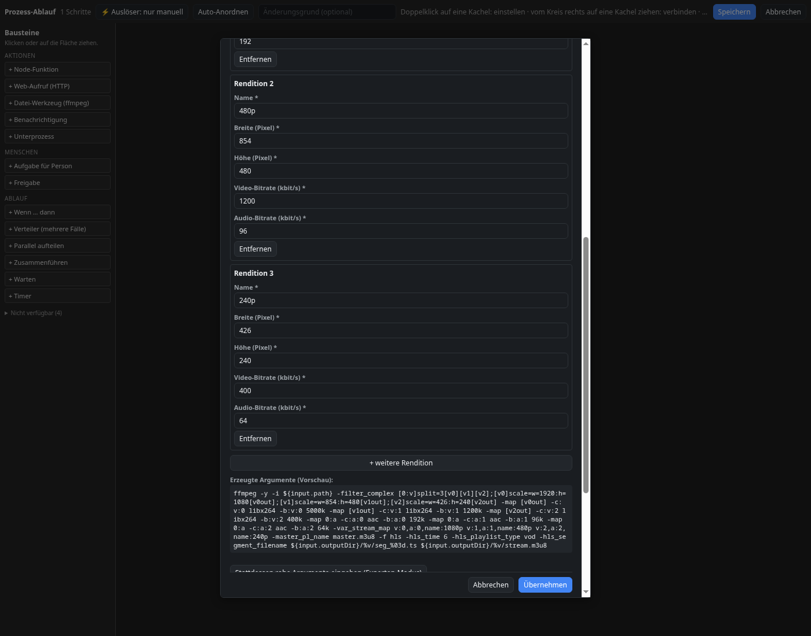

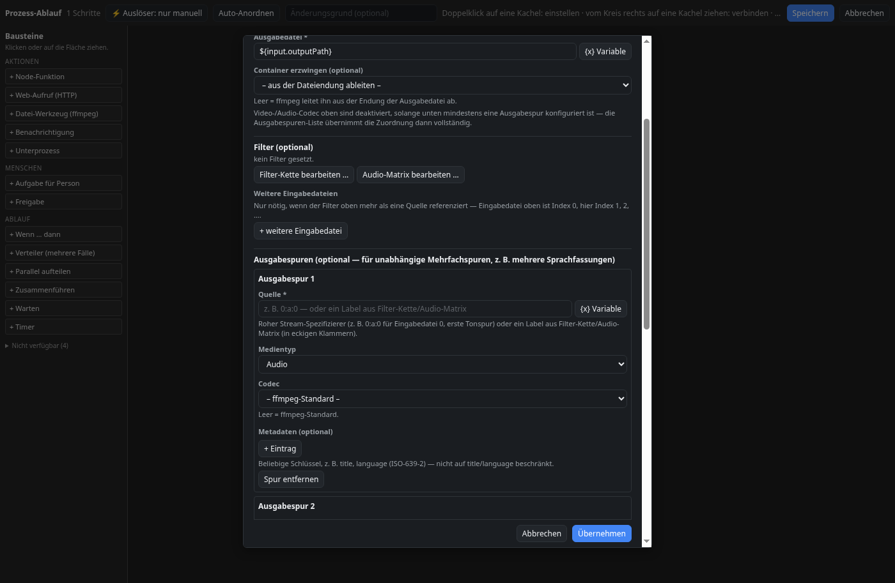

Innerhalb von „Format/Codec konvertieren“ gibt es zwei weitere
Bausteine, die zusammen abdecken, was früher eine eigene, inzwischen
wieder ausgebaute „Mehrspur-Container bauen“-Sonderfunktion war:

- **„Audio-Matrix bearbeiten …“** öffnet ein Kreuzschienen-Raster:
  Zeilen sind die Tonkanäle aller angegebenen Quelldateien (Haupt-
  Eingabedatei plus beliebig viele Zusatzquellen). Jede Zusatzquelle
  bekommt einen eigenen, benennbaren **„Auxinput“**-Abschnitt (z. B.
  „SW8-Trailer“ statt nur „Quelle 2“) — per Klick auf die Kopfzeile
  ein-/ausklappbar, damit die Liste bei vielen Zusatzquellen
  übersichtlich bleibt; der gewählte Name erscheint direkt als
  Zeilen-Beschriftung im Raster darunter.

  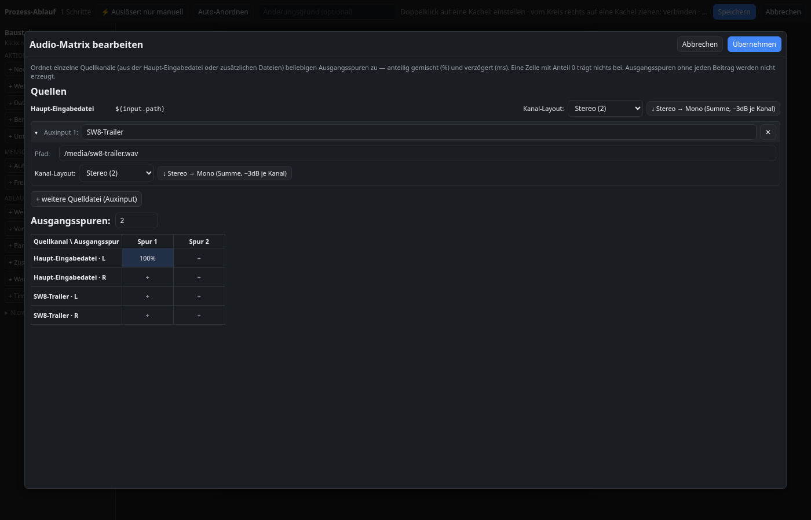

  Spalten sind frei wählbare Ausgangsspuren. Je Quelldatei wählt man ein
  **Kanal-Layout** (Mono/Stereo/5.1/7.1 oder „Eigene Anzahl“ für alles
  andere) — die Zeilen zeigen dann echte Kanal-Namen (L/R/C/LFE/Ls/Rs
  statt nur „Kanal 1/2/3“). Ein Klick auf eine Zelle öffnet einen
  **Downmixer**-Dialog mit Gain-Regler (%, inklusive live berechneter
  dB-Anzeige) und Verzögerung (ms) — eine Zelle ohne Anteil trägt
  nichts bei, eine Ausgangsspur ganz ohne Beitrag wird gar nicht erst
  erzeugt. So lassen sich Kanäle beliebig routen, anteilig mischen und
  zueinander verzögern, ohne Filtersyntax zu kennen.

  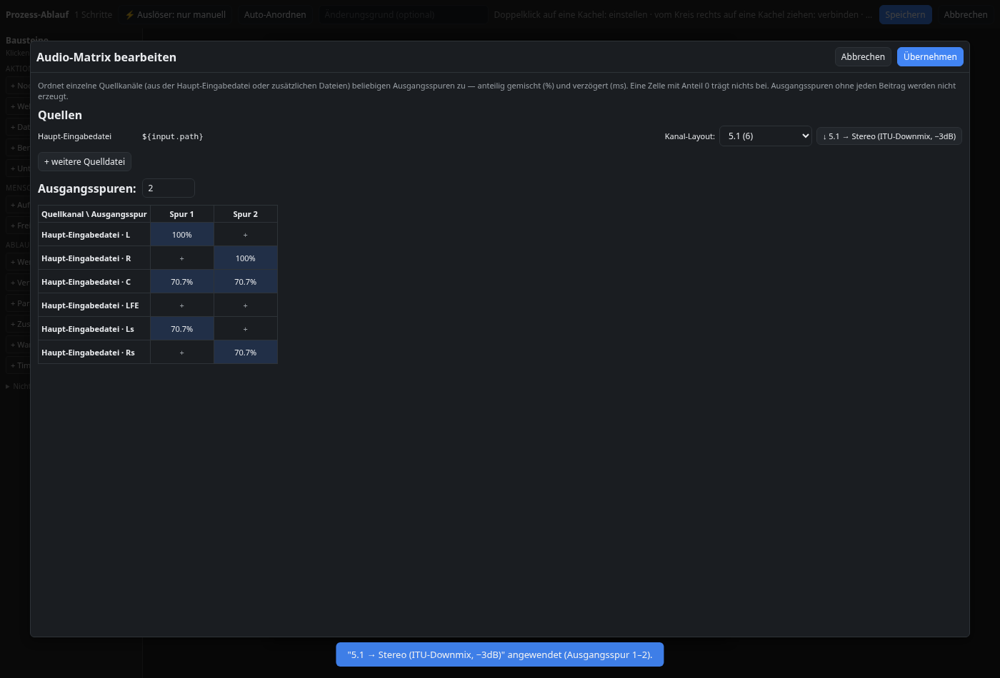

  Für gängige Layout-Kombinationen bietet die Matrix eine
  **Downmix-Vorlage** als Ein-Klick-Knopf neben dem Kanal-Layout an
  (z. B. „5.1 → Stereo (ITU-Downmix, −3dB)“, „Stereo → Mono“, „Mono →
  Stereo“) — sie füllt die passenden Zellen sofort mit sinnvollen
  Vorgaben, die man danach wie jede andere Zelle per Klick nachjustieren
  kann. Der Downmixer-Dialog einer einzelnen Zelle sieht so aus:

  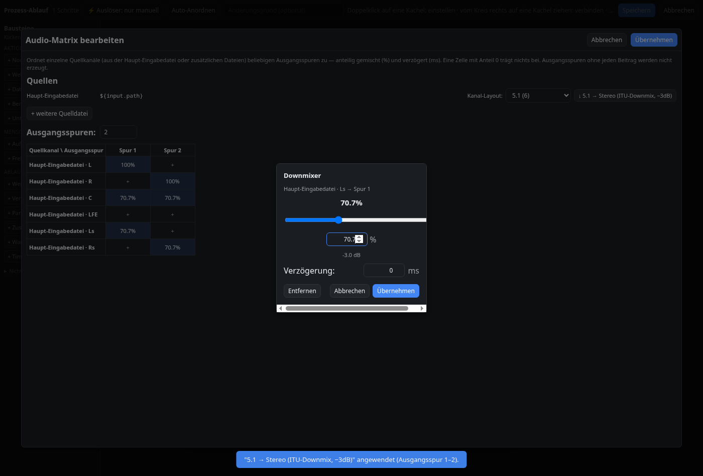

- **„+ Ausgabespur“** (weiter unten im Formular) legt beliebig viele
  unabhängige, einzeln kodierte Ausgangsspuren an — Quelle (roher
  Stream-Spezifizierer wie `0:a:0`, oder per Knopf ein Label aus der
  Audio-Matrix/Filter-Kette wie `[mxout0]` übernehmen), Medientyp,
  Codec samt Optionen und beliebige Metadaten-Schlüssel (nicht nur
  Titel/Sprache — jeder Schlüssel, den ffmpeg versteht). Sobald
  mindestens eine Ausgabespur angelegt ist, übernimmt diese Liste die
  komplette Spurzuordnung; die einfachen Video-/Audio-Codec-Felder
  weiter oben blenden sich dafür aus, damit nie zwei widersprüchliche
  Angaben gleichzeitig sichtbar sind.

Ebenfalls bei „Format/Codec konvertieren“ öffnet **„Filter-Kette
bearbeiten …“** einen eigenen, größeren Dialog: Filter aus der echten
Filterliste dieses Servers suchen und als Kachel hinzufügen, per
Ziehen vom farbigen Punkt einer Kachel auf den Eingang der nächsten
verbinden. Ein „Eingang“-Baustein steht für eine Quelldatei (Kennung
z. B. `0:v`), ein „Ausgang“-Baustein für das Ergebnis. Filter mit
einstellbarer Eingangs-/Ausgangszahl (z. B. zum Mischen mehrerer
Tonspuren) zeigen ein Zahlenfeld dafür, Zahlenwerte mit bekannter
Ober-/Untergrenze erscheinen als Schieberegler. „Automatisch anordnen“
räumt die Kacheln auf, „Übernehmen“ baut daraus die tatsächliche
Filterkette. Referenziert die Filterkette mehr als eine Quelle,
erscheint im Hauptformular darunter „Weitere Eingabedateien“ — die
erste Datei bleibt Kennung `0`, jede weitere zählt hoch. Audio-Matrix
und Filter-Kette teilen sich dasselbe Ergebnis (die Filterkette hinter
den Kulissen) und ersetzen sich daher gegenseitig, statt sich zu
ergänzen — wer beides braucht, baut die Audio-Matrix-Logik von Hand als
Filterkette nach.

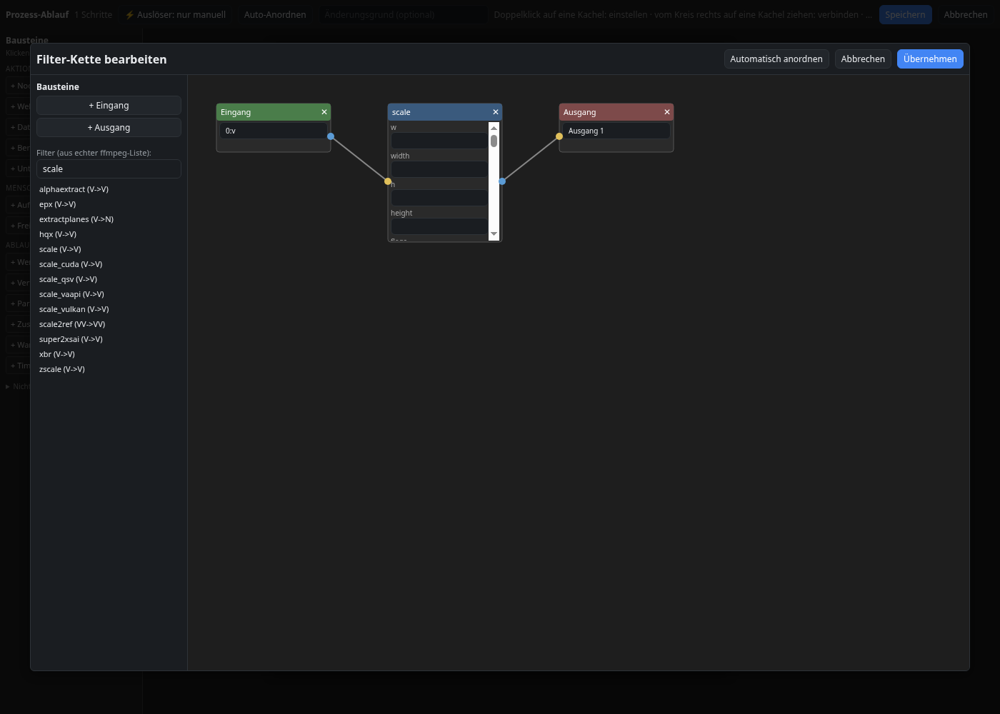

Wer die rohe ffmpeg-Befehlszeile kennt, kann jederzeit auf
**„Stattdessen rohe Argumente eingeben (Experten-Modus)"** umschalten.
Auch hier muss niemand mehr Parameter auswendig kennen: bekannte Flags
werden beim Tippen eines „-“ automatisch vorgeschlagen (Name +
Hilfetext), und der eingegebene Wert wird sofort gegen die bekannte
Definition geprüft (Zahlenbereich, Auswahlliste, Ja/Nein) — ein
falscher Wert erscheint direkt als Warnung unter dem Feld. Der Knopf
**„Parameter suchen …“** öffnet einen durchsuchbaren Katalog, der
buchstäblich jeden Parameter dieses Servers umfasst: alle globalen
ffmpeg-Flags (aus `ffmpeg -h full`) plus alle AVOptions aller
installierten Encoder/Decoder/Muxer/Demuxer/Filter (typischerweise über
1.000 Parameter insgesamt) — eine Suche nach z. B. „crf“ findet direkt
`-crf` in jedem Encoder, der es kennt, ganz ohne diesen Encoder vorher
von Hand aufzuklappen. Jeder Treffer zeigt seine Kategorie als
Beschriftung (z. B. „libx264 (Encoder)“, „Filter“, „globales Flag“).
Ein Tippfehler im gesuchten Namen (z. B. „sacle“ statt „scale“, ein
Zahlendreher wie „libx265“ statt „libx264“) findet den gemeinten
Parameter trotzdem — solche Treffer sind zusätzlich mit **„≈
Tippfehler?“** markiert, damit klar bleibt, dass der eingegebene Text
nicht wörtlich vorkommt. Die Trefferliste lässt sich komplett über die
Tastatur bedienen: **Pfeiltasten** wechseln den markierten Treffer,
**Eingabetaste** fügt ihn ein (bei einem Flag mit Wert direkt gefolgt
von einer leeren, fokussierten Wertzeile), **Esc** leert die Suche.
Klick auf einen Treffer fügt ihn ebenso als neues Argument ein.

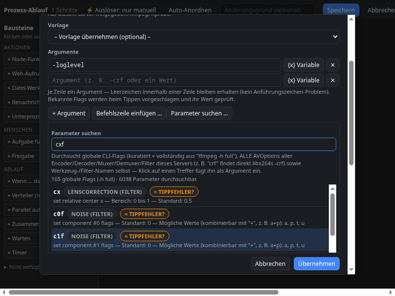

## 5b. Assets

Der Reiter **Assets** verwaltet Medien-Assets samt Metadaten,
Versionen und technischen Dateien (Representations):

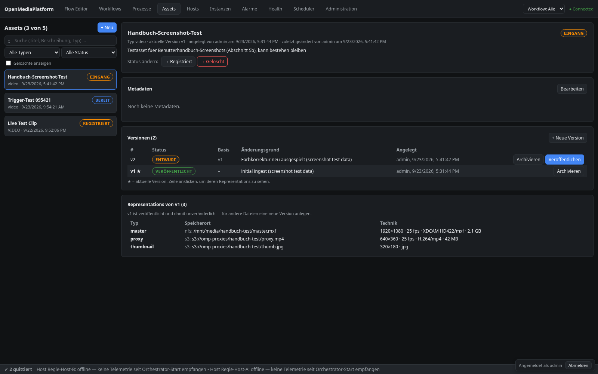

- Links die Asset-Liste mit Suche (Titel/Beschreibung/Typ) und Filtern
  nach Typ und Status; gelöschte Assets sind ausgeblendet, bis
  „Gelöschte anzeigen" aktiv ist. **„+ Neu"** legt ein Asset an (Titel,
  frei wählbarer Typ wie `video`/`audio`, Beschreibung) — es startet im
  Status „Eingang".
- **Status ändern:** die Knöpfe unter dem Titel bieten nur die Übergänge
  an, die der Lebenszyklus vom aktuellen Status aus erlaubt (Eingang →
  Registriert → In Verarbeitung → Bereit → In Prüfung → Freigegeben →
  Veröffentlicht → Archiviert, plus Rückwege, „Abgelaufen" und
  „Gelöscht"). „Gelöscht" ist ein Endzustand und fragt vorher nach.
- **Metadaten → „Bearbeiten"** öffnet ein Formular mit Feldname/Wert je
  Kategorie (Beschreibend, Redaktionell, Technisch, Eigene Felder,
  KI-generiert, System). Strukturierte Werte (Zahlen, Listen) erscheinen
  als JSON in Monospace-Schrift und bleiben beim Speichern Zahl bzw.
  Liste. Hat jemand anderes das Asset währenddessen geändert, lehnt der
  Server das Speichern ab, das Formular schließt sich mit Hinweis — neu
  öffnen, damit nichts Fremdes überschrieben wird.
- **Versionen:** „+ Neue Version" legt einen Entwurf an (optional auf
  Basis einer früheren Version, mit Änderungsgrund). Eine Zeile anklicken
  zeigt deren **Representations** (z. B. Master, Proxy, Thumbnail mit
  Speicherort und Technik wie 1920×1080 · 25 fps). Representations lassen
  sich nur an einem **Entwurf** hinzufügen oder entfernen;
  **„Veröffentlichen"** macht die Version unveränderlich und zur
  aktuellen Version des Assets (★, „veröffentlicht und damit
  unveränderlich" im Representations-Panel, ohne „Entfernen"-Knöpfe).
  Für geänderte Dateien danach eine
  neue Version anlegen.

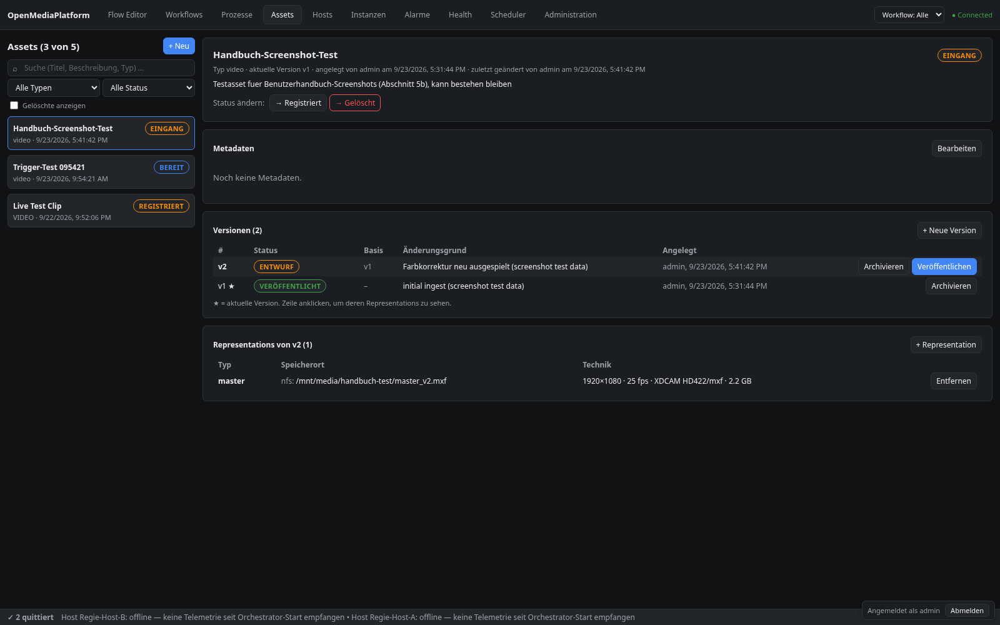

### 5b.1 Dateien von lokalen Hosts oder einem Netzlaufwerk (z. B. Isilon) hinzufügen

„+ Representation" trägt **keine Datei hoch** — Feld „Speicher"
(`filesystem`/`s3`/`http`, frei wählbar) plus „Pfad/URI" registrieren
nur einen **Verweis** darauf, wo die Datei bereits liegt (reine
Katalog-/Such-Metadaten, es werden keine Bytes bewegt). Ein echter
Browser-Datei-Upload über die konfigurierten S3/MinIO-Speicher-Backends
(Administration → Storage) ist backend-seitig vorbereitet, aber noch
nicht an dieses Formular angebunden.

Was eine Mediendatei tatsächlich **abspielbar** macht, ist davon
unabhängig: Playout-Nodes (Kanal-Player, MXF-Player, …) lesen ihre
Datei direkt vom Dateisystem des Hosts, auf dem ihr Prozess läuft —
über `OMP_MEDIA_DIR` (Vorgabe `data/media`, relative Pfade bleiben
darauf beschränkt) oder einen absoluten Pfad ohne Einschränkung.
Daraus ergibt sich:

- **Datei liegt auf demselben Rechner wie dieser Node** (z. B. euer
  Laptop, wenn Node und Browser dort laufen): ein ganz normaler
  absoluter Pfad reicht, auch außerhalb des Projektverzeichnisses.
- **Netzlaufwerk/NAS wie eine Isilon:** muss auf dem Host, der den
  Node-Prozess ausführt, selbst gemountet sein (NFS/SMB, außerhalb von
  OMPs Verantwortung) — danach ist es für den Node ein ganz normaler
  lokaler Pfad.
- Der Node-Typ `omp-media-library` scannt ein Verzeichnis
  (`OMP_MEDIA_DIR`) automatisch, liest technische Metadaten per
  `ffprobe` aus (Dauer, Codec, Auflösung, Mark-In/Out) und ist der
  vorgesehene Weg, ein Verzeichnis oder Netzlaufwerk als durchsuchbare
  Bibliothek einzubinden — unabhängig vom Asset-Katalog oben.
- Bietet eure Isilon (neuere OneFS-Versionen) ein S3-kompatibles
  Protokoll an, lässt sie sich wie MinIO im Administration-Tab unter
  „Storage" als eigenes Backend eintragen — auch das aktuell nur als
  Backend, noch ohne Browser-Upload-Knopf im Assets-Tab.

## 6. Alarme

Der Reiter **Alarme** sammelt an einer Stelle, was operative
Aufmerksamkeit braucht: abgestürzte oder instabile (flappende)
Instanzen, überlastete Hosts und fehlgeschlagene Workflow-Starts. Im
Normalbetrieb bleibt er leer:

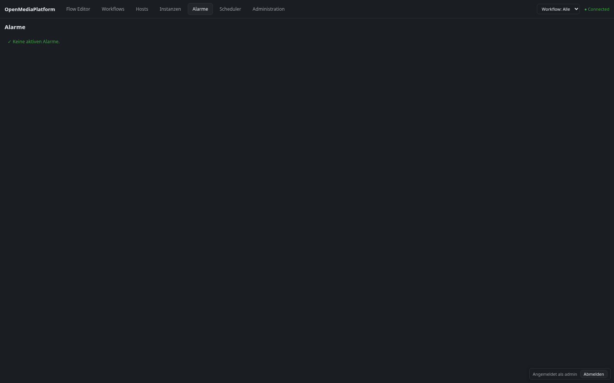

## 7. Administration

Der Reiter **Administration** (nur sichtbar für Nutzer mit
Administrationsrecht) verwaltet Nutzerkonten, Organisationen, Gruppen,
Rollenbindungen, den Node-Katalog-Import/Export, Storage-Backends, zeigt
ein Audit-Log aller schreibenden API-Zugriffe und Diagnose-Angaben,
erstellt/restauriert Datenbank-Sicherungen, spielt **System-Updates** ein
und verwaltet den Orchestrator-Cluster selbst. Die Bereiche liegen als
eigene Unter-Reiter nebeneinander (Nutzer, Organisationen, Gruppen,
Rollenbindungen, Node-Katalog, Storage, Audit-Log, Diagnose,
Backup/Restore, System-Update, Cluster) statt untereinander (der
Screenshot unten zeigt noch den älteren Stand, die ersten vier Abschnitte
untereinander):

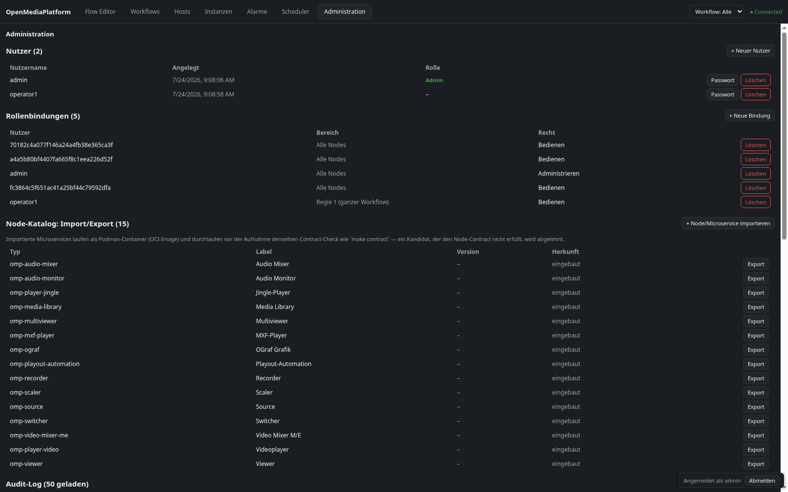

- **Nutzer** — anlegen, Passwort zurücksetzen, löschen.
- **Rollenbindungen** — verknüpfen einen Nutzer mit einem Rechtebereich
  (`Alle Nodes`, eine einzelne Node-ID, oder — wie im Screenshot bei
  „operator1" — ein ganzer Workflow) und einem Recht (`Bedienen` <
  `Konfigurieren` < `Administrieren`). Ein Nutzer ohne passende
  Bindung sieht die entsprechende Aktion in der Oberfläche gar nicht
  erst als Option. Die kryptischen Nutzernamen in den übrigen Zeilen
  des Screenshots sind Service-Token-Bindungen, die der Orchestrator
  automatisch für Control-Plane-Nodes wie `omp-playout-automation`
  anlegt (dessen Instanz-ID als Subject) — keine echten Personenkonten.
- **Node-Katalog: Import/Export** — jeder eingebaute Node-Typ ist hier
  als Referenz exportierbar; „+ Node/Microservice importieren"
  (Abschnitt „Related project"/`HANDBUCH.md`) nimmt zusätzlich
  containerisierte Drittanbieter-Microservices auf, nach demselben
  Contract-Check wie eingebaute Nodes.
- **Audit-Log** — jede schreibende Anfrage (wer, wann, welcher
  API-Pfad, welcher HTTP-Status) — auch fehlgeschlagene Versuche (rot
  markierte Statuscodes) bleiben sichtbar.
- **Backup/Restore** — „Backup jetzt erstellen“ erstellt sofort einen
  Download; Restore verlangt, den gewählten Dateinamen exakt
  einzutippen (Bestätigung), ersetzt danach den kompletten
  Datenbankinhalt und lädt die Seite nach einigen Sekunden automatisch
  neu, sobald der Orchestrator wieder erreichbar ist (Details:
  `docs/HANDBUCH.md` §5, inkl. des dafür nötigen Supervisor-Prozesses).
- **System-Update** — spielt eine neue Version des Servers per
  Browser-Upload ein (Firmware-artig, ohne Zugriff auf die Maschine):

  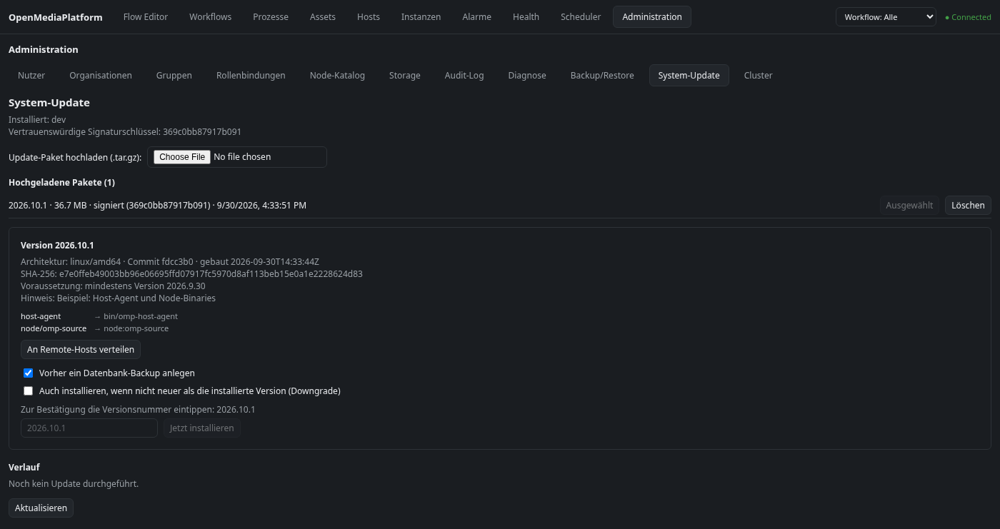

  1. Ein **Update-Paket** (`.tar.gz`, vom Betreiber mit `make update-bundle`
     gebaut und **signiert**) über „Update-Paket hochladen" auswählen. Der
     Server prüft sofort Aufbau, Prüfsummen und die Signatur gegen die
     hinterlegten Schlüssel (oben unter „Vertrauenswürdige
     Signaturschlüssel" angezeigt). Ein unsigniertes, verändertes oder
     beschädigtes Paket wird abgelehnt und nicht abgelegt.
  2. Das Paket erscheint in der Liste; „Auswählen" zeigt Version,
     Architektur, Commit, Prüfsumme, Hinweistext, **Voraussetzung**
     (Mindestversion), die enthaltenen Komponenten (Orchestrator,
     Supervisor, Host-Agent, Oberfläche, Node-Programme) und ob das Update
     die **Datenbank ändert**.
  3. **„Jetzt installieren"** wird erst aktiv, wenn du die Versionsnummer
     exakt eintippst. Ein Datenbank-Backup vorher ist voreingestellt (bei
     Datenbank-Änderungen Pflicht). „Downgrade" erlaubt ausdrücklich eine
     ältere oder gleiche Version.
  4. Der Server sichert, wird angehalten, aktualisiert und neu gestartet
     (Sekunden bis wenige Minuten; die Seite lädt danach von selbst neu).
     **Kommt die neue Version nicht gesund hoch, stellt der Supervisor den
     vorherigen Stand automatisch wieder her.** Das Ergebnis steht unter
     „Verlauf" (erfolgreich / fehlgeschlagen, zurückgerollt, mit Grund).
  5. **Laufende Nodes bleiben in Betrieb.** Instanzen, deren Programm
     ersetzt wurde, sind als **„veraltet"** gekennzeichnet (Reiter
     Instanzen); oben im Update-Reiter zeigt eine Warnung ihre Anzahl mit
     dem Knopf **„Veraltete Instanzen jetzt neu starten"** (mit
     Sicherheitsabfrage; Workflow-Rollen behalten dabei Node-IDs und
     Bedienzustand).
  6. **„An Remote-Hosts verteilen"** schickt das Paket an alle
     erreichbaren Host-Agents; jeder prüft es mit seinem eigenen
     Schlüssel und ersetzt sein Agent-Programm und die Node-Programme aus
     seinem lokalen Katalog. Das Ergebnis je Host erscheint live in der
     Liste (ok / fehlgeschlagen / offline). Ein neues Host-Agent-Programm
     wird erst nach dem Neustart des Agents aktiv.

  Wichtig: Ein Update-Paket ist ausführbarer Code. Deshalb ist der Reiter
  nur für Administratoren, jedes Hochladen/Installieren steht im Audit-Log,
  und ohne hinterlegten Signaturschlüssel wird **jedes** Paket abgelehnt.
  Einrichtung, Paket bauen und Fehlerbehebung: `docs/HANDBUCH.md` §5b.
- **Cluster** — Redundanz des Orchestrators selbst (Raft-Konsens,
  `ARCHITECTURE.md` §19.3): eine Statuskarte zeigt die eigene Node-ID,
  Zustand (Leader/Follower), Term und angewandten Log-Index dieser
  Instanz sowie den aktuellen Leader; darunter die Mitgliederliste mit
  Leader-Kennzeichnung und „Entfernen“ (mit Sicherheitsabfrage) je
  Mitglied. „+ Weiteren Orchestrator hinzufügen“ öffnet ein Formular
  (Node-ID, Raft-Adresse, optional die HTTP-Adresse der neuen Instanz),
  das darunter live ein fertiges Start-Skript mit allen nötigen
  Umgebungsvariablen erzeugt — auf der neuen Maschine ausführen, warten
  bis sie läuft, dann hier „Jetzt beitreten lassen“ klicken:

  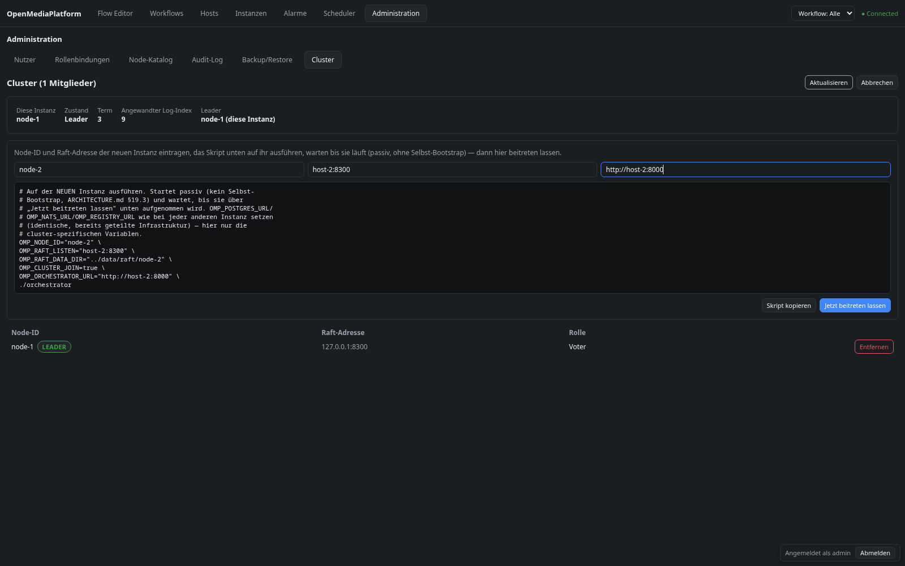

  Beitritt/Entfernen laufen serverseitig immer auf dem tatsächlichen
  Leader (eine Anfrage an eine Follower-Instanz wird automatisch
  dorthin weitergeleitet) — welcher Orchestrator gerade befragt wird,
  spielt für die Bedienung keine Rolle.

## 8. Hosts (Remote-Betrieb)

Der Reiter **Hosts** zeigt entfernte Maschinen, auf denen ein
Host-Agent läuft und die sich beim Orchestrator registriert haben —
Instanzen lassen sich dann auch auf diesen entfernten Hosts starten,
nicht nur lokal:

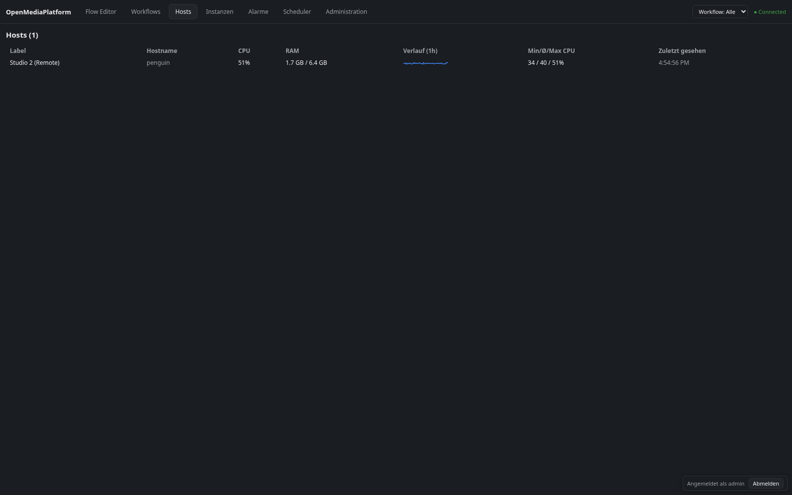

Neben dem aktuellen CPU-/RAM-Stand zeigt die Tabelle eine Ein-Stunden-
Verlaufs-Sparkline sowie Minimum/Durchschnitt/Maximum CPU — hilfreich,
um vor dem Start einer weiteren Instanz abzuschätzen, ob auf diesem
Host noch Luft ist.

Ein Host-Agent führt ausschließlich Node-Typen aus seinem eigenen,
lokal konfigurierten Katalog aus — der Orchestrator kann keinen
beliebigen Befehl auf einem entfernten Host ausführen, das ist eine
bewusste Sicherheitsgrenze.

### 8.1 Neuen Host hinzufügen (Wizard)

„+ Neuen Host hinzufügen“ (nur für Admins sichtbar) führt durch vier
Schritte statt den Bootstrap-Token-Flow von Hand per API zu bedienen:
Zielumgebung (Bare-Metal, VM im lokalen Cluster, oder Cloud/AWS EC2)
plus ein Label wählen; ein einmaliges, eine Stunde gültiges
Bootstrap-Token wird automatisch erzeugt; ein fertiges,
kopierbares Provisionierungs-Skript erscheint — je nach gewählter
Zielumgebung ein einfacher Shell-Befehl oder ein EC2-User-Data-Skript,
mit editierbaren Feldern für Orchestrator-/Registry-/NATS-Adresse
(vorbelegt, aber Vermutungen, die auf einer anderen Maschine ggf.
angepasst werden müssen):

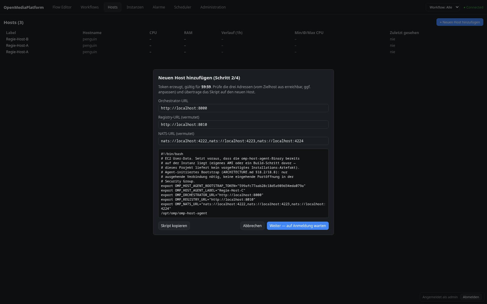

Nach dem Übertragen des Skripts auf den neuen Host wartet der Wizard
live (per SSE, mit Poll als Fallback) auf die Anmeldung des Host-Agents
und zeigt seine gemeldeten Capabilities (Betriebssystem, Architektur,
CPU-Zahl), sobald sie eintrifft — kein manuelles Nachschauen im
Hosts-Tab nötig. Der Wizard kann jederzeit im Hintergrund
weiterlaufen gelassen und geschlossen werden: das Token bleibt bis zum
Ablauf gültig, der Host erscheint bei erfolgreicher Anmeldung ohnehin
in der Tabelle oben. Bare-Metal, VM und Cloud unterscheiden sich für
den Host-Agent selbst nicht — die Auswahl bestimmt nur den Wortlaut des
erzeugten Skripts (`ARCHITECTURE.md` §18.8). Ein tatsächliches
automatisches Hochfahren einer Cloud-Instanz gehört bewusst nicht dazu
(kein Cloud-SDK im Orchestrator-Kern, `ARCHITECTURE.md` §18.9 Punkt 5)
— das Anlegen der Maschine selbst bleibt Sache des Betreibers.

Sobald mindestens zwei Hosts registriert sind, zeigt der Flow Editor
zusätzlich eine **Host-Ansicht** mit Zonen pro Host direkt auf der
Arbeitsfläche (Abschnitt 2.5) — die Hosts-Tabelle hier bleibt die
Detailsicht (Registrierung, Ressourcenverlauf), die Zonen im Flow
Editor zeigen, welche laufende Instanz auf welchem Host sitzt, und
warnen vor host-lokalen MXL-Kanten über eine Zonengrenze hinweg.

## 9. Operator-Konsole (Regieplatz)

Ein Nutzer ohne Konfigurationsrecht, aber mit `Bedienen`-Rechten auf
einen Workflow oder einzelne seiner Rollen (Abschnitt 7:
Rollenbindungen), landet nach dem Anmelden nicht im Flow Editor,
sondern direkt auf einer **Operator-Konsole** — einer reinen
Bedienoberfläche ohne Graph, Katalog oder Verkabelungsmöglichkeit. Sind
einem Nutzer mehrere Workflows zugewiesen, wählt er zunächst aus einer
Kachel-Liste den gewünschten Workflow — jede Kachel nennt den
Workflow-Namen und die Anzahl der darin zugewiesenen Rollen:

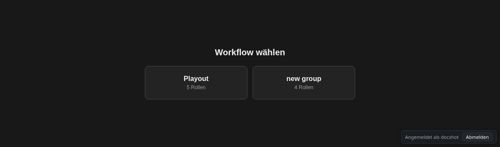

Sobald einem Operator **mehr als eine** Rolle in einem Workflow zusteht,
zeigt die Konsole alle zugewiesenen Node-Oberflächen gleichzeitig als
frei verschieb- und skalierbare Kacheln (bei genau einer Rolle erscheint
stattdessen deren Oberfläche vollflächig, ohne Kachel-Rahmen):

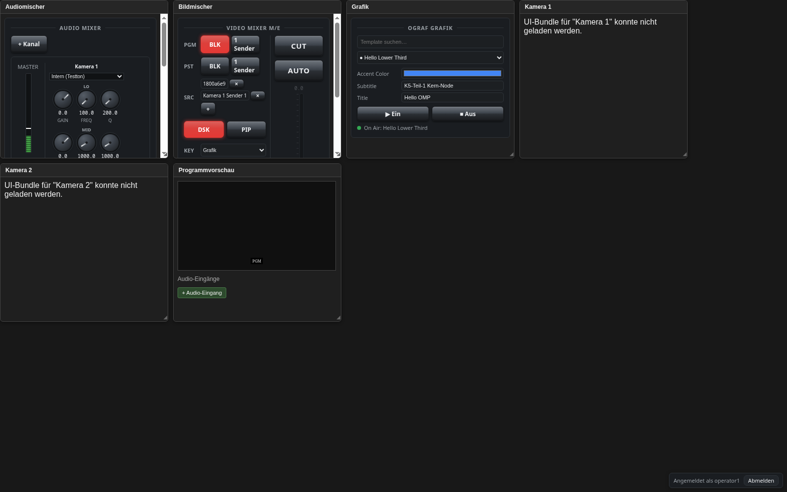

In diesem Beispiel ist der Operator per Workflow-weiter Bindung
(„Regie 1 (ganzer Workflow)", Abschnitt 7) auf allen sechs Rollen
bedienberechtigt:

- **Audiomischer** (oben links) — Kanalzüge mit Gain/EQ (LO/MID/HIGH);
  „+ Kanal" legt einen neuen Eingang an.
- **Bildmischer** — echtes M/E-Bedienpult: PGM-/PST-Kreuzschienen-
  Tasten, CUT/AUTO für harte bzw. weiche Umschaltung, DSK
  (Downstream-Keyer, hier aktiv/rot, mit der Grafik als Fill+Key-Quelle
  über das KEY-Dropdown) und PIP (Bild-im-Bild als eigener Layer).
- **Grafik** — Vorlage auswählen (Suchfeld + Dropdown), Formularfelder
  befüllen, „▶ Ein"/„■ Aus" schaltet die Grafik auf Sendung (im
  Screenshot bereits aktiv: „On Air: Hello Lower Third").
- **Kamera 1** / **Kamera 2** — beide zeigen hier bewusst „UI-Bundle …
  konnte nicht geladen werden": nicht jeder Node-Typ bringt eine eigene
  Bedienoberfläche mit (`omp-source` hat keine, außer den generischen
  Parametern nichts zu bedienen) — die Konsole meldet das ehrlich statt
  eine leere Kachel ohne Erklärung zu zeigen. Welche Quelle welches
  Testmuster zeigt, stellt man über deren `pattern`-Parameter im
  Flow-Editor ein (Parameter-Panel bei Doppelklick auf die Kachel).
- **Programmvorschau** — zeigt das tatsächliche PGM-Ausgangsbild des
  Bildmischers als Live-Vorschau.

Läuft mehr als ein Host (Abschnitt 8), zeigt die Titelleiste jeder
Kachel zusätzlich ein kleines Host-Label (z. B. „Studio 2 (Remote)")
— welcher Host eine Rolle gerade ausführt, ist damit auch im
Regieplatz sichtbar, nicht nur im Flow Editor (Abschnitt 2.5). Der
Screenshot oben stammt aus einem Single-Host-Setup und zeigt deshalb
kein Host-Label.

Jede Kachel verhält sich wie ein echtes Fenster: Titelleiste zum
Verschieben (Ziehen), ein Anfasser unten rechts zum Skalieren, sowie in
der Titelleiste zwei Knöpfe zum **Minimieren** (klappt die Kachel an Ort
und Stelle auf die reine Titelleiste zusammen, bleibt weiter verschiebbar
— erneuter Klick stellt sie wieder her) und **Maximieren** (füllt den
gesamten sichtbaren Konsolenbereich; Maximieren einer anderen Kachel
stellt die vorherige automatisch wieder her, es ist stets höchstens eine
Kachel gleichzeitig maximiert). Ein Klick auf eine Kachel holt sie vor
alle anderen. Oben rechts sorgt **„⊞ Alle anordnen"** dafür, dass alle
Kacheln wieder in einem übersichtlichen Raster erscheinen und
minimierte Kacheln dabei wieder aufklappen. Position, Größe,
Minimiert-Zustand und Reihenfolge werden pro Regieplatz im Browser
gespeichert und bleiben über einen Seiten-Reload hinweg erhalten —
passend zu einem fest installierten Regieplatz-Bildschirm, an dem stets
derselbe Browser läuft (maximiert startet dagegen nie automatisch wieder
— das ist eine vorübergehende Fokus-Aktion, keine dauerhafte
Layout-Entscheidung).

Ohne eine zugewiesene Playout-Automation-Rolle steuert ein Operator rein
manuell (Cut/Auto, Kreuzschiene, DSK/PIP) statt über eine Playlist —
passend für einen reinen Live-Schaltplatz ohne Bandmaterial; ist eine
`omp-playout-automation`-Rolle Teil des Workflows und dem Operator
zugewiesen, erscheint zusätzlich deren Playlist-Oberfläche als eigene
Kachel.

### 9.1 Workflow wechseln (Home-Button)

Ist ein Operator mehreren Workflows zugewiesen, zeigt das
Nutzer-Widget unten rechts (neben „Abmelden") zusätzlich einen
**„🏠 Workflow wechseln"**-Button, solange man sich innerhalb einer
einzelnen Konsole befindet — ein Klick führt zurück zur Kachel-Auswahl
von oben, ohne sich neu anmelden zu müssen. Bewusst „Workflow" statt
„Regieplatz" im Button: das trifft auch dann, wenn ein zugewiesener
Workflow kein klassischer Live-Schaltplatz ist.

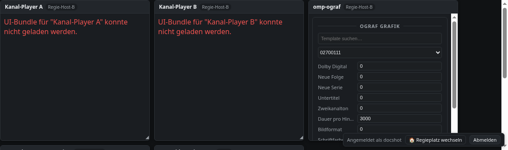

Der Button erscheint gezielt nur dort, wo es tatsächlich etwas zum
Zurückspringen gibt: ein Operator mit nur einem zugewiesenen Workflow
bekommt ihn nicht (es gäbe keine Kachel-Auswahl, zu der man wechseln
könnte), ein Nutzer mit Konfigurations-/Admin-Recht ebenfalls nicht (er
arbeitet im Flow Editor, nicht auf einem Regieplatz).

## 10. Messgerät (Scope)

Der Node-Typ **Messgerät (Scope)** (`omp-scope`) ist ein passives
Messgerät: er hängt sich an einen Video- und/oder einen Audio-Flow, ohne
selbst etwas zu senden. Sie starten ihn wie jeden anderen Node aus dem
Katalog und ziehen im Flow Editor eine Verbindung von der Quelle auf
seinen Video- bzw. Audio-Eingang — beide Eingänge sind unabhängig, einer
allein reicht. Ein Klick auf die Kachel öffnet das Messpanel.

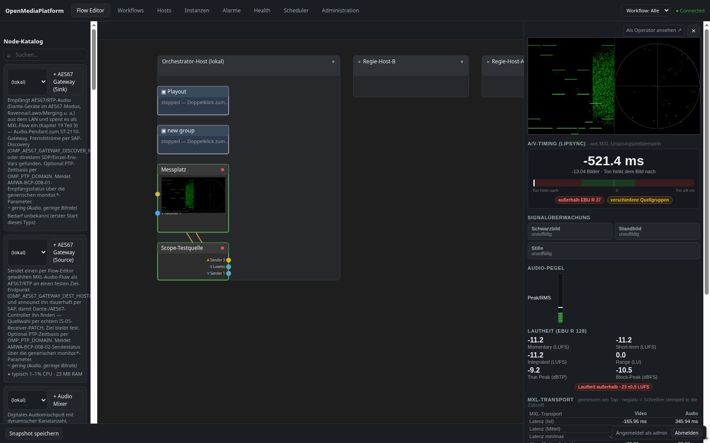

Von oben nach unten:

- **Messbild** — Luma-Waveform (links) und Cb/Cr-Vektorskop (rechts).
- **A/V-Timing (Lipsync)** — der Versatz zwischen Bild und Ton in
  Millisekunden und in Bildern, gerechnet aus den Ursprungszeitstempeln,
  die die Quelle den MXL-Grains mitgibt (nicht aus Ankunftszeiten). Der
  grüne Bereich der Skala ist das nach **EBU R 37** zulässige Fenster:
  der Ton darf dem Bild höchstens 40 ms vorauseilen und höchstens 60 ms
  nachhinken. Ein positiver Wert heißt „Ton eilt vor", ein negativer
  „Ton hinkt nach".
- **Signalüberwachung** — Schwarzbild, Standbild und Stille. Alle drei
  schlagen erst an, wenn der Zustand ununterbrochen anhält (1 s bzw.
  2 s); ein einzelnes schwarzes Bild zwischen zwei Schnitten ist kein
  Alarm. Die Kachel zeigt zusätzlich, seit wann der Zustand anliegt.
- **Audio-Pegel und Lautheit** — Peak/RMS sowie EBU R 128
  (Momentary/Short-term/Integrated/Range), True Peak in dBTP nach
  ITU-R BS.1770 und eine Ampel, ob das Programm die R-128-Vorgaben
  einhält (−23 ±0,5 LUFS, True Peak höchstens −1 dBTP).

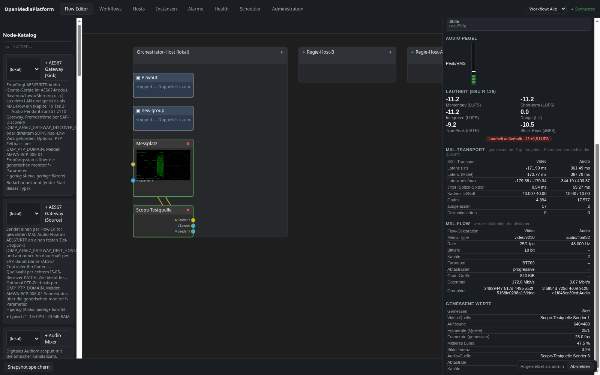

- **MXL-Transport** — je Flow die gemessene Latenz (aktuell, Mittel,
  Min/Max), der Jitter als Spitze-zu-Spitze-Schwankung dieser Latenz,
  die gemessene Kadenz gegen den Sollwert sowie Zähler für ausgelassene
  Grains und für Neuaufsetzer des Lesers. **Ein negativer Latenzwert ist
  kein Anzeigefehler:** er bedeutet, dass die Quelle ihre Grains mit
  einem Zeitstempel in der Zukunft versieht.
- **MXL-Flow** — was der Schreiber über seinen Flow *deklariert*
  (Media-Type, Rate, Bittiefe, Farbraum, Abtastraster, Grain-Größe,
  Datenrate, NMOS-Grouphint). Bewusst getrennt von den gemessenen
  Werten darunter: erst der Vergleich beider deckt einen falsch
  deklarierten Flow auf.
- **Gemessene Werte** — Quelle, Auflösung, Soll- und Ist-Bildrate,
  mittleres Luma, Bilddifferenz, Abtastrate, Kanalzahl.

Schlägt die Signalüberwachung an, färbt sich die betroffene Kachel rot
und nennt die Dauer:

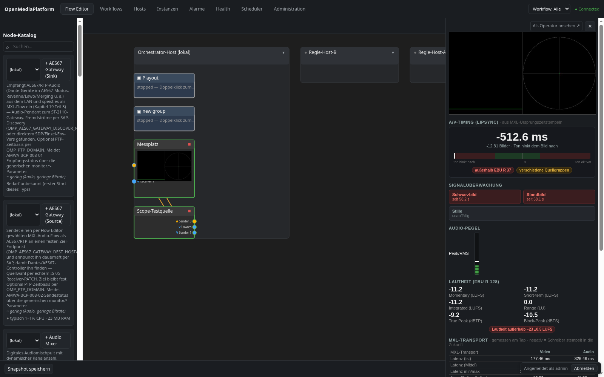

## 10a. Audiomischer-Konsole

Die Konsole des Audiomischers zeigt Kanäle als **Kanalzüge** (Name, Pegel,
ON AIR / MUTED / OFF AIR, Mute, Solo, Select, Status-Badges) und die Details
des gewählten Kanals im **Center Control** (Tabs IN, EQ, COMP, GATE, DELAY,
PAN, AUX, AUTOMIX, DUCK, AUTOMATION, SZENEN).

- **Ansicht** (Auto, Desktop, Compact, Dicht, Grid, Touch), **Operate** (Übersicht,
  Fader ausgeblendet) und **Mix** (Fader + Center Control), **Fader** ein/aus,
  Spalten, Metergröße. Das sind reine Darstellungs-Einstellungen: sie ändern nie
  Pegel oder Routing; ein ausgeblendeter Fader behält seinen Wert.
- **ON AIR** heißt: wirklich hörbar im Programm (nicht stumm, auf Programm
  geroutet, nicht weggeregelt) — nicht bloß „nicht stumm“.
- **AUTO −x dB** = Absenkung durch AutoMix, **DUCK −x dB** = durch Ducking,
  **MANUAL** = Automation wirkt nicht auf diesen Kanal. Der eigene Fader bleibt
  davon getrennt und wird nie von der Automation überschrieben.
- **Fader**: ziehen (Touch: horizontal/vertikal je nach Layout, Wisch quer scrollt
  die Liste), seitlich wegziehen oder Shift = Feinmodus, Doppeltipp = 0 dB,
  Tastatur Pfeile/Bild/Pos1.
- **Tastatur**: Pfeile wechseln den Kanal, M = Mute, S = Solo, Esc schließt.
- **AUX**: Aux- und N-1-Busse (max. 6) anlegen; N-1 enthält alle Kanäle außer
  dem ausgeschlossenen — dessen Signal ist technisch nicht enthalten. Sends
  Pre- oder Post-Fader.
- **SZENEN**: Mix speichern/aktivieren (ohne Aussetzer); Zuordnung
  „Videoquelle → Audio-Szene“ und Presets des ganzen Mixers.

## 10b. Handy-Kamera (WebRTC-Gateway)

Mit dem Node **WebRTC-Gateway (Handy-Kamera)** kann ein gewöhnliches Handy
per Browser als Kamera in OMP einspeisen — ohne App-Installation. Der
Node liefert die Sendeseite selbst aus (eigener Port, nicht über den
Orchestrator). Ein zweiter Node-Typ, **WebRTC-Gateway (Monitor)**, schickt
ein beliebiges Bild aus dem Flow Editor als **Retourbild** zurück aufs Handy.

**Einrichten**

1. Instanz „WebRTC-Gateway (Handy-Kamera)“ starten (Flow Editor, Abschnitt 2.1).
2. In der Bedienoberfläche des Nodes eine **Einladung** erzeugen: Das ergibt
   einen Link und einen QR-Code. Ohne gültige Einladung nimmt der Node
   keine Verbindung an; Einladungen lassen sich einzeln widerrufen
   (laufende Verbindung optional gleich trennen).
3. Optional im Feld **Retourbild-Node** einen Monitor-Node wählen: Dann
   enthält derselbe Link/QR-Code auch das Retourbild, und die Quelle wird per
   Drag & Drop im Flow Editor am Monitor-Node ausgewählt.
4. Das Handy öffnet den Link, erlaubt Kamera/Mikrofon und tippt
   **Verbinden**.

**Die Handy-Seite**

- Im Look der Anmeldeseite (dunkles Navy, Cyan→Violett-Verlauf, Glas-Karte),
  für Hoch- und Querformat ausgelegt.
- **Vorausgewählte Auflösung und Bildrate:** Die Auswahlfelder sind schon auf
  die Werte eingestellt, mit denen das Gateway betrieben wird (Workflow-
  Format bzw. `OMP_WIDTH`, `OMP_HEIGHT`, `OMP_FRAMERATE_NUM/DEN`; ohne
  Angabe 1280×720 bei 25 fps). Der Nutzer kann abweichen, muss es aber nicht.
  Die Vorauswahl wird beim Laden der Seite gesetzt; eine bereits offene Seite
  muss nach geänderten Gateway-Werten neu geladen werden.
- Nach dem Verbinden: Kamerabild (und ggf. Retourbild; Antippen vergrößert),
  Anzeige „Live“, **Verbindung trennen** und ein aufklappbares **Status**-Feld
  mit Verbindungszustand und Latenz. Die optionale **Latenzmessung**
  blendet einen Zeitstempel-Streifen ins Bild ein.
- Fehler beim Verbinden (Kamera nicht erlaubt, Einladung ungültig, Server
  nicht erreichbar) erscheinen als gut sichtbarer Hinweis im Startbildschirm.

**CPU-Last und Empfehlung:** Das Gateway dekodiert das Handy-Bild in
Software. Wähle deshalb nach Möglichkeit **1280×720 bei 25–30 fps**;
1080p oder 50/60 fps verdoppeln den Aufwand. Der Viewer rechnet seine
Vorschau nur mit der eingestellten Vorschau-Bildrate (`previewFps`) und
legt die Quellenbezeichnung als HTML-Overlay über das Bild.

**Betriebshinweise:** Läuft das Handy übers Internet hinter NAT, die
Startumgebung `OMP_WEBRTC_PUBLIC_IP` und `OMP_WEBRTC_ICE_PORT` setzen.
`OMP_WEBRTC_LATENCY_MS` (Standard 40) steuert den Jitterbuffer,
`OMP_WEBRTC_BITRATE_KBPS` (Standard 4000) die Bitrate des Retourbilds.

## 10c. Audio-Ausgabe (Ausgabegruppen, Zuordnung, Ersatzregeln)

Unter **Administration → Audio-Ausgabe** legst du fest, wie die Kanal-Player ihren Ton ausgeben.
Gilt für den Kanal-Player, den MXF-Player und den MXF-Player direkt (deren frühere eigene Editoren für Programmgruppen und Presets entfallen; der MXF-Player direkt übernimmt Änderungen live per „Einstellungen neu laden“). Alles ist Konfiguration, nichts ist fest im Programm — andere Gruppen, mehr Spuren (z. B. 16 bei
XAVC) oder neue Ersatzregeln brauchen keine Programmänderung. Gespeichert wird das ganze Dokument
mit **Speichern**; **Auf Standard zurücksetzen** lädt die mitgelieferten ORF-Werte in den Editor
(erst Speichern übernimmt sie).

1. **Ausgabegruppen** — jede Gruppe wird ein eigener Audio-Sender der Player (Standard:
   Programmton, Hörfilm/AD, Originalton, Dolby E, 5.1). Je Gruppe: ID, Name, Layout (Mono, Stereo,
   5.1, 7.1 oder eigene Kanalnamen), Tags (z. B. `role:pt`), „bit-exakt“ (nur reine 1:1-Auswahl,
   für Dolby E) und eine Vorgabe, falls ein Event nichts anderes sagt. Die erste Gruppe behält den
   Sendernamen „… Audio“. Änderungen an den Gruppen wirken nach einem Neustart der Player-Instanz.
2. **Spurschemata** — was die Spuren einer Quelle bedeuten (Spurnummer, Layout, Tags). Das passende
   Schema wird je Datei automatisch nach Format, Spurzahl und Pfadmuster gewählt. Mit „Als
   Mono-Spuren“ entsteht schnell ein Schema für N Spuren. Ein Tag `ch:L`, `ch:R`, … weist einer
   Spur einen Zielkanal zu.
3. **Zuordnungsvorlagen** — pro Vorlage und Gruppe eine **Klick-Matrix**: Zeilen sind die
   Quellspuren, Spalten die Kanäle der Gruppe. Ein Klick weist die Spur dem Kanal zu, ein zweiter
   macht ihn still. Alternativ „Tags statt Spuren“ (Tag-Ausdruck wie `role:ad AND layout:stereo`)
   und ein Prozessor (z. B. Upmix Stereo → 5.1). Je Zuordnung lassen sich **Gain (dB)**,
   **Verzögerung (ms)** (z. B. Laufzeitausgleich für den Hörfilmton) und ein **Loudness-Ziel (LUFS)** einstellen.
   Das Loudness-Ziel schaltet einen dynamischen EBU-R128-Normalizer ein (z. B. −23 LUFS); leer = aus.
   Verarbeitung führt bisher nur der Kanal-Player aus. Die 13 ORF-Presets sind als Vorlagen enthalten.
4. **Ersatzregeln** — greifen, wenn die Zuordnung einer Gruppe nicht erfüllbar ist. Von oben nach
   unten gewinnt die erste Regel, die eine Quelle findet; in einer Regel die erste Aktion, die
   klappt: *Quelle nehmen* (Tag-Ausdruck, optional über Upmix/Downmix), *Stille* oder *Event nicht
   senden (Alarm)*, jeweils mit optionalem Hinweistext. Beispiel: 5.1 → „nimm `role:pt AND
   layout:stereo` über Upmix, sonst Stille“.

5. **Testen** — unten im Editor beschreibst du eine Quelle (Datei laut Spurschema, N Mono-Spuren oder
   Live mit Stereo/Mono/5.1), wählst optional eine Zuordnung und klickst **Berechnen**: Du siehst je
   Gruppe, aus welchen Spuren sie entsteht, welche Ersatzregel greift oder ob sie still bleibt —
   ohne Medien und mit dem aktuellen, auch ungespeicherten Stand des Editors. (Der Orchestrator
   ruft dafür das Programm `audio-sim` auf; es entsteht mit `make nodes`.)

**Pro Event:** Im Event-Editor der Playout-Automation wählst du im Reiter **Audio** die Zuordnung.
Ohne Wahl gilt für MXF-Dateien die Vorlage „Stereo“, sonst der Programmton der Quelle. Sobald das
Event gecued oder auf Sendung ist, zeigt der Reiter den aufgelösten Plan (je Gruppe: welche Spuren,
oder Ersatzregel, oder still); die Playlist-Spalte „Audio“ markiert Ersatz und Warnungen mit ⚠.

## 10d. Playout-Workflow „Playout MXF“ (Player, Mischer, Monitor)

Der Workflow **Playout MXF** (Reiter Workflows, nach dem Anlegen im Zustand „gestoppt“) enthält:
zwei **Kanal-Player** (A/B), **Bildmischer**, **Tonmischer**, **Audio-Monitor**, **Viewer** und die
**Playout-Automation** — ohne Grafik. Programmformat 720p25; der Bildmischer ist mit dem Viewer verbunden.

**Starten und abspielen**

1. Workflow **starten**. Die Automation belegt ihre Ziele selbst anhand der Rollen (erster Kanal-Player =
   Kanal A, zweiter = Kanal B, Bildmischer, Tonmischer, Grafik falls vorhanden; Panel-Bereich „Ziele“,
   dort weiter änderbar).
2. In der Operator-Konsole (oder im Panel der Automation) im Bereich **Playlist** mit **＋** ein Event
   anlegen, als Medium die MXF-Datei wählen (Dateiliste des Kanal-Players, `OMP_MEDIA_DIR`), und im Reiter
   **Audio** bei Bedarf die Zuordnung wählen (Standard für MXF: „Stereo“).
3. **TAKE** bzw. ▶ beim Event drücken. Der Viewer zeigt das Programmbild.

**Ausgangsgruppen hören:** Im Panel des **Audio-Monitors** über das Dropdown **Gruppenwahl** die gewünschte
Quelle wählen — jeder Kanal-Player bietet dort seine Audio-Gruppen an („… Audio“ = Programmton, danach
„… Audio Hörfilm/AD“, „… Originalton“, „… Dolby E“, „… Audio 5.1 Diskret“). Das Audio wird direkt im
Browser abgespielt. Mehr Kanäle gleichzeitig mischt der Tonmischer (Kanäle dort hinzufügen und die
Gruppen als Quelle wählen); er folgt dem Bildmischer nur, wenn die Quelle als Gruppe (Video + Audio) bekannt
ist — Kanal-Player melden dafür ihre Audio-Gruppen als zusammengehörig.

**Hinweise**

- Die Automation sucht ihre Ziele jetzt in der Node-Liste des Orchestrators, nicht nur in der lokalen
  Registry: Player und Mischer auf einem **anderen Host** erscheinen dadurch in der Zielauswahl.
- Läuft die Automation auf einem anderen Host als der Player, liest die Dateiauswahl die Dateien des
  Players (Kanal A); die Datei muss dort unter `OMP_MEDIA_DIR` liegen.

## 11. Weiterführende Dokumente

- [`HANDBUCH.md`](HANDBUCH.md) — Installation, `make`-Targets,
  Troubleshooting, mTLS/Backup/Soak-Betrieb.
- [`NODE-TUTORIAL.md`](NODE-TUTORIAL.md) — eigene Node-Typen
  entwickeln (Node-Contract, SDK).
- [`../ARCHITECTURE.md`](../ARCHITECTURE.md) — Architekturentscheidungen
  und Standard-Basis (EBU DMF, MXL, NMOS/ST2110).
- [`../UMSETZUNG.md`](../UMSETZUNG.md) — Umsetzungsstand, Status-
  Checkliste aller Kapitel.
